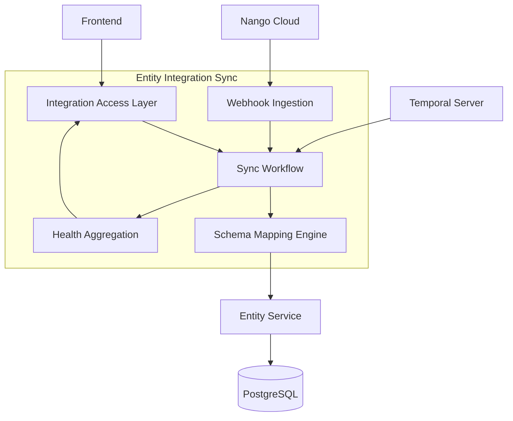
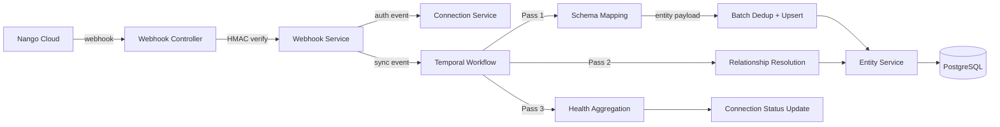
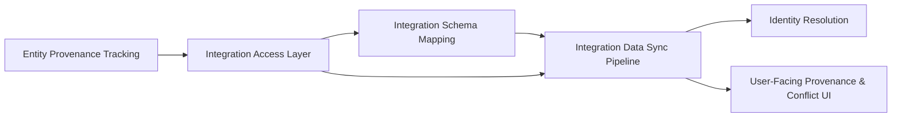

---
tags:
  - architecture/subdomain-plan
Created: 13-02-2026
Updated:
Domains:
  - "[[riven/docs/system-design/domains/Integrations/Integrations]]"
  - "[[riven/docs/system-design/domains/Entities/Entities]]"
---
# Sub-Domain Plan: Syncing Integrations into Entity Ecosystem

---

> _Overarching design plan for the **Entity Integration Sync** sub-domain. Groups related feature designs, defines architecture and data flows, and sets the implementation sequence._

---

## 1. Vision & Purpose

### What This Sub-Domain Covers

The Entity Integration Sync sub-domain connects third-party SaaS tools via Nango and syncs their data into the Riven entity ecosystem. It provides platform-defined schema mappings to convert external data into entity types, simple `source_external_id` deduplication with a full-replace update strategy (integration entities are readonly — the external system is the source of truth), and entity-level provenance tracking to distinguish integration-synced entities from user-created ones.

### Why It Exists as a Distinct Area

Integration sync is a cohesive sub-domain because all its components form a single data pipeline: webhook ingestion (HMAC-verified Nango events) triggers Temporal workflow orchestration, which performs paginated record fetching, schema mapping to entity payloads, batch deduplication via `source_external_id` partial unique indexes, two-pass processing (entity upserts then relationship resolution), and health aggregation that surfaces connection status to users. Schema mapping changes affect entity creation; connection health drives user-visible status; webhook handling gates all sync activity. These stages must evolve together.

### Boundaries

- **Owns:** Integration connection management, Nango API communication, schema mapping definitions and transformation, webhook ingestion with HMAC verification, Temporal sync workflow orchestration, batch deduplication, connection health aggregation, installation status lifecycle
- **Does NOT own:** Entity type definitions and schema ([[riven/docs/system-design/domains/Entities/Entities]] domain), entity CRUD operations (EntityService), workflow execution engine ([[riven/docs/system-design/domains/Workflows/Workflows]] domain), user authentication (Workspaces & Users domain), file storage, UI components

---

## 2. Architecture Overview

### System Context


```mermaid
graph TD
    subgraph "Entity Integration Sync"
        IAL[Integration Access Layer]
        SM[Schema Mapping Engine]
        WH[Webhook Ingestion]
        SW[Sync Workflow]
        HS[Health Aggregation]
    end

    Nango[Nango Cloud] --> WH
    WH --> SW
    IAL --> SW
    SW --> SM
    SM --> ES[Entity Service]
    ES --> DB[(PostgreSQL)]
    SW --> HS
    HS --> IAL
    Temporal[Temporal Server] --> SW
    UI[Frontend] --> IAL
```

### Core Components

| Component | Responsibility | Status |
|-----------|---------------|--------|
| NangoClientWrapper | REST API client for Nango (OAuth, connections, record fetching, sync triggering) | Built (Phase 1), Extended (Phase 2) |
| IntegrationDefinitionService | Integration catalog queries (by slug, category, active) | Built (Phase 1) |
| IntegrationConnectionService | Connection lifecycle management with simplified state machine | Built (Phase 1), Refactored (Phase 2) |
| SchemaMappingService | Transform external JSON payloads to entity attribute payloads | Built (Phase 2) |
| NangoWebhookController | Nango webhook ingestion with HMAC-SHA256 signature verification | Planned (Phase 2) |
| NangoWebhookService | Auth webhook dispatch (connection creation) and sync webhook dispatch (Temporal workflow start) | Planned (Phase 2) |
| IntegrationSyncWorkflow | Temporal workflow: paginated fetch, two-pass processing (upsert + relationships), health update | Planned (Phase 3) |
| IntegrationSyncActivities | Temporal activities: fetchRecords, processRecordBatch, resolveRelationships, updateSyncState | Planned (Phase 3) |
| IntegrationConnectionHealthService | Aggregates per-entity-type sync state into connection health status | Planned (Phase 4) |
| TemplateMaterializationService | Catalog-to-workspace entity type materialization | Built (Phase 2) |

### Key Design Decisions

| Decision | Rationale | Alternatives Rejected |
|----------|-----------|----------------------|
| Nango as integration infrastructure | Handles OAuth, token refresh, rate limits for 600+ providers — avoids building integration plumbing. See [[riven/docs/system-design/decisions/ADR-001 Nango as Integration Infrastructure]]. | Custom OAuth, Merge.dev unified API, Paragon |
| Declarative-first storage for mappings and entity types | Integration entity type schemas and field mappings are defined in JSON manifest files, loaded into DB on startup, interpreted by a generic mapping engine. No per-integration Kotlin classes for standard mappings. See [[riven/docs/system-design/decisions/ADR-004 Declarative-First Storage for Integration Mappings and Entity Templates]]. | Per-integration code (class per integration), database-only with SQL seeds, runtime admin API |
| Unique index dedup over mapping table | Entities already have `source_external_id` + `source_integration_id` — partial unique index replaces separate mapping table. See [[riven/docs/system-design/decisions/ADR-009 Unique Index Deduplication over Mapping Table]]. | Separate integration_entity_map table |
| Full-replace update strategy | Integration entity types are readonly — external system is source of truth, no user attributes to protect | Attribute-level merge, conflict resolution |
| Webhook-driven connection creation | PENDING_AUTHORIZATION and AUTHORIZING removed — connections created in CONNECTED state from auth webhook. See [[riven/docs/system-design/decisions/ADR-010 Webhook-Driven Connection Creation]]. | Pre-creation in PENDING_AUTHORIZATION state |
| Temporal for sync orchestration | Durable execution, built-in retry, deterministic workflow IDs for webhook dedup, activity heartbeating. See [[riven/docs/system-design/decisions/ADR-008 Temporal for Integration Sync Orchestration]]. | Spring @Async, message queue |
| Two-pass in-workflow relationship resolution | Integrations only relate their own entity types — all targets in same sync batch. No persistent queue needed. | Persistent relationship queue table |
| Per-record error isolation | One bad record must not fail thousands of valid records; matches SchemaMappingService's resilient pattern | Batch-level fail-all |

---

## 3. Data Flow

### Primary Flow


```mermaid
flowchart LR
    A[Nango Cloud] -->|webhook| B[Webhook Controller]
    B -->|HMAC verify| C[Webhook Service]
    C -->|auth event| D[Connection Service]
    C -->|sync event| E[Temporal Workflow]
    E -->|Pass 1| F[Schema Mapping]
    F -->|entity payload| G[Batch Dedup + Upsert]
    G --> H[Entity Service]
    H --> I[(PostgreSQL)]
    E -->|Pass 2| J[Relationship Resolution]
    J --> H
    E -->|Pass 3| K[Health Aggregation]
    K --> L[Connection Status Update]
```

### Secondary Flows

- **Error/retry flow:** Failed record processing is caught per-record with error aggregation. Temporal retries failed activities with backoff (3 attempts, 30s initial, 2x). After max failures, connection health transitions to DEGRADED (some types failing) or FAILED (all types failing).
- **Auth webhook flow:** Nango auth event creates connection in CONNECTED state, triggers template materialization, and updates installation to ACTIVE. Missing tags or missing installation log error and return 200.
- **Reconnection flow:** When a DISCONNECTED or FAILED connection is reconnected (CONNECTED via auth webhook), stale entities get refreshed as new sync data arrives. The `modifiedAfter` parameter ensures only changed records are fetched.

---

## 4. Feature Map

> Features belonging to this sub-domain and their current pipeline status.

```dataviewjs
const base = "2. Areas/2.1 Startup & Business/Riven/2. System Design/feature-design";
const pages = dv.pages(`"${base}"`)
  .where(p => p.file.name !== "feature-design")
  .where(p => {
    const sd = p["Sub-Domain"];
    if (!sd) return false;
    const items = Array.isArray(sd) ? sd : [sd];
    return items.some(s => String(s).includes(dv.current().file.name));
  });

const getPriority = (p) => {
  const t = (p.tags || []).map(String);
  if (t.some(tag => tag.includes("priority/high"))) return ["High", 1];
  if (t.some(tag => tag.includes("priority/medium"))) return ["Med", 2];
  if (t.some(tag => tag.includes("priority/low"))) return ["Low", 3];
  return ["\u2014", 4];
};

const getDesign = (p) => {
  const t = (p.tags || []).map(String);
  if (t.some(tag => tag.includes("status/implemented"))) return "Implemented";
  if (t.some(tag => tag.includes("status/designed"))) return "Designed";
  if (t.some(tag => tag.includes("status/draft"))) return "Draft";
  return "\u2014";
};

if (pages.length > 0) {
  const rows = pages
    .sort((a, b) => getPriority(a)[1] - getPriority(b)[1])
    .map(p => [
      p.file.link,
      p.file.folder.replace(/.*\//, ""),
      getPriority(p)[0],
      getDesign(p),
      p["blocked-by"] ? "Yes" : ""
    ]);
  dv.table(["Feature", "Stage", "P", "Design", "Blocked"], rows);
} else {
  dv.paragraph("*No features linked yet. Add `Sub-Domain: \"[[" + dv.current().file.name + "]]\"` to feature frontmatter to link them here.*");
}
```

---

## 5. Feature Dependencies


```mermaid
graph LR
    IAL[Integration Access Layer] --> ISM[Integration Schema Mapping]
    ISM --> IDSP[Integration Data Sync Pipeline]
    IAL --> IDSP
    IDSP --> IIR[Identity Resolution]
    IDSP --> UFPC[User-Facing Provenance & Conflict UI]
    EPT[Entity Provenance Tracking] --> IAL
```

### Implementation Sequence

| Phase | Features | Rationale |
|-------|----------|-----------|
| 1 | [[Entity Provenance Tracking]], [[riven/docs/system-design/feature-design/3. Active/Integration Access Layer]] | Foundation — provenance columns and integration infrastructure unblock everything |
| 2 | [[riven/docs/system-design/feature-design/1. Planning/Integration Schema Mapping]] | Core capability — transform external data into entity payloads |
| 3 | [[riven/docs/system-design/flows/Integration Data Sync Pipeline]] | End-to-end pipeline: webhook ingestion, Temporal sync, batch dedup, health aggregation |
| 4 | [[Integration Identity Resolution System]] | Enhanced matching beyond source_external_id (deterministic + probabilistic) |
| 5 | User-Facing Provenance + Conflict Management | UI for match review, provenance transparency |

---

## 6. Domain Interactions

### Depends On

| Domain / Sub-Domain | What We Need | Integration Point |
|---------------------|-------------|-------------------|
| [[riven/docs/system-design/domains/Entities/Entities]] | Entity storage, type definitions, schema validation, relationships | Direct service calls (EntityService, EntityTypeService) |
| [[riven/docs/system-design/domains/Workflows/Workflows]] | Temporal workflow orchestration for async sync pipeline | Temporal SDK — dedicated task queue for sync workflows |
| Workspaces & Users | Workspace scoping, user authentication, role-based authorization | JWT auth, @PreAuthorize, workspace_members for RLS |

### Consumed By

| Domain / Sub-Domain | What They Need | Integration Point |
|---------------------|---------------|-------------------|
| Frontend UI | Connection status, match review interface | REST API (controllers in later phases) |
| [[riven/docs/system-design/domains/Workflows/Workflows]] | Integration actions — trigger syncs, query integration data | WorkflowActionType.INTEGRATION_REQUEST (existing enum, not yet implemented) |

### Cross-Cutting Concerns

- Workspace scoping: all integration data (connections, mappings, sync events) is workspace-scoped with RLS policies matching the existing entity pattern
- Audit logging: connection lifecycle events and sync operations logged via ActivityService
- Soft delete: follows existing pattern for entity-related data
- JSONB payload storage: integration metadata uses the same Hypersistence Utils JsonBinaryType pattern as entity payloads

---

## 7. Design Constraints

- **Tech Stack:** Must integrate within existing Kotlin/Spring Boot architecture using established patterns (layered architecture, JPA entities, DTOs, workspace-scoped repositories)
- **Integration Infrastructure:** Nango is the chosen integration layer — no alternative integration platforms
- **Multi-tenancy:** All integration data must be workspace-scoped and respect existing RLS policies
- **Schema Compatibility:** Entity provenance fields must not break existing entity creation/update flows — user-created entities work exactly as before with sensible defaults
- **Database:** PostgreSQL with raw SQL schema files in `db/schema/` — no Flyway or Liquibase. Schema files are declarative (current desired state), not incremental migrations.

---

## 8. Open Questions

> [!warning] Unresolved
>
> - [ ] Nango webhook payload structure needs verification during Phase 4 implementation — documentation was incomplete during research
> - [ ] Exact Nango provider keys for each target integration (hubspot vs hubspot-crm) need validation against Nango's current catalog
> - [ ] Schema mapping versioning strategy — how to handle external API schema changes over time (field renames, deprecations)

---

## 9. Decisions Log

| Date | Decision | Rationale | Alternatives Considered |
|------|----------|-----------|------------------------|
| 2026-02-13 | Nango as integration infrastructure | Handles OAuth, token refresh, rate limits — avoids building integration plumbing | Custom OAuth, Merge.dev, Paragon |
| 2026-02-13 | Database-stored integration catalog | Enables future admin management without code deployments | Code-defined enum, config files |
| 2026-02-13 | 10-state connection lifecycle | Precise UX feedback for connection health visibility | 3-state or 5-state simplified models |
| 2026-02-13 | Five fixed source types (enum) | Clean taxonomy covers all entity creation paths | Extensible string-based types, per-integration types |
| 2026-02-28 | Declarative-first storage for integration mappings and entity types | JSON manifest files in repo, loaded into DB on startup. Generic mapping engine interprets declarative definitions — no per-integration code for standard mappings. Lowers community contribution barrier and enables self-hoster extensibility. See [[riven/docs/system-design/decisions/ADR-004 Declarative-First Storage for Integration Mappings and Entity Templates]]. | Per-integration Kotlin classes, SQL-only seeds, runtime admin API |
| 2026-03-16 | Temporal for sync orchestration | Durable execution, built-in retry, deterministic IDs for webhook dedup | Spring @Async, message queue, synchronous |
| 2026-03-16 | Unique index dedup over mapping table | Entities already have source columns; eliminates separate table | integration_entity_map table |
| 2026-03-16 | Webhook-driven connection creation | Simplifies state machine, connections only exist after successful auth | Pre-creation in PENDING_AUTHORIZATION |
| 2026-03-16 | Per-record error isolation | One bad record must not fail the batch | Batch-level fail-all |
| 2026-03-16 | Two-pass in-workflow relationship resolution | All targets in same sync batch; no persistent queue needed | Persistent relationship queue |
| 2026-03-16 | Simplified ConnectionStatus (8 states) | PENDING_AUTHORIZATION and AUTHORIZING were dead code | Keep 10-state model |

---

## 10. Related Documents

- [[riven/docs/system-design/feature-design/3. Active/Integration Access Layer]]
- [[riven/docs/system-design/feature-design/1. Planning/Integration Schema Mapping]]
- [[riven/docs/system-design/feature-design/2. Planned/Identity Resolution System]]
- [[riven/docs/system-design/feature-design/3. Active/Predefined Integration Entity Types]]
- [[riven/docs/system-design/decisions/ADR-001 Nango as Integration Infrastructure]]
- [[riven/docs/system-design/decisions/ADR-004 Declarative-First Storage for Integration Mappings and Entity Templates]]
- [[Flow Integration Connection Lifecycle]]
- [[riven/docs/system-design/flows/Integration Data Sync Pipeline]]
- [[riven/docs/system-design/decisions/ADR-008 Temporal for Integration Sync Orchestration]]
- [[riven/docs/system-design/decisions/ADR-009 Unique Index Deduplication over Mapping Table]]
- [[riven/docs/system-design/decisions/ADR-010 Webhook-Driven Connection Creation]]
- [[riven/docs/system-design/domains/Entities/Entities]]
- [[riven/docs/system-design/domains/Workflows/Workflows]]

---

## 11. Changelog

| Date | Author | Change |
|------|--------|--------|
| 2026-02-13 | Claude | Populated from GSD Phase 1 planning documents |
| 2026-03-16 | Claude | Updated for Integration Data Sync Pipeline — revised vision, components, data flow, dependencies, and decisions to reflect actual sync pipeline design (webhook-driven, Temporal orchestration, batch dedup, two-pass processing) |
