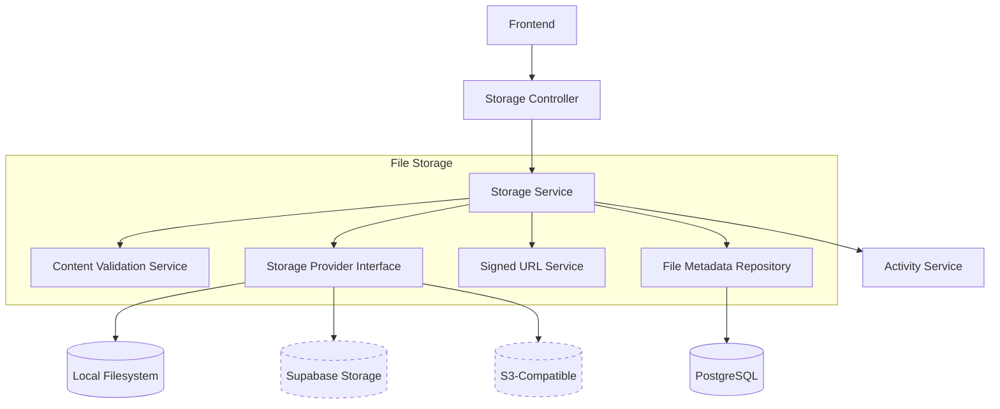
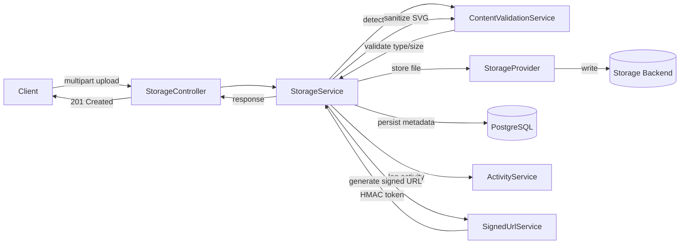
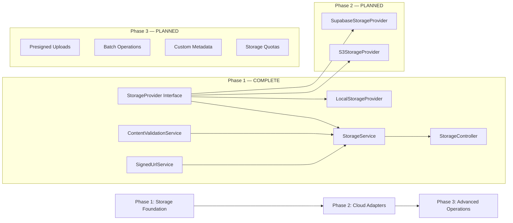

---
tags:
  - architecture/subdomain-plan
Created: 2026-03-06
Updated: 2026-03-06
Domains:
  - "[[Storage]]"
---
# Sub-Domain Plan: File Storage

---

> _Overarching design plan for the **File Storage** sub-domain. Groups related feature designs, defines architecture and data flows, and sets the implementation sequence._

---

## 1. Vision & Purpose

### What This Sub-Domain Covers

The File Storage sub-domain provides provider-agnostic file upload, download, delete, and listing operations for the platform. It handles content type validation via magic byte detection, per-domain file size and type enforcement, SVG sanitization for XSS prevention, HMAC-signed download URLs for unauthenticated file access, file metadata persistence, and storage provider abstraction enabling local filesystem, Supabase Storage, and S3-compatible backends.

### Why It Exists as a Distinct Area

File storage is a cohesive sub-domain because all its components share a common concern: managing binary file assets across the platform. The pipeline stages (content validation --> physical storage --> metadata persistence --> signed URL generation --> streaming download) are tightly coupled and must evolve together. Content validation rules affect what gets stored; metadata persistence enables file discovery and download; signed URLs bridge the gap between authenticated file management and unauthenticated file serving. No individual stage delivers value alone -- they form a coherent storage pipeline.

### Boundaries

- **Owns:** File upload/download/delete/list, content type detection and validation, file size validation, SVG sanitization, storage provider abstraction (local/cloud), file metadata persistence, HMAC-signed URL generation and validation, storage domain definitions (AVATAR, future domains)
- **Does NOT own:** Block content or block tree structure ([[Blocks]] domain), entity schemas or entity type definitions ([[Entities]] domain), workspace management or membership ([[Workspaces & Users]] domain), user authentication or JWT handling ([[Workspaces & Users]] domain), workflow execution ([[Workflows]] domain)

---

## 2. Architecture Overview

### System Context



### Core Components

| Component | Responsibility | Status |
|-----------|---------------|--------|
| `StorageProvider` | Blocking interface for upload, download, delete, exists, generateSignedUrl, healthCheck | Complete (Phase 1) |
| `LocalStorageProvider` | Filesystem implementation with path traversal prevention | Complete (Phase 1) |
| `ContentValidationService` | Apache Tika magic byte detection, domain validation, SVG sanitization, key generation | Complete (Phase 1) |
| `SignedUrlService` | HMAC-SHA256 token generation/validation with constant-time comparison | Complete (Phase 1) |
| `StorageService` | Orchestrates upload, download, delete, list, getFile, generateSignedUrl | Complete (Phase 1) |
| `StorageController` | 6 REST endpoints for file operations | Complete (Phase 1) |
| `FileMetadataEntity` / `FileMetadataRepository` | JPA entity and repository for file metadata persistence | Complete (Phase 1) |
| `StorageConfigurationProperties` | Configuration for provider, paths, signed URL secrets and expiry | Complete (Phase 1) |
| `SupabaseStorageProvider` | Supabase Storage adapter | Planned (Phase 2) |
| `S3StorageProvider` | S3-compatible storage adapter | Planned (Phase 2) |

### Key Design Decisions

| Decision | Rationale | Alternatives Rejected |
|----------|-----------|----------------------|
| Strategy pattern with `@ConditionalOnProperty` for provider selection | Only one provider active per deployment, idiomatic Spring, zero runtime overhead. See [[ADR-005 Strategy Pattern with Conditional Bean Selection for Storage Providers]]. | Pure if/else factory, abstract class hierarchy, runtime provider switching via DB config |
| HMAC-signed download tokens | Self-contained tokens require no DB lookup per download, decoupled from JWT lifecycle. See [[ADR-006 HMAC-Signed Download Tokens for File Access]]. | JWT-based file tokens, database-stored tokens, permanent public URLs |
| Apache Tika for content type detection | Magic bytes are not spoofable, Tika maintains comprehensive detection database. See [[ADR-007 Magic Byte Content Validation via Apache Tika]]. | Extension-based detection, custom magic byte tables, client-provided Content-Type header |
| Separate HMAC secret from JWT secret | Decouples file access scope from user auth scope, limits blast radius of secret compromise | Shared secret with JWT |
| Blocking (non-suspend) provider interface | Matches synchronous Spring MVC architecture | Reactive/coroutine-based interface |
| Local filesystem adapter first | Zero external dependencies, enables self-hosted deployments | Cloud-first (Supabase/S3) |

---

## 3. Data Flow

### Primary Flow



### Secondary Flows

- **Signed URL download flow:** Client requests `GET /api/v1/storage/download/{token}` (unauthenticated). `SignedUrlService` validates HMAC token, `StorageProvider` streams file bytes, `FileMetadataRepository` provides original filename for Content-Disposition. See [[Flow - Signed URL Download]].
- **File delete flow:** Client requests `DELETE /api/v1/storage/workspace/{wId}/files/{fileId}` (authenticated). `StorageService` soft-deletes metadata, then deletes physical file from provider. Physical deletion failure is logged but does not roll back metadata soft-delete.
- **Signed URL generation flow:** Client requests `POST /api/v1/storage/workspace/{wId}/files/{fileId}/signed-url` (authenticated). `StorageService` looks up file metadata, `SignedUrlService` generates HMAC token with configurable expiry.

---

## 4. Feature Map

> Features belonging to this sub-domain and their current pipeline status.

```dataviewjs
const base = "2. Areas/2.1 Startup & Business/Riven/2. System Design/feature-design";
const pages = dv.pages(`"${base}"`)
  .where(p => p.file.name !== "feature-design")
  .where(p => {
    const sd = p["Sub-Domain"];
    if (!sd) return false;
    const items = Array.isArray(sd) ? sd : [sd];
    return items.some(s => String(s).includes(dv.current().file.name));
  });

const getPriority = (p) => {
  const t = (p.tags || []).map(String);
  if (t.some(tag => tag.includes("priority/high"))) return ["High", 1];
  if (t.some(tag => tag.includes("priority/medium"))) return ["Med", 2];
  if (t.some(tag => tag.includes("priority/low"))) return ["Low", 3];
  return ["\u2014", 4];
};

const getDesign = (p) => {
  const t = (p.tags || []).map(String);
  if (t.some(tag => tag.includes("status/implemented"))) return "Implemented";
  if (t.some(tag => tag.includes("status/designed"))) return "Designed";
  if (t.some(tag => tag.includes("status/draft"))) return "Draft";
  return "\u2014";
};

if (pages.length > 0) {
  const rows = pages
    .sort((a, b) => getPriority(a)[1] - getPriority(b)[1])
    .map(p => [
      p.file.link,
      p.file.folder.replace(/.*\//, ""),
      getPriority(p)[0],
      getDesign(p),
      p["blocked-by"] ? "Yes" : ""
    ]);
  dv.table(["Feature", "Stage", "P", "Design", "Blocked"], rows);
} else {
  dv.paragraph("*No features linked yet. Add `Sub-Domain: \"[[" + dv.current().file.name + "]]\"` to feature frontmatter to link them here.*");
}
```

---

## 5. Feature Dependencies



### Implementation Sequence

| Phase | Features | Rationale |
|-------|----------|-----------|
| 1 | Storage Foundation (local adapter, content validation, signed URLs, metadata, REST API) | Foundation — enables file operations with zero external dependencies. COMPLETE. |
| 2 | Cloud Adapters (Supabase Storage, S3-compatible) | Production readiness — cloud deployments need managed storage backends |
| 3 | Advanced Operations (presigned uploads, batch operations, custom metadata, storage quotas) | Scale and UX — direct-to-storage uploads for large files, workspace-level quotas for cost control |

---

## 6. Domain Interactions

### Depends On

| Domain / Sub-Domain | What We Need | Integration Point |
|---------------------|-------------|-------------------|
| [[Workspaces & Users]] | Workspace scoping, user authentication, role-based authorization | JWT auth, `@PreAuthorize`, workspace ID for file isolation |
| Activity | Audit trail for upload and delete operations | Direct service call to `ActivityService.logActivity` |

### Consumed By

| Domain / Sub-Domain | What They Need | Integration Point |
|---------------------|---------------|-------------------|
| [[Blocks]] (future) | File attachments in block content, inline image rendering | Block types reference file IDs; signed URLs render inline images |
| [[Entities]] (future) | File-type attributes on entity instances | Entity attribute payload references file IDs |
| [[Workspaces & Users]] | Workspace and user avatar upload/display | AVATAR storage domain; signed URLs for `` rendering |

### Cross-Cutting Concerns

- **Workspace scoping:** All file metadata is workspace-scoped. Storage keys include workspace ID in the path. `@PreAuthorize` on all authenticated service methods.
- **Audit logging:** Upload and delete operations logged via `ActivityService`.
- **Soft delete:** `FileMetadataEntity` extends `AuditableSoftDeletableEntity` with `@SQLRestriction("deleted = false")`.
- **Security boundary:** Download endpoint is explicitly unauthenticated in `SecurityConfig`. Authorization is the HMAC-signed token, not JWT.

---

## 7. Design Constraints

- **Tech Stack:** Must integrate within existing Kotlin/Spring Boot architecture using established patterns (layered architecture, JPA entities, DTOs, workspace-scoped repositories)
- **Multi-tenancy:** All file metadata must be workspace-scoped. Storage paths include workspace ID.
- **Provider Agnostic:** Business logic in `StorageService` must not reference any concrete provider. Provider-specific behavior is encapsulated behind the `StorageProvider` interface.
- **Self-Hostable:** Local filesystem adapter must work with zero external service dependencies for self-hosted deployments.
- **Database:** PostgreSQL with raw SQL schema files in `db/schema/`. No Flyway or Liquibase.
- **Blocking I/O:** Storage provider interface is blocking (non-suspend) to match synchronous Spring MVC.

---

## 8. Open Questions

> [!warning] Unresolved
>
> - [ ] Phase 2 adapter implementation — Supabase Storage adapter needs investigation of their SDK and signed URL support (may use provider-native signed URLs instead of HMAC tokens)
> - [ ] S3-compatible adapter — need to decide on AWS SDK vs. MinIO client for S3 compatibility
> - [ ] Storage quotas — per-workspace storage limits are not implemented. Need to define quota model (hard limit vs. soft limit, enforcement point, quota tracking mechanism)
> - [ ] Presigned uploads — Phase 3 direct-to-storage uploads bypass the backend. Need to design the two-phase flow (get presigned URL, upload directly to storage, confirm with backend)
> - [ ] Encryption at rest — local storage has no encryption. Cloud adapters should leverage provider-native encryption but this needs explicit design.
> - [ ] Background cleanup — orphaned physical files (metadata persisted but file write failed, or vice versa) need a periodic cleanup job

---

## 9. Decisions Log

| Date | Decision | Rationale | Alternatives Considered |
|------|----------|-----------|------------------------|
| 2026-03-06 | Strategy pattern with `@ConditionalOnProperty` for provider selection | Only one provider active per deployment, idiomatic Spring, zero runtime overhead | Pure if/else factory, abstract class hierarchy, runtime provider switching |
| 2026-03-06 | HMAC-signed download tokens | Self-contained, no DB lookup per download, decoupled from JWT lifecycle | JWT-based file tokens, database-stored tokens, permanent public URLs |
| 2026-03-06 | Apache Tika for content type detection | Magic bytes not spoofable, comprehensive detection database | Extension-based detection, custom magic byte tables, client Content-Type header |
| 2026-03-06 | Separate HMAC secret from JWT secret | Decouples file access scope from user auth scope | Shared JWT secret |
| 2026-03-06 | Blocking (non-suspend) provider interface | Matches synchronous Spring MVC architecture | Reactive/coroutine-based interface |
| 2026-03-06 | Local filesystem adapter first | Zero external dependencies, self-hosted deployments | Cloud-first approach |
| 2026-03-06 | StorageProvider interface designed against S3 object model | Lowest common denominator ensures future cloud adapters implement cleanly | Custom abstraction, provider-specific interfaces |
| 2026-03-06 | Physical file deletion failures do not roll back metadata soft-delete | Orphaned files are harmless; failed metadata rollback is worse | Atomic delete (all-or-nothing) |
| 2026-03-06 | SVG sanitization before storage | SVGs execute scripts in browsers; must sanitize to prevent stored XSS | Serve SVGs with Content-Type: text/plain, reject SVGs entirely |
| 2026-03-06 | Download endpoint unauthenticated (token-as-auth) | Required for inline image rendering where browser cannot attach JWT headers | Proxy all downloads through authenticated endpoint |

---

## 10. Related Documents

- [[Provider-Agnostic File Storage]] -- Feature design for Phase 1 Storage Foundation
- [[ADR-005 Strategy Pattern with Conditional Bean Selection for Storage Providers]] -- Provider selection mechanism
- [[ADR-006 HMAC-Signed Download Tokens for File Access]] -- Signed URL authentication
- [[ADR-007 Magic Byte Content Validation via Apache Tika]] -- Content type detection
- [[Flow - File Upload]] -- Upload flow documentation
- [[Flow - Signed URL Download]] -- Download flow documentation

---

## 11. Changelog

| Date | Author | Change |
|------|--------|--------|
| 2026-03-06 | Claude | Initial sub-domain plan from Phase 1 Storage Foundation implementation |
