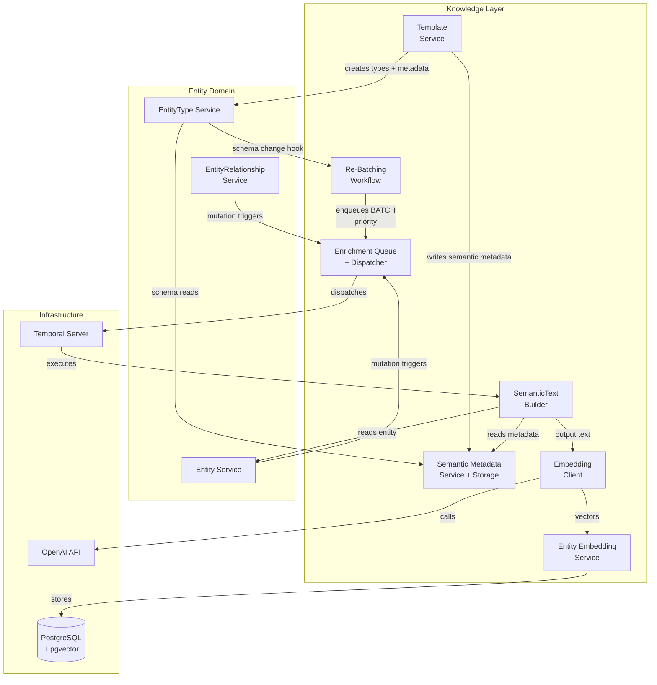
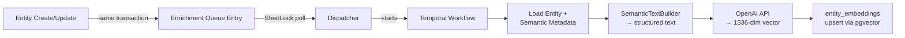
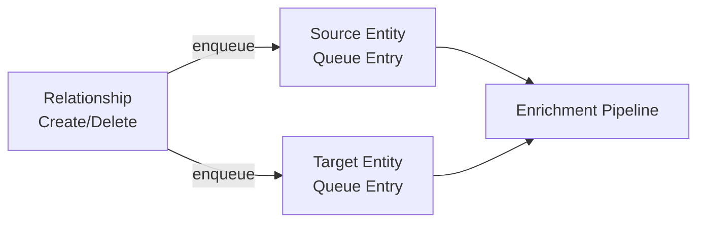
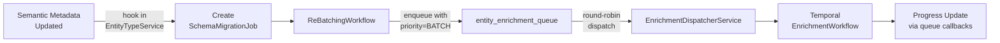
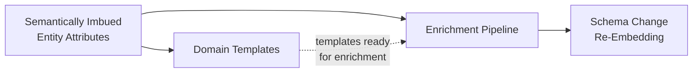
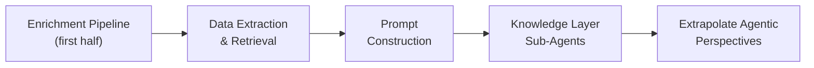

---
tags:
  - architecture/subdomain-plan
Created: 2026-02-17
Updated: 2026-02-18
Domains:
  - "[[Entities]]"
---
# Sub-Domain Plan: Knowledge Layer Ingestion

---

> _Overarching design plan for a sub-set of the **Knowledge Layer** sub-domain. Groups related feature designs, defines architecture and data flows, and sets the implementation sequence._

---

## 1. Vision & Purpose

### What This Sub-Domain Covers

The Knowledge Layer enriches entity data with semantic meaning and vector embeddings so the system understands what business concepts its data represents. It spans four concerns:

1. **Semantic Metadata** — User-editable classifications and natural language descriptions on entity types, attributes, and relationships that capture business meaning beyond raw field names.
2. **Domain Templates** — Pre-configured entity schemas with full semantic metadata that give users an immediately useful data model in one action.
3. **Enrichment Pipeline** — Asynchronous queue-and-workflow system that transforms entity data + semantic context into vector embeddings stored in pgvector.
4. **Schema Change Reconciliation** — Background re-embedding of affected entities when semantic metadata or schema definitions change.

Together these form the data understanding foundation. Downstream capabilities (retrieval, prompt construction, agentic reasoning) consume what this layer produces but are not part of it.

### Why It Exists as a Distinct Area

These features share a single architectural concern: **making entity data machine-understandable**. They share infrastructure (pgvector, Temporal enrichment workflows, the semantic metadata model), have hard sequential dependencies on each other, and are meaningless in isolation — semantic metadata without embeddings has no computational use; embeddings without semantic metadata produce low-quality vectors.

### Boundaries

- **Owns:**
  - Semantic metadata model (entity type definitions, attribute classifications, relationship context)
  - Domain template definitions and idempotent installation logic
  - Enrichment queue, dispatcher, and Temporal workflow orchestration
  - Semantic text construction (entity data → structured natural language)
  - OpenAI embedding client integration
  - Vector storage in pgvector (`entity_embeddings` table, HNSW index)
  - Schema change detection hooks and batch re-embedding orchestration
  - Schema migration job tracking and progress reporting
- **Does NOT own:**
  - Entity CRUD (Entity domain)
  - Entity type / attribute / relationship definitions (Entity domain — Knowledge Layer reads these, never writes them)
  - Vector similarity search or retrieval endpoints (future Retrieval sub-domain)
  - Prompt construction or LLM reasoning (future Query & Reasoning sub-domain)
  - Agentic perspectives / analytical briefs (future Agents sub-domain)
  - Integration sync pipeline (Entity Integration Sync sub-domain)

---

## 2. Architecture Overview

### System Context

The Knowledge Layer sits above the Entity domain, consuming entity mutations as its primary input. It integrates with Temporal for async workflow execution and OpenAI for embedding generation, writing results to pgvector-enabled PostgreSQL.



### Core Components

| Component | Responsibility | Status |
| --------- | -------------- | ------ |
| `EntitySemanticMetadataService` | CRUD for semantic definitions, attribute classifications, relationship context on entity types | Planned |
| `entity_type_semantic_metadata` table | Stores semantic metadata separate from entity_types (1:1 FK, UNIQUE constraint) | Planned |
| `EntityTypeTemplateService` | Idempotent installation of pre-configured domain templates (SaaS, DTC, Service Business) | Planned |
| `EnrichmentQueueService` | Manages `entity_enrichment_queue` — enqueue, dequeue, deduplication | Planned |
| `EnrichmentDispatcherService` | Polls queue via ShedLock with workspace-fair round-robin claim, per-workspace concurrency caps, and priority ordering (NORMAL before BATCH). Dispatches to Temporal workflows | Planned |
| `SemanticTextBuilderService` | Transforms entity data + semantic metadata into structured natural language for embedding. Applies token budget (~7,500) with priority truncation: entity type definition → identifier → high-signal attributes → relationships → remaining attributes. Sets `truncated` flag when budget exceeded | Planned |
| `EmbeddingClientService` | WebClient wrapper for OpenAI text-embedding-3-small API with retry + backoff | Planned |
| `EntityEmbeddingService` | Reads/writes `entity_embeddings` table (pgvector storage with upsert semantics) | Planned |
| `EnrichmentCoordinationActivity` | Single Temporal activity: load entity → build text → embed → store | Planned |
| `EnrichmentWorkflowImpl` | Temporal workflow wrapping EnrichmentCoordinationActivity with retry config | Planned |
| `SchemaMigrationJobService` | Tracks re-embedding jobs: status, progress counts, timestamps | Planned |
| `ReBatchingWorkflowImpl` | Temporal workflow for schema change re-embedding. Enqueues affected entities into `entity_enrichment_queue` with `BATCH` priority instead of spawning child workflows directly. Progress tracking via queue completion callbacks | Planned |
| `KnowledgeController` | REST endpoints for semantic metadata CRUD and template installation | Planned |

### Key Design Decisions

| Decision | Rationale | Alternatives Rejected |
| --- | --- | --- |
| pgvector in existing PostgreSQL over dedicated vector DB | Single database instance, sufficient at initial scale, avoids operational complexity of a second data store | Pinecone, Weaviate, Qdrant — unnecessary infra for v1 volumes |
| OpenAI text-embedding-3-small (1536 dimensions) | Good quality/cost ratio; platform-level API key simplifies management | text-embedding-3-large (3072 dims, higher cost, marginal gain at our scale), local models (operational burden) |
| Semantic metadata in separate table | Avoids polluting the entity_types CRUD hot path; zero changes to existing entity read/write flows | Adding columns to `entity_types` table — couples semantic concerns to core entity lifecycle |
| Queue-based enrichment triggers | Follows the existing `workflow_execution_queue` pattern; decouples entity writes from embedding latency | Synchronous embedding (adds 200-500ms to every write), CDC/WAL-based triggers (infrastructure complexity) |
| Semantic type as extensible string, not DB enum | Users may define domain-specific classifications; start with 6 defaults, allow custom values without migrations | PostgreSQL enum type — requires migration for every new value |
| Temporal for enrichment orchestration | Already deployed for workflow execution; reuse existing infrastructure and queue (WORKFLOWS_DEFAULT_QUEUE) | Dedicated enrichment queue (unnecessary isolation for v1), Spring async (loses retry/observability) |
| Templates install full schemas in one action | Maximises day-one value — user gets entity types, attributes, relationships, and semantic metadata immediately | Wizard-based setup (higher friction), empty workspace with documentation (poor onboarding) |
| HNSW index with cosine similarity | Standard for text embeddings; good recall/speed tradeoff; `vector_cosine_ops` with m=16, ef_construction=64 | IVFFlat (requires training step), exact search (doesn't scale) |

---

## 3. Data Flow

### Primary Flow — Entity Enrichment

Entity mutations trigger asynchronous enrichment that produces vector embeddings.



**Key characteristics:**
- Entity writes are never blocked by embedding — queue entry is in the same transaction, embedding is async
- Queue deduplicates: multiple pending entries for the same entity collapse to one
- SemanticTextBuilder uses semantic type labels and descriptions, not raw attribute keys, producing high-quality embedding input
- `entity_embeddings` has UNIQUE constraint on `entity_id` — upsert semantics (ON CONFLICT DO UPDATE)

### Secondary Flow — Relationship Change Propagation

Relationship mutations enqueue **both** source and target entities because relationship context affects both embeddings.



### Secondary Flow — Schema Change Re-Embedding

When semantic metadata changes on an entity type, all entities of that type are re-embedded via the shared enrichment queue.



**Key characteristics:**
- Scoped to affected `entity_type_id` only — never re-embeds the entire workspace
- Re-embedding entities are enqueued into `entity_enrichment_queue` with `BATCH` priority, sharing the single dispatch path with entity mutation enrichments
- Entity mutation enrichments (`NORMAL` priority) always dispatch before `BATCH` items within each workspace's share — real-time operations are never starved by background re-embedding
- Workspace-fair round-robin dispatch ensures one workspace's schema migration doesn't starve other workspaces
- Per-workspace concurrency cap (configurable, default ~10) prevents any single workspace from saturating the OpenAI rate limit
- Entity CRUD continues normally during re-embedding; queries return stale embeddings rather than failing
- Staleness is determined at entity-type granularity: check if a `schema_migration_job` with status PENDING/IN_PROGRESS exists for the queried `entity_type_id`
- Deduplication: won't launch a new migration job if one is already IN_PROGRESS for the same entity type
- SLA: schema changes affecting <1000 entities complete within 15 minutes

---

## 4. Feature Map

> Features belonging to this sub-domain and their current pipeline status.

```dataviewjs
const base = "2. Areas/2.1 Startup & Business/Riven/2. System Design/feature-design";
const pages = dv.pages(`"${base}"`)
  .where(p => p.file.name !== "feature-design")
  .where(p => {
    const sd = p["Sub-Domain"];
    if (!sd) return false;
    const items = Array.isArray(sd) ? sd : [sd];
    return items.some(s => String(s).includes(dv.current().file.name));
  });

const getPriority = (p) => {
  const t = (p.tags || []).map(String);
  if (t.some(tag => tag.includes("priority/high"))) return ["High", 1];
  if (t.some(tag => tag.includes("priority/medium"))) return ["Med", 2];
  if (t.some(tag => tag.includes("priority/low"))) return ["Low", 3];
  return ["\u2014", 4];
};

const getDesign = (p) => {
  const t = (p.tags || []).map(String);
  if (t.some(tag => tag.includes("status/implemented"))) return "Implemented";
  if (t.some(tag => tag.includes("status/designed"))) return "Designed";
  if (t.some(tag => tag.includes("status/draft"))) return "Draft";
  return "\u2014";
};

if (pages.length > 0) {
  const rows = pages
    .sort((a, b) => getPriority(a)[1] - getPriority(b)[1])
    .map(p => [
      p.file.link,
      p.file.folder.replace(/.*\//, ""),
      getPriority(p)[0],
      getDesign(p),
      p["blocked-by"] ? "Yes" : ""
    ]);
  dv.table(["Feature", "Stage", "P", "Design", "Blocked"], rows);
} else {
  dv.paragraph("*No features linked yet. Add `Sub-Domain: \"[[" + dv.current().file.name + "]]\"` to feature frontmatter to link them here.*");
}
```

---

## 5. Feature Dependencies

### First Half — Entity Semantics & Enrichment Pipeline

The active implementation scope. These four phases have hard sequential dependencies.



### Second Half — Retrieval & Reasoning (Deferred)

Future scope that consumes what the first half produces.



### Implementation Sequence

| Phase | Features | Rationale |
| ----- | -------- | --------- |
| 1 | [[Semantically Imbued Entity Attributes]] | Foundation — semantic metadata model that all downstream features depend on. New table, service, controller, pgvector extension registration. |
| 2 | [[Semantic Metadata Baked Entity Data Model Templates]] | Fastest path to user value — complete entity schema with semantic metadata in one action. Ships before enrichment; when Phase 3 deploys, template-created types are immediately ready. |
| 3 | [[Data Chunking and Enrichment Pipeline]] | Core capability — queue-based trigger system, Temporal workflow, OpenAI integration, pgvector storage. Transforms semantic metadata into computational vectors. |
| 4 | [[Knowledge Base Adaption to Schema Customisation]] | Reconciliation — schema changes trigger scoped re-embedding so vectors stay consistent with the current data model. |

---

## 6. Domain Interactions

### Depends On

| Domain / Sub-Domain | What We Need | Integration Point |
| -------------------- | ------------ | ----------------- |
| Entity (EntityTypeService) | Entity type definitions, attribute schemas, relationship definitions — read-only | Direct service injection |
| Entity (EntityService) | Entity data for embedding text construction; mutation hooks for enrichment triggers | Direct service injection + event hooks in same transaction |
| Entity (EntityRelationshipService) | Relationship data for embedding context; mutation hooks for re-enrichment of both endpoints | Direct service injection + event hooks |
| Workspace | Workspace-scoped access control via `@PreAuthorize` | `WorkspaceSecurity` bean |
| Temporal Server | Async workflow execution for enrichment and re-batching workflows | Temporal SDK (existing WORKFLOWS_DEFAULT_QUEUE) |
| OpenAI API | text-embedding-3-small for vector generation | Spring WebClient with retry/backoff |

### Consumed By

| Domain / Sub-Domain | What They Need | Integration Point |
| -------------------- | -------------- | ----------------- |
| Future: Retrieval | Vector similarity search over `entity_embeddings`, embedding metadata (staleness via `schema_migration_jobs` lookup by entity type, schema version). Staleness is entity-type granularity — check for PENDING/IN_PROGRESS migration job on the queried entity type, not per-entity row comparison | Direct repository query (pgvector cosine similarity) + `SchemaMigrationJobRepository` lookup |
| Future: Query & Reasoning | Semantic metadata for prompt construction (type definitions, attribute descriptions) | Direct service injection of EntitySemanticMetadataService |
| Future: Agents | Enrichment status, embedding freshness, schema migration progress for agentic decision-making | Direct service injection |
| Activity | Audit trail entries for all enrichment mutations | ActivityService.logActivity() |

### Cross-Cutting Concerns

- **Queue pattern reuse** — `entity_enrichment_queue` mirrors the existing `workflow_execution_queue` structure exactly (same column layout, same ShedLock-based polling, same dispatcher pattern). This is intentional for operational consistency.
- **Temporal worker registration** — Enrichment workflows register on the existing `WORKFLOWS_DEFAULT_QUEUE` rather than creating a new task queue. Shared queue simplifies v1 operations.
- **Activity logging** — All enrichment mutations (embed created, embed failed, re-embed triggered, migration started/completed) flow through ActivityService following the same pattern as entity and workflow mutations.

---

## 7. Design Constraints

- **Performance:** Embedding latency is async — entity writes must never block on OpenAI calls. Schema re-embedding for <1000 entities must complete within 15 minutes. Batch size ~100 entities per child workflow balances parallelism vs. OpenAI rate limits.
- **Security:** OpenAI API key is never passed as a Temporal activity parameter — always injected from Spring context inside the activity. HTTP client log level set to WARN in production to prevent key leakage. `entity_embeddings` table enforces workspace isolation via `workspace_id` column (RLS-ready).
- **Compatibility:** Zero changes to existing entity CRUD paths. Semantic metadata lives in a separate table. Enrichment triggers are additive hooks — existing EntityService and EntityRelationshipService mutation flows are not modified, only extended with queue entry side-effects.
- **Infrastructure:** Single new external dependency: OpenAI API (text-embedding-3-small). Single new Maven dependency: `com.pgvector:pgvector:0.1.6`. pgvector extension registered via `CREATE EXTENSION IF NOT EXISTS vector`. HNSW index created in schema SQL before any data insertion. H2 cannot test pgvector — integration tests use Testcontainers with pgvector-enabled PostgreSQL image.

---

## 8. Open Questions

> [!success] All Resolved
>
> - [x] Token length limits — **Resolved: Structured priority truncation.** `SemanticTextBuilderService` truncates by section priority (entity type definition → identifier → high-signal attributes → relationships → remaining attributes) when enriched text exceeds the token budget (~7,500 tokens). A `truncated` flag is stored on the embedding record. See Decision #10.
> - [x] Workspace-fair queue ordering — **Resolved: Single queue with workspace-fair round-robin.** `EnrichmentDispatcherService` claims batches round-robin across workspaces with per-workspace concurrency caps and priority lanes (NORMAL for entity mutations, BATCH for schema re-embedding). Phase 4 re-embedding funnels through the same queue instead of spawning child workflows directly. See Decisions #11, #12.
> - [x] Template post-install embedding latency — **Resolved: Silent.** Templates install entity types (schemas), not entity instances. Nothing to embed at install time. Entities created later flow through the enrichment queue naturally with NORMAL priority. See Decision #13.
> - [x] Staleness indicator granularity — **Resolved: Entity-type level.** Staleness is determined by checking if a `schema_migration_job` with status PENDING or IN_PROGRESS exists for the queried `entity_type_id`. Not per-entity (join overhead on hot path) or workspace-level (too coarse). See Decision #14.

---

## 9. Decisions Log

| Date | Decision | Rationale | Alternatives Considered |
| ---- | -------- | --------- | ----------------------- |
| 2026-02-17 | pgvector in existing PostgreSQL for vector storage | Single data store, sufficient scale for v1, no new infrastructure to operate | Pinecone, Weaviate, Qdrant |
| 2026-02-17 | OpenAI text-embedding-3-small (1536 dims) | Best quality/cost ratio; platform-managed key avoids per-workspace complexity | text-embedding-3-large, local models |
| 2026-02-17 | Semantic metadata in separate table (`entity_type_semantic_metadata`) | Decouples semantic concerns from entity CRUD hot path; zero migration risk to existing tables | Columns on `entity_types` |
| 2026-02-17 | Queue-based async enrichment triggers | Matches existing workflow queue pattern; decouples write latency from embedding | Synchronous embedding, CDC-based triggers |
| 2026-02-17 | Semantic types as extensible strings, not DB enums | Users may define domain-specific classifications; avoids migration for new values | PostgreSQL enum type |
| 2026-02-17 | Reuse existing Temporal WORKFLOWS_DEFAULT_QUEUE | One task queue simplifies v1 operations; enrichment volume doesn't warrant isolation | Dedicated enrichment task queue |
| 2026-02-17 | Three domain templates (SaaS, DTC, Service Business) | Covers primary target personas; each includes complete semantic metadata for immediate enrichment readiness | Wizard-based setup, empty workspace |
| 2026-02-17 | HNSW index (m=16, ef_construction=64, cosine_ops) | Standard for text embedding workloads; good recall/speed tradeoff | IVFFlat (requires training), exact search (doesn't scale) |
| 2026-02-17 | Batch re-embedding in child workflows (~100 per batch) | Balances Temporal parallelism against OpenAI rate limits; each child retries independently | Single monolithic workflow, per-entity workflows |
| 2026-02-18 | Structured priority truncation for token limits | Preserves highest-signal content (entity type definition, identifier) when enriched text exceeds ~7,500 token budget; `truncated` flag stored on embedding record | Hard truncation at character limit, summarisation via LLM call (adds latency and I/O dependency) |
| 2026-02-18 | Single queue with workspace-fair round-robin dispatch | All embedding work (entity mutations AND schema re-embedding) flows through `entity_enrichment_queue` with round-robin claim across workspaces, per-workspace concurrency caps, and priority lanes | Separate queues per workspace (operational complexity), strict FIFO (allows workspace starvation) |
| 2026-02-18 | Priority lanes: NORMAL (mutations) and BATCH (re-embedding) | Entity mutation embeddings always dispatch before background schema re-embedding within each workspace's share, keeping real-time operations responsive | Single priority (re-embedding starves mutations), separate queue for re-embedding (duplicate infrastructure) |
| 2026-02-18 | Template post-install embedding: silent (no indicator) | Templates install schemas, not entity instances — nothing to embed at install time; entities created later flow through the enrichment queue naturally | "Preparing knowledge base" progress indicator (unnecessary complexity for zero entities) |
| 2026-02-18 | Staleness at entity-type granularity via schema_migration_jobs | Single-row lookup against `schema_migration_jobs` for the queried entity type — no join overhead on similarity queries | Per-entity staleness (requires join on hot path for marginal precision), workspace-level (too coarse, misleading for unaffected types) |

---

## Related Documents

- [[Entity]] — Parent domain; provides entity types, attributes, relationships
- [[Semantically Imbued Entity Attributes]] — Phase 1 feature design
- [[Semantic Metadata Baked Entity Data Model Templates]] — Phase 2 feature design
- [[Data Chunking and Enrichment Pipeline]] — Phase 3 feature design
- [[Knowledge Base Adaption to Schema Customisation]] — Phase 4 feature design
- [[Schema Change Handler]] — Supporting feature design for re-embedding triggers
- [[Data Extraction and Retrieval from Queries]] — Future: first feature of the second half
- [[Knowledge Layer Sub-Agents]] — Future: agentic reasoning over embedded data

---

## Changelog

| Date | Author | Change |
| ---- | ------ | ------------- |
| 2026-02-17 | | Initial draft — filled architecture for first half (Phases 1-4: semantic metadata, templates, enrichment pipeline, schema change reconciliation) |
| 2026-02-18 | | Resolved all 4 open questions. Added decisions #10-14: token truncation strategy, workspace-fair round-robin dispatch, priority lanes, silent template install, entity-type staleness. Updated component descriptions, schema change data flow (single-queue path), and domain interaction notes |
