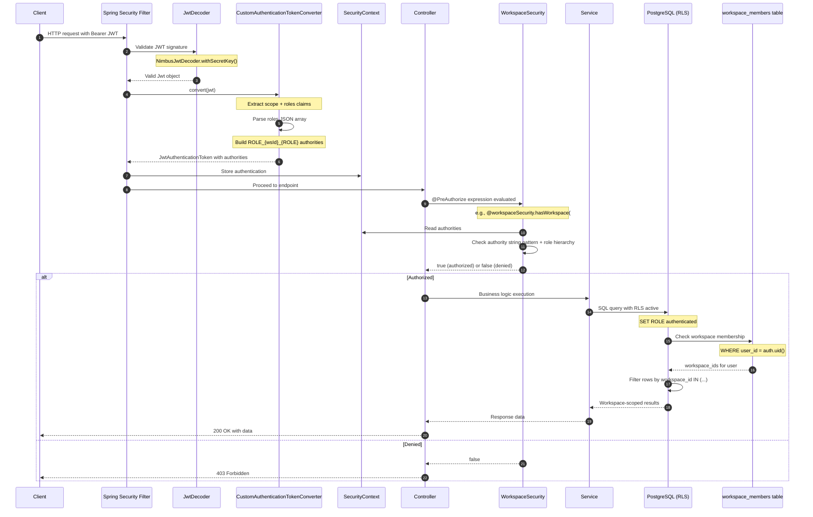

---
tags:
  - flow/user-facing
  - architecture/flow
Created: 2026-02-09
Updated: 2026-02-09
Critical: true
Domains:
  - "[[Workspaces & Users]]"
---
# Flow: Auth & Authorization

---

## Overview

This flow traces the complete authentication and authorization chain from JWT validation through workspace-scoped permission enforcement. Every protected endpoint in Riven follows this path: JWT signature verification, authority extraction from workspace roles, Spring Security @PreAuthorize checks, and database-level Row-Level Security (RLS) enforcement. Understanding this flow is critical for debugging access control issues and maintaining defense-in-depth security.

---

## Trigger

**What initiates this flow:**

|Trigger Type|Source|Condition|
|---|---|---|
|API Call|HTTP client with Bearer token|Every authenticated request to protected endpoints|

**Entry Point:** Spring Security filter chain via [[SecurityConfig]]

---

## Preconditions

- [ ] User has valid JWT token signed with correct secret key
- [ ] JWT contains `sub` (user ID) and `email` claims
- [ ] JWT contains custom `roles` claim with workspace assignments: `[{"workspace_id": "uuid", "role": "OWNER"}]`
- [ ] User exists in database with matching workspace_members entries

---

## Actors

|Actor|Role in Flow|
|---|---|
|HTTP Client|Sends requests with Bearer token in Authorization header|
|Spring Security|Validates JWT, extracts authorities, enforces @PreAuthorize|
|Supabase (external)|Provides JWKS for JWT signature verification (alternative: local secret key)|
|PostgreSQL|Enforces row-level security policies based on authenticated user|

---

## Flow Steps

### Happy Path



### Step-by-Step Breakdown

#### 1. JWT Validation

- **Component:** [[SecurityConfig]] + Spring Security JwtDecoder
- **Action:** Extract Bearer token from Authorization header, validate JWT signature using secret key or JWKS endpoint
- **Input:** HTTP request with `Authorization: Bearer <token>` header
- **Output:** Validated Jwt object with claims
- **Side Effects:** None - read-only validation

**Implementation:**
```kotlin
@Bean
fun jwtDecoder(): JwtDecoder {
    return NimbusJwtDecoder.withSecretKey(secretKey).build()
}
```

#### 2. Authority Extraction

- **Component:** [[TokenDecoder]] (CustomAuthenticationTokenConverter)
- **Action:** Parse JWT claims to extract workspace roles, build Spring Security authorities in format `ROLE_{workspaceId}_{ROLE}`
- **Input:** Jwt object with `scope` and `roles` claims
- **Output:** JwtAuthenticationToken with authorities list
- **Side Effects:** None - pure transformation

**Authority format examples:**
- `ROLE_550e8400-e29b-41d4-a716-446655440000_OWNER`
- `ROLE_550e8400-e29b-41d4-a716-446655440000_ADMIN`
- `ROLE_550e8400-e29b-41d4-a716-446655440000_MEMBER`

**Implementation:**
```kotlin
val customClaims = extractCustomClaims(jwt)
customClaims.roles.forEach { orgRole ->
    val authority = "ROLE_${orgRole.workspaceId}_${orgRole.role.toString().uppercase()}"
    authorities.add(SimpleGrantedAuthority(authority))
}
```

#### 3. SecurityContext Population

- **Component:** Spring Security filter chain
- **Action:** Store authentication token in ThreadLocal SecurityContext for this request
- **Input:** JwtAuthenticationToken
- **Output:** SecurityContext with authentication populated
- **Side Effects:** ThreadLocal storage (thread-safe, request-scoped)

#### 4. Controller Method Invocation

- **Component:** Spring MVC dispatcher
- **Action:** Route request to controller method
- **Input:** HTTP request with populated SecurityContext
- **Output:** Controller method called
- **Side Effects:** None yet

#### 5. @PreAuthorize Expression Evaluation

- **Component:** [[WorkspaceSecurity]]
- **Action:** Spring Security evaluates @PreAuthorize annotation BEFORE method executes, calls [[WorkspaceSecurity]] methods with workspace ID parameter
- **Input:** Workspace ID from method parameter, authorities from SecurityContext
- **Output:** Boolean (true = proceed, false = throw AccessDeniedException)
- **Side Effects:** None - reads from SecurityContext

**Common expressions:**
- `@PreAuthorize("@workspaceSecurity.hasWorkspace(#workspaceId)")` — any role
- `@PreAuthorize("@workspaceSecurity.hasWorkspaceRoleOrHigher(#workspaceId, 'ADMIN')")` — admin or owner
- `@PreAuthorize("@workspaceSecurity.hasWorkspaceRole(#workspaceId, 'OWNER')")` — owner only

**Role hierarchy check:**
```kotlin
fun hasWorkspaceRoleOrHigher(workspaceId: UUID, targetRole: WorkspaceRoles): Boolean {
    val claim = it.authorities.firstOrNull { claim ->
        claim.authority.startsWith("ROLE_$workspaceId")
    } ?: return false

    return WorkspaceRoles.fromString(claim.removePrefix("ROLE_${workspaceId}_"))
        .authority >= targetRole.authority  // OWNER(3) >= ADMIN(2) >= MEMBER(1)
}
```

#### 6. Service Layer Execution

- **Component:** Various domain services (EntityService, WorkflowDefinitionService, etc.)
- **Action:** Execute business logic, prepare database queries
- **Input:** Request parameters, authenticated user context
- **Output:** Prepared SQL queries
- **Side Effects:** None yet - queries not executed

#### 7. Database RLS Enforcement

- **Component:** PostgreSQL with RLS enabled
- **Action:** Query execution with automatic workspace filtering via RLS policies
- **Input:** SQL query from service layer
- **Output:** Workspace-scoped result set (silently filtered)
- **Side Effects:** Database reads workspace_members table to determine user's accessible workspaces

**RLS policy example:**
```sql
CREATE POLICY "entities_select_by_org" ON entities
    FOR SELECT
    TO authenticated
    USING (
        workspace_id IN (
            SELECT workspace_id
            FROM workspace_members
            WHERE user_id = auth.uid()
        )
    );
```

**How auth.uid() works:**
- PostgreSQL function (Supabase extension) extracts user ID from JWT
- Returns UUID matching the `sub` claim from the JWT
- Used in RLS policies to filter rows

#### 8. Response

- **Component:** Controller
- **Action:** Serialize workspace-scoped data, return HTTP response
- **Input:** Database results
- **Output:** 200 OK with JSON response
- **Side Effects:** None

---

## Responsibility Matrix

Critical for understanding which domain owns each auth layer:

| Auth Layer | Mechanism | Owning Domain | Key Component |
|---|---|---|---|
| JWT Validation | Supabase JWKS or secret key | External (Supabase) / Config | Spring Security JwtDecoder |
| Authority Extraction | Token parsing + claim transformation | [[Workspaces & Users]] | [[TokenDecoder]] (CustomAuthenticationTokenConverter) |
| Method-level Authorization | @PreAuthorize expression evaluation | [[Workspaces & Users]] | [[WorkspaceSecurity]] |
| Row-level Security | PostgreSQL RLS policies | Cross-cutting (Database) | PostgreSQL RLS + workspace_members table |

**Key insight:** Authentication (who is the user?) is external/framework responsibility. Authorization (what can they do?) is split between application layer ([[WorkspaceSecurity]]) for role-based checks and database layer (RLS) for workspace isolation.

---

## Data Transformations

|Step|Input Shape|Output Shape|Transformation|
|---|---|---|---|
|JWT Validation|Base64-encoded JWT string|Jwt object with claims map|JWT decode + signature verification|
|Authority Extraction|`roles: [{"workspace_id": "uuid", "role": "OWNER"}]`|`List<SimpleGrantedAuthority>` with `ROLE_{uuid}_{ROLE}` strings|JSON parse + string interpolation|
|@PreAuthorize Check|Authority strings + workspace ID param|Boolean (allow/deny)|String pattern matching + numeric role comparison|
|RLS Filtering|SQL query + auth.uid()|Filtered result set|workspace_members JOIN + WHERE clause injection|

---

## Failure Modes

### Failure Point: JWT Validation

|Failure|Cause|Detection|User Experience|Recovery|
|---|---|---|---|---|
|Invalid signature|Tampered JWT or wrong secret key|JwtDecoder throws JwtException|401 Unauthorized|Client must obtain new valid JWT|
|Expired token|JWT `exp` claim past current time|JwtDecoder throws JwtExpiredException|401 Unauthorized|Client refreshes token via auth service|
|Missing Authorization header|Client didn't send Bearer token|Spring Security filter detects|401 Unauthorized|Client must add Authorization header|
|Malformed JWT|Not valid base64 or missing parts|JwtDecoder throws JwtException|401 Unauthorized|Client must fix token format|

### Failure Point: Authority Extraction

|Failure|Cause|Detection|User Experience|Recovery|
|---|---|---|---|---|
|Missing `roles` claim|JWT doesn't contain workspace roles|[[TokenDecoder]] returns empty authorities|403 Forbidden on all workspace operations (no authorities)|User must be assigned workspace role via workspace_members table|
|Malformed `roles` claim|Invalid JSON structure or types|[[TokenDecoder]] catches exception, returns empty authorities|403 Forbidden|JWT issuer must fix claims format|
|Invalid workspace_id|Not a valid UUID string|UUID.fromString() fails, [[TokenDecoder]] skips role|403 Forbidden (partial authority loss)|JWT issuer must provide valid UUIDs|
|Invalid role string|Role not in WorkspaceRoles enum|WorkspaceRoles.fromString() throws, [[TokenDecoder]] skips role|403 Forbidden (partial authority loss)|JWT issuer must use valid role strings|

### Failure Point: @PreAuthorize Check

|Failure|Cause|Detection|User Experience|Recovery|
|---|---|---|---|---|
|User not workspace member|Authority string doesn't start with `ROLE_{workspaceId}`|[[WorkspaceSecurity]].hasWorkspace() returns false|403 Forbidden|User must be added to workspace via WorkspaceInviteService|
|Insufficient role level|User is MEMBER but endpoint requires ADMIN|[[WorkspaceSecurity]].hasWorkspaceRoleOrHigher() compares authority levels|403 Forbidden|Workspace owner/admin must promote user role|
|No authentication|SecurityContext has no authentication|[[WorkspaceSecurity]] returns false|403 Forbidden|Client must authenticate|

### Failure Point: RLS Enforcement

|Failure|Cause|Detection|User Experience|Recovery|
|---|---|---|---|---|
|User not in workspace_members|auth.uid() returns no workspace_ids|RLS policy filters out all rows|200 OK with empty array (silent filtering)|User must be added to workspace_members table|
|RLS policy misconfigured|Policy USING clause has bug|All queries return empty|200 OK with empty array (appears as empty workspace)|DBA must fix RLS policy|
|auth.uid() returns null|PostgreSQL can't extract user ID from context|RLS blocks all access|500 Internal Server Error or empty results|Database session must have JWT context set|

### Partial Completion Scenarios

|Scenario|State After Failure|Cleanup Required|Retry Safe|
|---|---|---|---|
|Authentication fails at JWT validation|No SecurityContext created|None - request never reaches controller|Yes|
|@PreAuthorize denies access|Controller method never called|None - no side effects yet|Yes|
|RLS filters all rows|Query executes but returns empty|None - read-only operation|Yes|

**Key insight:** Auth failures are safe - they block execution before any mutations occur. No cleanup needed.

---

## Alternative Paths

### Anonymous Access Path

**Condition:** Endpoint has no authentication requirements (e.g., `/actuator/**`, `/docs/**`, `/public/**`)

**Diverges at:** Step 1 (JWT validation skipped)

**Steps:**
1. Spring Security checks `authorizeHttpRequests` configuration
2. Path matches `.requestMatchers("/public/**").permitAll()`
3. No JWT validation or authority extraction
4. Controller method executes without @PreAuthorize checks
5. Database queries may still have RLS but with anonymous context

**Rejoins at:** Step 8 (response)

### Insufficient Permissions Path

**Condition:** User authenticated but lacks required role/workspace membership

**Diverges at:** Step 5 (@PreAuthorize evaluation)

**Steps:**
1. [[WorkspaceSecurity]] evaluates expression
2. Returns false (no matching authority or insufficient role level)
3. Spring Security throws AccessDeniedException
4. Exception handler in [[SecurityConfig]] catches
5. Returns 403 Forbidden with error message

**Rejoins at:** Step 8 (error response instead of data)

---

## Compensation / Rollback

Authentication and authorization are read-only operations - no compensation needed. If authorization fails, no business logic executes, so no state changes occur.

---

## Async Boundaries

None - auth flow is fully synchronous per request. Each HTTP request follows this flow independently.

---

## Timeouts & SLAs

|Segment|Timeout|SLA|Breach Action|
|---|---|---|---|
|End-to-end auth flow|~5-10ms|p99 < 50ms|Log slow auth, investigate SecurityContext access or JWT decoder config|
|JWT validation|~1-2ms|p99 < 10ms|Check JwtDecoder configuration, JWKS endpoint latency|
|@PreAuthorize check|~1ms|p99 < 5ms|Pure in-memory check - breach indicates GC or thread contention|
|RLS query|Varies by query|Add ~1-5ms overhead|RLS adds workspace_members JOIN - ensure index exists|

---

## Idempotency

- [x] Flow is fully idempotent

Authentication and authorization have no side effects - same JWT + same request always produces same auth decision. Multiple retries safe.

**Idempotency Key:** JWT token itself (contains all auth context)

**Duplicate Detection:** Not applicable - auth checks are stateless

---

## Observability

### Key Metrics

|Metric|What It Measures|
|---|---|
|`auth_jwt_validation_total`|JWT validations (success/failure counts)|
|`auth_jwt_validation_failed_total`|Failed validations by reason (expired, invalid signature, malformed)|
|`auth_preauthorize_denied_total`|@PreAuthorize denials by endpoint and workspace|
|`auth_duration_seconds`|Auth flow latency (JWT decode + authority extraction)|
|`workspace_membership_cache_hit_ratio`|If caching workspace authorities (not currently implemented)|

### Trace Structure

```
http:request
├── security:jwt_validation
│   └── jwt:decode
├── security:authority_extraction
│   ├── claims:parse_roles
│   └── authorities:build
├── security:preauthorize_check
│   └── workspace_security:has_workspace
└── db:query_with_rls
    └── db:workspace_members_lookup
```

### Key Log Events

|Event|Level|When|Key Fields|
|---|---|---|---|
|`auth.jwt.validated`|DEBUG|JWT successfully decoded|user_id, workspace_count|
|`auth.jwt.failed`|WARN|JWT validation failed|reason (expired, invalid_signature, malformed)|
|`auth.authorities.extracted`|DEBUG|Authorities built from claims|user_id, authority_count, workspaces|
|`auth.preauthorize.denied`|WARN|@PreAuthorize check failed|user_id, workspace_id, required_role, actual_role, endpoint|
|`auth.rls.empty_result`|INFO|RLS filtered all rows|user_id, workspace_id, table (may indicate permission issue)|

---

## Testing Scenarios

### Happy Path Tests

- [ ] Valid JWT with OWNER role grants access to all workspace operations
- [ ] Valid JWT with ADMIN role grants access to admin operations but denied for owner-only operations
- [ ] Valid JWT with MEMBER role grants access to read operations but denied for admin operations
- [ ] User with multiple workspace roles can access each workspace independently

### Edge Cases

- [ ] JWT with missing `roles` claim results in 403 for all workspace operations
- [ ] JWT with malformed `roles` claim (wrong structure) returns empty authorities, 403 for workspace ops
- [ ] User authenticated but not member of requested workspace gets 403 from @PreAuthorize
- [ ] User authenticated and @PreAuthorize passes, but RLS filters all rows (empty response, not 403)
- [ ] Request to public endpoint bypasses all auth checks
- [ ] Concurrent requests with same JWT all succeed independently (ThreadLocal isolation)

### Failure Injection Tests

- [ ] Expired JWT returns 401 Unauthorized
- [ ] JWT with tampered signature returns 401 Unauthorized
- [ ] Request without Authorization header returns 401 Unauthorized
- [ ] JWT with valid signature but wrong secret key returns 401 Unauthorized
- [ ] User removed from workspace_members table: @PreAuthorize still passes (stale JWT) but RLS filters rows
- [ ] Database auth.uid() returns null: RLS blocks all access

---

## Rate Limits & Throttling

No rate limiting at auth layer. Rate limiting should be applied at API gateway or controller level, after authentication.

---

## Security Considerations

- **Authorization checks at:** Three layers - @PreAuthorize (method-level), [[WorkspaceSecurity]] (role hierarchy), PostgreSQL RLS (database-level)
- **Sensitive data in flight:** JWT contains user ID, email, workspace roles - transmitted via HTTPS only
- **Audit logging:** Failed auth attempts logged at WARN level with user context

**Defense-in-depth architecture:**

> [!warning] Multiple Auth Layers Required
> Application-layer @PreAuthorize checks prevent unnecessary database queries and provide role-level granularity (OWNER vs ADMIN vs MEMBER). Database-layer RLS prevents data leakage if application checks are bypassed (SQL injection, misconfigured controller, compromised service). Both layers are essential - do not rely on only one.

**Threat model:**

- **Threat:** Attacker obtains valid JWT for victim user
  - **Mitigation:** Short JWT expiration (15 minutes), refresh token rotation, HTTPS-only transmission
- **Threat:** Application bug bypasses @PreAuthorize checks
  - **Mitigation:** RLS enforces workspace isolation at database level
- **Threat:** SQL injection bypasses application query logic
  - **Mitigation:** RLS policies use parameterized auth.uid() function, not string interpolation
- **Threat:** User's workspace role removed but JWT still valid until expiration
  - **Mitigation:** @PreAuthorize uses stale JWT authorities, but RLS will filter rows immediately (eventual consistency window = JWT expiration time)

---

## Performance Characteristics

|Metric|Typical|Peak|Notes|
|---|---|---|---|
|Latency (p50)|5ms|10ms|JWT decode + authority extraction + @PreAuthorize check|
|Latency (p99)|15ms|50ms|Includes RLS workspace_members lookup|
|Throughput|10,000+ req/s|Limited by DB connections|Auth checks are in-memory, bottleneck is DB|

### Bottlenecks

|Step|Bottleneck|Mitigation|
|---|---|---|
|JWT Validation|CPU-bound signature verification|Use hardware acceleration for crypto, consider caching decoded JWTs (trade-off: revocation delay)|
|Authority Extraction|JSON parsing of roles claim|Keep roles claim small (max 10-20 workspaces per user), paginate workspace list in UI|
|RLS workspace_members lookup|Database query on every SELECT|Ensure index on (user_id, workspace_id), consider caching workspace membership|

---

## Components Involved

|Component|Role|Can Block Flow|
|---|---|---|
|[[SecurityConfig]]|Configures Spring Security filter chain, registers JwtDecoder and [[TokenDecoder]]|Yes - misconfiguration blocks all requests|
|Spring Security JwtDecoder|Validates JWT signature using secret key|Yes - invalid/expired JWT returns 401|
|[[TokenDecoder]]|Extracts authorities from JWT `roles` claim, builds `ROLE_{wsId}_{ROLE}` strings|Partially - returns empty authorities on malformed claims|
|[[WorkspaceSecurity]]|Evaluates @PreAuthorize expressions, checks role hierarchy|Yes - returns false for insufficient permissions (403)|
|[[AuthTokenService]]|Service-layer access to JWT claims (user ID, email)|No - used after auth succeeds|
|PostgreSQL RLS|Database-level workspace filtering via policies and auth.uid()|Partially - filters rows silently (empty results, not error)|
|workspace_members table|Pivot table linking users to workspaces with roles|Yes - no membership = RLS filters all rows|

---

## External Dependencies

|Service|Step|Failure Impact|Fallback|
|---|---|---|---|
|Supabase JWKS endpoint|JWT validation (if using JWKS instead of secret key)|All auth fails with 401|Use local secret key configuration instead of JWKS|
|PostgreSQL|RLS enforcement|Queries fail with 500 or return empty results|None - database is critical dependency|

---

## Related

- [[Auth & Authorization]] - Parent subdomain
- [[TokenDecoder]] - Authority extraction component
- [[WorkspaceSecurity]] - Authorization component
- [[AuthTokenService]] - Claim extraction service
- [[SecurityConfig]] - Spring Security configuration
- [[WorkspaceRoles]] - Role enum with authority levels

---

## Gotchas & Tribal Knowledge

> [!warning] ROLE_{workspaceId}_{ROLE} Format is Critical Coupling Point
> The authority string format `ROLE_{workspaceId}_{ROLE}` is hardcoded in three places: [[TokenDecoder]] (builds it), [[WorkspaceSecurity]] (parses it), and @PreAuthorize expressions (references it). Changing this format breaks authorization system-wide.

> [!warning] RLS Provides Silent Filtering, Not Errors
> When RLS policies filter rows, the application receives an empty result set with 200 OK, not a 403 Forbidden. This means a user not in workspace_members will see empty workspaces, not access denied errors. This is by design - it prevents information leakage about workspace existence.

> [!warning] JWT Expiration Creates Eventual Consistency Window
> When a user's workspace role is removed from workspace_members table:
> - @PreAuthorize checks still pass (JWT has stale authorities until expiration)
> - RLS immediately filters rows (database sees current workspace_members state)
> - User can hit endpoints but gets empty results until JWT expires (~15 min)

> [!warning] No User Existence Check in Auth Flow
> [[TokenDecoder]] creates authorities based purely on JWT claims - it does not verify the user or workspace exists in the database. A JWT with valid signature but referring to deleted user/workspace will pass auth checks and fail later in business logic or RLS filtering.

> [!warning] Graceful Degradation on Malformed Claims
> [[TokenDecoder]] never throws exceptions - malformed `roles` claims result in empty authorities list. This means auth "succeeds" but user is unauthorized for all workspace operations. Check logs for `auth.authorities.extracted` with `authority_count: 0` to debug.

> [!warning] CustomJwtPrincipal.toString() Returns User ID
> Services that call `SecurityContextHolder.getContext().authentication.principal.toString()` get the user ID string. This coupling means CustomJwtPrincipal's toString() implementation affects [[AuthTokenService]].getUserId() and similar methods.

---

## Changelog

|Date|Change|Reason|
|---|---|---|
|2026-02-09|Initial architecture flow doc created|Phase 4 Plan 06 - Auth & Authorization flow documentation|
