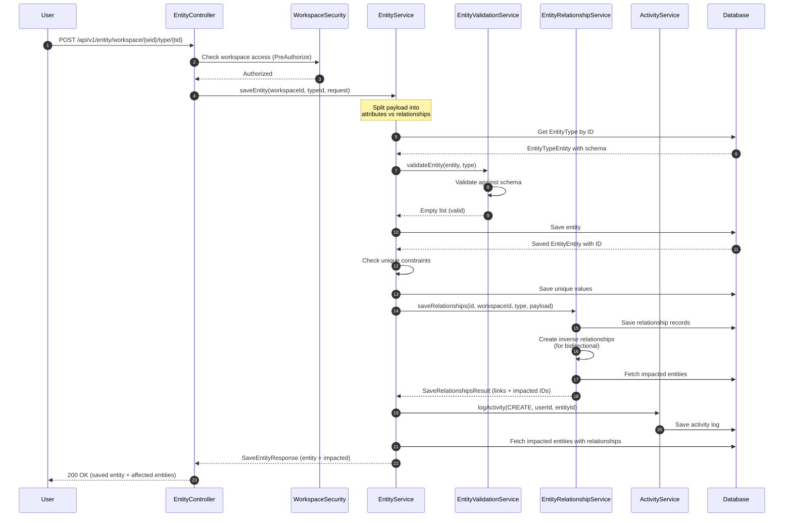
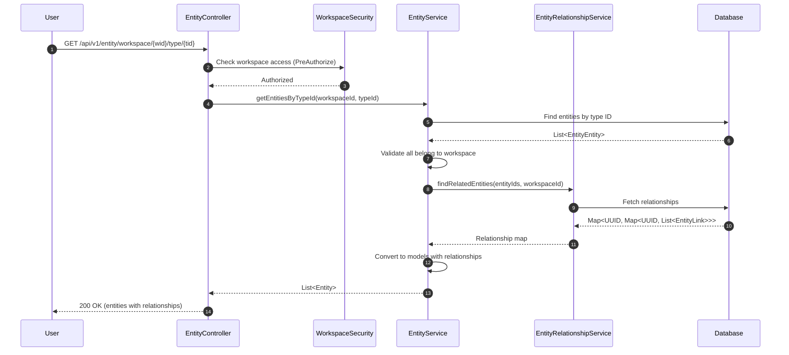
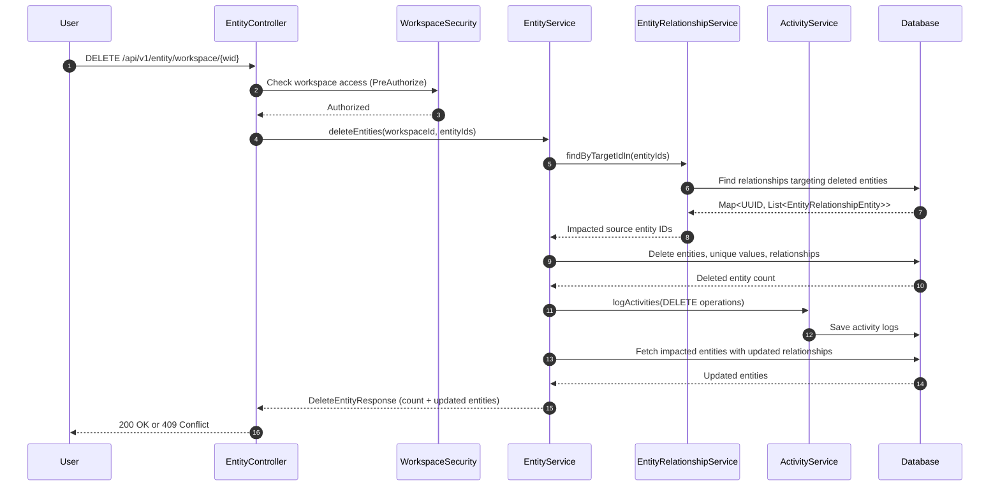

---
tags:
  - flow/user-facing
  - architecture/flow
Created: 2026-02-09
Updated: 2026-02-09
Critical: true
Domains:
  - "[[Entities]]"
  - "[[Workspaces & Users]]"
---
# Flow: Entity CRUD

---

## Overview

Creates, updates, retrieves, and deletes entity instances within a workspace. This flow validates entity payloads against type schemas, manages relationships (including bidirectional sync), enforces unique constraints, and logs all operations for audit. It represents the core user-facing CRUD operations for the [[Entities]] domain with workspace-scoped data isolation via [[Workspaces & Users]].

---

## Trigger

**What initiates this flow:**

|Trigger Type|Source|Condition|
|---|---|---|
|User Action|Entity management UI / API client|User creates, edits, fetches, or deletes an entity|

**Entry Point:** `EntityController`

---

## Preconditions

- User has valid JWT token with workspace access
- User has appropriate workspace role permissions (enforced via `@PreAuthorize`)
- For create/update: Entity type exists and has valid schema
- For update/delete: Entity ID exists and belongs to the workspace

---

## Actors

|Actor|Role in Flow|
|---|---|
|User|Initiates CRUD operation via UI or API|
|[[WorkspaceSecurity]]|Cross-domain validation of workspace access|
|[[EntityService]]|Orchestrates CRUD operations|
|[[EntityValidationService]]|Validates payload against schema|
|[[EntityRelationshipService]]|Manages instance relationships and bidirectional sync|
|`ActivityService`|Logs operations for audit trail|

---

## Flow Steps

### Happy Path: Create Entity

### Step-by-Step Breakdown

#### 1. Receive Request

- **Component:** `EntityController`
- **Action:** Receives POST request with workspace ID, entity type ID, and payload
- **Input:** `SaveEntityRequest` with optional entity ID (update), attribute payload, relationship payload, icon
- **Output:** Passes to [[EntityService]]
- **Side Effects:** None (authorization not yet checked)

#### 2. Workspace Authorization

- **Component:** [[WorkspaceSecurity]] (cross-domain)
- **Action:** `@PreAuthorize` evaluates `@workspaceSecurity.hasWorkspace(#workspaceId)`
- **Input:** Workspace ID from request path
- **Output:** Authorization granted or exception thrown
- **Side Effects:** Blocks request if user lacks workspace access

#### 3. Determine Operation Type

- **Component:** [[EntityService]]
- **Action:** Checks if `request.id` is present to determine create vs. update
- **Input:** `SaveEntityRequest.id`
- **Output:** Decision: new `EntityEntity` or copy of existing
- **Side Effects:** For updates, fetches existing entity from database

#### 4. Split Payload

- **Component:** [[EntityService]]
- **Action:** Separates payload into primitive attributes and relationship references
- **Input:** `Map<UUID, EntityAttributeRequest>` from request
- **Output:**
  - `attributePayload: Map<String, EntityAttributePrimitivePayload>`
  - `relationshipPayload: Map<UUID, List<UUID>>`
- **Side Effects:** None

#### 5. Fetch Entity Type Schema

- **Component:** [[EntityService]]
- **Action:** Retrieves entity type definition from [[EntityTypeService]]
- **Input:** Entity type ID
- **Output:** `EntityTypeEntity` with schema
- **Side Effects:** Throws exception if type not found

#### 6. Validate Payload

- **Component:** [[EntityValidationService]]
- **Action:** Validates attribute payload against type schema
- **Input:** `EntityEntity`, `EntityTypeEntity`
- **Output:** `List<String>` of validation errors (empty if valid)
- **Side Effects:** Throws `SchemaValidationException` if validation fails

#### 7. Persist Entity

- **Component:** [[EntityService]]
- **Action:** Saves entity to database (INSERT for create, UPDATE for update)
- **Input:** `EntityEntity` with validated payload
- **Output:** Saved `EntityEntity` with generated ID
- **Side Effects:** Database write, entity ID generated

#### 8. Enforce Unique Constraints

- **Component:** [[EntityService]] via [[EntityTypeAttributeService]]
- **Action:**
  - Extracts unique attributes from type schema
  - Checks uniqueness (excluding current entity for updates)
  - Saves to normalized `entity_unique_values` table
- **Input:** Type ID, field IDs, values
- **Output:** Success or exception on conflict
- **Side Effects:** Database write to unique values table, exception throws transaction rollback on conflict

#### 9. Save Relationships

- **Component:** [[EntityRelationshipService]]
- **Action:**
  - Compares previous vs. current relationships
  - Adds new relationships, removes old ones
  - Creates inverse relationships for bidirectional definitions
  - Tracks impacted entities (targets of inverse changes)
- **Input:** Entity ID, workspace ID, type, relationship payload
- **Output:** `SaveRelationshipsResult` with links map and impacted entity IDs
- **Side Effects:** Database writes to `entity_relationship` table, inverse relationships created

#### 10. Log Activity

- **Component:** `ActivityService`
- **Action:** Creates audit log entry with CREATE or UPDATE operation
- **Input:** Activity type, operation, user ID, workspace ID, entity ID, entity type, details
- **Output:** `ActivityLog` record
- **Side Effects:** Database write to activity log table

#### 11. Fetch Impacted Entities

- **Component:** [[EntityService]]
- **Action:** If relationships created inverse links, fetches those entities with updated relationships hydrated
- **Input:** Set of impacted entity IDs
- **Output:** `Map<UUID, List<Entity>>` grouped by type ID
- **Side Effects:** Database reads for impacted entities

#### 12. Return Response

- **Component:** `EntityController`
- **Action:** Returns saved entity plus impacted entities to client
- **Input:** `SaveEntityResponse`
- **Output:** HTTP 200 with JSON body
- **Side Effects:** Client can update UI cache for all affected entities

---

### Happy Path: Retrieve Entities

#### Key Steps

1. **[[WorkspaceSecurity]]** — Validates workspace access (cross-domain check)
2. **[[EntityService]]** — Queries entities by type ID, validates workspace ownership
3. **[[EntityRelationshipService]]** — Batch-fetches relationships for all entities
4. **[[EntityService]]** — Converts database entities to API models with hydrated relationships
5. **`EntityController`** — Returns entities to client

---

### Happy Path: Delete Entities

#### Key Steps

1. **[[WorkspaceSecurity]]** — Validates workspace access
2. **[[EntityRelationshipService]]** — Finds entities that link TO the deleted entities (impacted sources)
3. **[[EntityService]]** — Deletes entity rows, unique values, and relationships
4. **`ActivityService`** — Logs DELETE activity for each entity
5. **[[EntityService]]** — Fetches impacted entities with updated relationships (cascaded removal of links)
6. **`EntityController`** — Returns count of deleted entities plus updated entities

---

## Data Transformations

|Step|Input Shape|Output Shape|Transformation|
|---|---|---|---|
|Split Payload|`Map<UUID, EntityAttributeRequest>`|`attributePayload: Map<String, Primitive>` `relationshipPayload: Map<UUID, List<UUID>>`|Pattern match on `EntityAttributeRequest.payload` type|
|Validate|`EntityEntity`, `EntityTypeEntity`|`List<String>` errors|[[EntityValidationService]] validates payload against schema|
|Persist|`EntityEntity` (transient)|`EntityEntity` (persisted)|JPA save generates ID|
|Save Relationships|`Map<UUID, List<UUID>>` (field → targets)|`Map<UUID, List<EntityLink>>` (field → hydrated links)|[[EntityRelationshipService]] creates records, returns links with labels/icons|
|Hydrate Relationships|`EntityEntity`|`Entity` model|Converts database entity to API model with relationships map|

---

## Failure Modes

### Failure Point: Workspace Authorization

|Failure|Cause|Detection|User Experience|Recovery|
|---|---|---|---|---|
|Access Denied|User lacks workspace access|`@PreAuthorize` throws exception|HTTP 403 Forbidden|User must be granted workspace access|

### Failure Point: Schema Validation

|Failure|Cause|Detection|User Experience|Recovery|
|---|---|---|---|---|
|Invalid Payload|Missing required field, wrong type, constraint violation|[[EntityValidationService]] returns errors|HTTP 200 with `SaveEntityResponse.errors` populated|User corrects payload and retries|

### Failure Point: Unique Constraint Violation

|Failure|Cause|Detection|User Experience|Recovery|
|---|---|---|---|---|
|Duplicate Value|Unique attribute value already exists|[[EntityTypeAttributeService]] throws exception|HTTP 409 Conflict (transaction rolled back)|User changes value to unique one|

### Failure Point: Entity Type Not Found

|Failure|Cause|Detection|User Experience|Recovery|
|---|---|---|---|---|
|Invalid Type ID|Entity type doesn't exist or deleted|[[EntityTypeService]] throws exception|HTTP 404 Not Found|User selects valid entity type|

### Failure Point: Relationship Target Not Found

|Failure|Cause|Detection|User Experience|Recovery|
|---|---|---|---|
|Invalid Target ID|Relationship target entity doesn't exist|[[EntityRelationshipService]] skips invalid targets|Relationship not created (silent omission)|User removes invalid relationship or creates target entity first|

### Failure Point: Entity Not Found (Update/Delete)

|Failure|Cause|Detection|User Experience|Recovery|
|---|---|---|---|---|
|Invalid Entity ID|Entity doesn't exist or not in workspace|Repository query returns empty|HTTP 404 Not Found|User refreshes entity list|

### Partial Completion Scenarios

|Scenario|State After Failure|Cleanup Required|Retry Safe|
|---|---|---|---|
|Validation failure before persist|No database changes|None|Yes|
|Unique constraint violation|Transaction rolled back|None|Yes (after fixing value)|
|Relationship save failure|Entity persisted but relationships missing|Manual relationship re-save|Yes|
|Activity log failure|Entity and relationships saved, but no audit log|Manual log entry|Yes|

---

## Alternative Paths

### Update Path

**Condition:** When `SaveEntityRequest.id` is provided

**Diverges at:** Step 3 (Determine Operation Type)

**Steps:**
1. Fetch existing entity from database
2. Validate entity belongs to workspace
3. Validate entity type matches (cannot change type)
4. Update fields (icon, payload) on existing entity
5. Rejoin at validation step

**Rejoins at:** Step 6 (Validate Payload)

---

## Compensation / Rollback

Transaction boundaries ensure atomic operations. Failures during save or relationship operations roll back the entire transaction.

|Step to Undo|Compensation Action|Automated / Manual|
|---|---|---|
|Entity creation|Delete entity (soft-delete)|Manual via DELETE endpoint|
|Entity update|Restore previous version|Manual (no audit trail of previous values)|
|Entity deletion|Undelete not supported|Manual re-creation|
|Relationship changes|Re-save relationships with previous values|Manual|

---

## Timeouts & SLAs

|Segment|Timeout|SLA|Breach Action|
|---|---|---|---|
|End-to-end (create/update)|N/A (synchronous)|< 500ms (typical)|Client timeout, transaction rollback|
|End-to-end (retrieve)|N/A|< 200ms (typical)|Client timeout|
|End-to-end (delete)|N/A|< 500ms (typical)|Client timeout, transaction rollback|

---

## Idempotency

- [ ] Flow is fully idempotent
- [x] Partially idempotent (explain)
- [ ] Not idempotent (explain safeguards)

**Explanation:**

- **Create:** Not idempotent (generates new entity ID each time)
- **Update:** Idempotent for attribute changes, but relationship changes may create duplicate activity logs
- **Delete:** Idempotent (repeat deletes return error with 0 deleted count)
- **Retrieve:** Fully idempotent

**Duplicate Detection:** None (clients should implement optimistic locking via version fields if needed)

---

## Observability

### Key Metrics

|Metric|What It Measures|
|---|---|
|`entity_save_total`|Entity creates and updates|
|`entity_save_failed_total`|Save failures (by reason: validation, unique constraint)|
|`entity_retrieve_total`|Entity queries|
|`entity_delete_total`|Entity deletions|
|`entity_delete_failed_total`|Delete failures|

### Key Log Events

|Event|Level|When|Key Fields|
|---|---|---|---|
|Activity logged|INFO|After successful save/delete|activity, operation, userId, workspaceId, entityId, entityType|
|Schema validation failed|WARN|Validation errors returned|entityTypeId, errors|
|Unique constraint violation|ERROR|Duplicate unique value|typeId, fieldId, value|

---

## Security Considerations

- **Authorization checks at:**
  - Controller layer: `@PreAuthorize("@workspaceSecurity.hasWorkspace(#workspaceId)")` on all CRUD operations
  - Service layer: `@PostAuthorize` on `getEntity()` for retrieved entity workspace validation
- **Sensitive data in flight:** Entity payloads may contain sensitive data (encrypted in transit via HTTPS)
- **Audit logging:** All CREATE, UPDATE, DELETE operations logged via `ActivityService`
- **Workspace isolation:** All queries filter by workspace ID, RLS enforced at database level

---

## Performance Characteristics

|Metric|Typical|Peak|Notes|
|---|---|---|---|
|Latency (p50)|150ms|500ms|Create/update with validation and relationships|
|Latency (p99)|400ms|1000ms|Complex relationships with many inverse links|
|Throughput|50 req/s/instance|N/A|Limited by database write throughput|

### Bottlenecks

|Step|Bottleneck|Mitigation|
|---|---|---|
|Relationship hydration|N+1 query problem|[[EntityRelationshipService]] uses batch fetching for all entity IDs|
|Unique constraint check|Database unique index lookup|Native SQL operations, indexed queries|
|Impacted entity fetching|Database reads|Only fetch if relationships changed, batch fetch all IDs|

---

## Components Involved

|Component|Role|Can Block Flow|
|---|---|---|
|`EntityController`|API entry point|No (delegates immediately)|
|[[WorkspaceSecurity]]|Cross-domain authorization|Yes (throws 403)|
|[[EntityService]]|CRUD orchestration|Yes (coordinates all operations)|
|[[EntityValidationService]]|Schema validation|Yes (returns errors, may throw exception)|
|[[EntityTypeService]]|Type schema retrieval|Yes (throws 404 if type not found)|
|[[EntityRelationshipService]]|Relationship management|Partial (skips invalid targets)|
|[[EntityTypeAttributeService]]|Unique constraint enforcement|Yes (throws 409 on conflict)|
|`AuthTokenService`|User ID extraction from JWT|Yes (throws if invalid token)|
|`ActivityService`|Audit logging|No (failures don't block save)|

---

## External Dependencies

|Service|Step|Failure Impact|Fallback|
|---|---|---|---|
|Database|All steps|Flow fails|None (critical dependency)|

---

## Related

- [[Entity Management]] — Subdomain containing CRUD services
- [[Entity Querying]] — Advanced filtering and querying flows
- [[Validation]] — Schema validation subdomain
- [[Workspaces & Users]] — Workspace authorization and scoping
- [[EntityService]] — Primary orchestrator
- [[EntityRelationshipService]] — Relationship management
- [[EntityValidationService]] — Validation logic

---

## Gotchas & Tribal Knowledge

> [!warning] Transactional Boundaries
> `saveEntity()` and `deleteEntities()` are `@Transactional`. Relationship operations participate in the same transaction, so unique constraint violations or relationship failures will roll back the entire operation.

> [!warning] Impacted Entities
> Creating or deleting bidirectional relationships causes OTHER entities to be modified (inverse links added/removed). Clients must update their cache for ALL entities in `SaveEntityResponse.impactedEntities` and `DeleteEntityResponse.updatedEntities`, not just the primary entity.

> [!warning] Validation vs. Exceptions
> Schema validation errors are returned in `SaveEntityResponse.errors` (not thrown), but unique constraint violations throw exceptions. This inconsistency exists for UX reasons (validation errors can be corrected inline, unique constraints require user to change value).

> [!warning] Entity Type Immutability
> Cannot change an entity's type after creation. Attempting to update with different `entityTypeId` throws exception.

> [!warning] Relationship Target Validation
> [[EntityRelationshipService]] silently skips invalid relationship targets (entities that don't exist). No error returned to user. This prevents cascading failures but may cause confusion if relationships silently don't appear.

---

## Changelog

|Date|Change|Reason|
|---|---|---|
|2026-02-09|Initial documentation|Phase 4 Architecture Flows|
