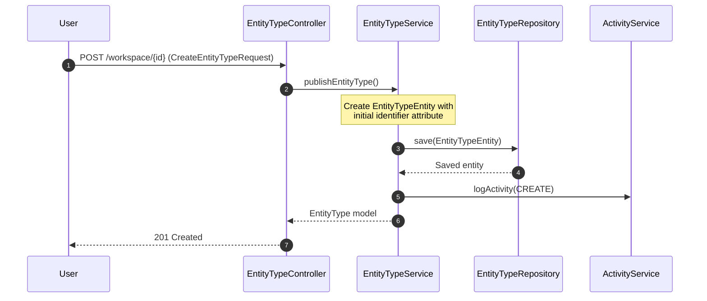
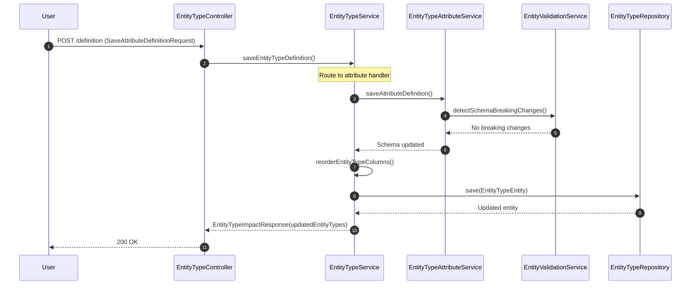
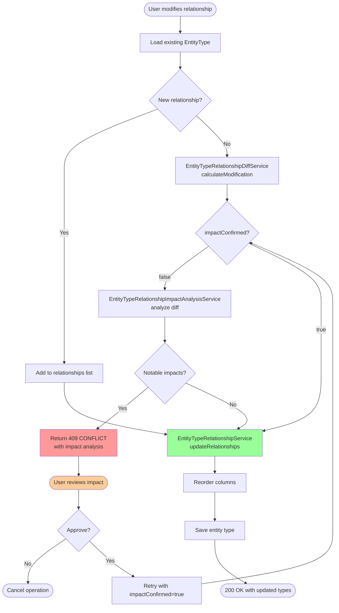

---
tags:
  - flow/user-facing
  - architecture/flow
Created: 2026-02-09
Updated: 2026-02-09
Critical: false
Domains:
  - "[[Entities]]"
---
# Flow: Entity Type Definition

---

## Overview

Entity Type Definition flow manages the complete lifecycle of entity type schemas, including creation, attribute/relationship configuration, breaking change detection, and impact analysis. This flow ensures schema modifications are safe and provides warnings when changes could affect existing entity data or other entity types through bidirectional relationships.

**Business value:** Prevents data loss and maintains system integrity by requiring user confirmation before breaking changes, while allowing non-breaking changes to flow through immediately.

---

## Trigger

**What initiates this flow:**

| Trigger Type | Source | Condition |
|---|---|---|
| User Action | Entity Type Configuration UI | User creates, updates, or deletes entity type or its definitions |
| API Call | POST/PUT/DELETE /api/v1/entity/schema/* | Direct API invocation |

**Entry Point:** [[EntityTypeController]]

---

## Preconditions

- [ ] User has workspace access (enforced via `@PreAuthorize` on all operations)
- [ ] For updates: Entity type exists in workspace
- [ ] For relationship changes: Referenced entity types must exist

---

## Actors

| Actor | Role in Flow |
|---|---|
| Developer/Admin | Defines entity type schemas, confirms breaking changes |
| System | Validates changes, analyzes impact, enforces constraints |

---

## Flow Steps

### Happy Path: Create Entity Type



### Happy Path: Add/Modify Attribute (Non-Breaking)



### Decision Path: Add/Modify Relationship with Impact



### Step-by-Step Breakdown

#### 1. Initial Request Routing

**Subdomain:** [[Type Definitions]]

- **Component:** [[EntityTypeController]]
- **Action:** Route request to appropriate endpoint based on operation type
- **Input:** CreateEntityTypeRequest, SaveTypeDefinitionRequest, DeleteTypeDefinitionRequest, or EntityType
- **Output:** Routed to [[EntityTypeService]]
- **Side Effects:** None (controller layer)

#### 2. Entity Type Creation

**Subdomain:** [[Type Definitions]]

- **Component:** [[EntityTypeService]]
- **Action:** Create new entity type with initial schema
- **Input:** workspaceId, CreateEntityTypeRequest
- **Output:** EntityType model with identifier attribute
- **Side Effects:**
  - Creates EntityTypeEntity with UUID-based identifier attribute
  - Identifier is STRING type, required, unique, protected
  - Logs CREATE activity
  - Initializes empty relationships list

#### 3. Attribute Definition Save

**Subdomain:** [[Type Definitions]]

- **Component:** [[EntityTypeAttributeService]]
- **Action:** Add or update attribute in schema, validate breaking changes
- **Input:** EntityTypeEntity, SaveAttributeDefinitionRequest
- **Output:** Updated schema property map
- **Side Effects:**
  - Detects breaking changes via EntityValidationService
  - If breaking: validates existing entities against new schema
  - Throws SchemaValidationException if entities would become invalid
  - Updates schema properties map

#### 4. Relationship Definition Save

**Subdomain:** [[Relationships]]

- **Component:** [[EntityTypeService]] → [[EntityTypeRelationshipDiffService]]
- **Action:** Calculate relationship modification diff
- **Input:** Previous and updated EntityRelationshipDefinition
- **Output:** EntityTypeRelationshipModification with change types
- **Side Effects:** None (pure calculation)

#### 5. Impact Analysis

**Subdomain:** [[Relationships]]

- **Component:** [[EntityTypeRelationshipImpactAnalysisService]]
- **Action:** Analyze diff for data loss and affected entity types
- **Input:** workspaceId, sourceEntityType, EntityTypeRelationshipDiff
- **Output:** EntityTypeRelationshipImpactAnalysis
- **Side Effects:**
  - Loads affected entity types from repository
  - Analyzes removals, modifications, cardinality restrictions
  - **Note:** Current implementation is a stub (returns empty result)

> [!warning] Impact Analysis Stub
> [[EntityTypeRelationshipImpactAnalysisService]] currently returns empty results. Full implementation requires entity data modeling completion. Users do not receive warnings about breaking changes until this is implemented.

#### 6. Breaking Change Decision Point

**Subdomain:** [[Type Definitions]]

- **Component:** [[EntityTypeService]]
- **Action:** Check if impacts exist and user has confirmed
- **Input:** impactConfirmed boolean, EntityTypeRelationshipImpactAnalysis
- **Output:** Decision to proceed or return impacts
- **Side Effects:**
  - If impacts exist and not confirmed: returns 409 CONFLICT
  - If confirmed or no impacts: proceeds to apply changes

#### 7. Relationship Update Execution

**Subdomain:** [[Relationships]]

- **Component:** [[EntityTypeRelationshipService]]
- **Action:** Apply relationship diff to entity type ecosystem
- **Input:** workspaceId, EntityTypeRelationshipDiff
- **Output:** Map of updated EntityTypeEntity by key
- **Side Effects:**
  - Creates inverse REFERENCE relationships for bidirectional ORIGINs
  - Updates origin relationships for REFERENCE additions
  - Removes relationships and cascades to inverses
  - Validates relationship definitions after processing
  - Logs relationship activity

#### 8. Column Reordering

**Subdomain:** [[Type Definitions]]

- **Component:** [[EntityTypeService]]
- **Action:** Update column order list with new/moved definition
- **Input:** Current columns, new column, previous index (if moving), new index
- **Output:** Updated List<EntityTypeAttributeColumn>
- **Side Effects:** Maintains UI column ordering for entity type

#### 9. Persistence

**Subdomain:** [[Type Definitions]]

- **Component:** EntityTypeRepository
- **Action:** Save updated entity type(s)
- **Input:** EntityTypeEntity or collection
- **Output:** Persisted entities
- **Side Effects:** Database write

---

## Data Transformations

| Step | Input Shape | Output Shape | Transformation |
|---|---|---|---|
| 2. Entity Type Creation | CreateEntityTypeRequest | EntityTypeEntity | Map display names, generate UUID identifier, create Schema with single property |
| 3. Attribute Save | SaveAttributeDefinitionRequest | Schema.properties (updated map) | Upsert attribute schema by UUID key |
| 4. Relationship Diff | Previous/Updated EntityRelationshipDefinition | EntityTypeRelationshipModification | Detect NAME_CHANGED, CARDINALITY_CHANGED, BIDIRECTIONAL_ENABLED, etc. |
| 5. Impact Analysis | EntityTypeRelationshipDiff | EntityTypeRelationshipImpactAnalysis | Aggregate affected types, data loss warnings, column removals/modifications |
| 7. Relationship Update | EntityTypeRelationshipDiff | Map<String, EntityTypeEntity> | Apply added/modified/removed relationships, cascade inverses |
| 9. Persistence | EntityTypeEntity | EntityType (model) | Convert entity to API model via toModel() |

---

## Failure Modes

### Failure Point: Schema Breaking Change Validation

| Failure | Cause | Detection | User Experience | Recovery |
|---|---|---|---|---|
| SchemaValidationException | Attribute change makes existing entities invalid | EntityAttributeService validates entities against new schema | 400 error with sample validation errors | Fix schema to be compatible or delete invalid entities first |
| Unique constraint type mismatch | User marks non-STRING/NUMBER attribute as unique | EntityAttributeService validates attribute type | 400 error: "Attribute with 'unique' constraint must be of type STRING or NUMBER" | Change attribute type or remove unique constraint |

### Failure Point: Relationship Definition Validation

| Failure | Cause | Detection | User Experience | Recovery |
|---|---|---|---|---|
| IllegalArgumentException | Referenced entity type doesn't exist | EntityTypeRelationshipService loads and validates entity types | 400 error: "Referenced entity types do not exist: {keys}" | Create missing entity type first |
| IllegalArgumentException | Bidirectional relationship missing inverse name | EntityTypeRelationshipService validateOriginBidirectionalRelationship | 400 error: "Bidirectional relationship for '{name}' must have an inverseName defined" | Provide inverse name |
| IllegalStateException | Protected relationship deletion attempt | EntityTypeRelationshipService removeOriginRelationship | 400 error: "Cannot remove protected relationship" | Protected relationships are system-managed, cannot be deleted |

### Failure Point: Impact Analysis and Confirmation

| Failure | Cause | Detection | User Experience | Recovery |
|---|---|---|---|---|
| 409 CONFLICT returned | Breaking change detected, user hasn't confirmed | EntityTypeService checks hasNotableImpacts() | Frontend shows impact dialog with affected types/warnings | User reviews and confirms, retry with impactConfirmed=true |

### Partial Completion Scenarios

| Scenario | State After Failure | Cleanup Required | Retry Safe |
|---|---|---|---|
| Relationship validation fails mid-creation | No entity types modified (all-or-nothing within transaction) | None | Yes |
| Impact analysis returns impacts | Entity type unchanged, impact returned to user | None | Yes |
| Database save fails | Transaction rollback | None | Yes |

---

## Alternative Paths

### Remove Definition with Cascade

**Condition:** User deletes attribute or relationship

**Diverges at:** Step 1 (DELETE /definition endpoint)

**Steps:**
1. Load existing entity type
2. For attributes: [[EntityTypeAttributeService]] removes from schema properties
3. For relationships:
   - Calculate impact of removal
   - If not confirmed and impacts exist: return 409 CONFLICT
   - If confirmed: [[EntityTypeRelationshipService]] removes with cascade
   - For ORIGIN relationships: removes all inverse REFERENCE relationships
   - For REFERENCE relationships: updates origin's bidirectionalEntityTypeKeys
4. Remove from column ordering
5. Save and return

**Rejoins at:** Step 9 (Persistence)

### Delete Entity Type with Relationship Cascade

**Condition:** User deletes entire entity type

**Diverges at:** Step 1 (DELETE /workspace/{id}/key/{key} endpoint)

**Steps:**
1. Load entity type
2. Analyze impact of removing ALL relationships
3. If not confirmed and impacts exist: return 409 CONFLICT
4. If confirmed:
   - Remove all relationships via [[EntityTypeRelationshipService]]
   - For ORIGIN relationships: DELETE_RELATIONSHIP action (cascade to inverses)
   - For REFERENCE relationships: REMOVE_ENTITY_TYPE action (update origins)
5. Delete EntityTypeEntity
6. Log DELETE activity

**Rejoins at:** Terminates separately (entity type deleted)

---

## Compensation / Rollback

_If this flow needs to be undone, what's the strategy?_

| Step to Undo | Compensation Action | Automated / Manual |
|---|---|---|
| Entity type creation | Delete entity type (if no entities created yet) | Manual |
| Attribute addition | Remove attribute definition | Manual |
| Relationship creation | Remove relationship with CASCADE | Manual |
| Breaking schema change | Revert schema to previous version | Manual (no version history) |

> [!warning] No Built-In Rollback
> Entity types are MUTABLE (unlike versioned BlockTypes). There is no automatic versioning or rollback mechanism. Schema changes are permanent unless manually reverted.

---

## Async Boundaries

_Where does the flow become asynchronous?_

This flow is fully synchronous — all operations complete within the HTTP request lifecycle.

---

## Timeouts & SLAs

| Segment | Timeout | SLA | Breach Action |
|---|---|---|---|
| End-to-end | HTTP timeout (default 30s) | < 5s for simple operations | User retries |
| Impact analysis | N/A (synchronous) | < 2s | User cancels |
| Relationship cascade | N/A (synchronous) | < 10s for complex graphs | User cancels |

---

## Idempotency

- [ ] Flow is fully idempotent
- [x] Partially idempotent (explain)
- [ ] Not idempotent (explain safeguards)

**Idempotency Key:** Entity type key is unique within workspace. Duplicate creation attempts fail with unique constraint violation.

**Duplicate Detection:**
- Create: Key uniqueness enforced by database
- Update: Matched by entity type ID (idempotent updates)
- Delete: Idempotent (deleting non-existent type fails gracefully)

**Non-idempotent aspects:**
- Relationship modification diffs are non-commutative (order matters)
- Column reordering is position-dependent

---

## Observability

### Key Metrics

| Metric | What It Measures |
|---|---|
| `entity_type_created_total` | New entity type creations |
| `entity_type_updated_total` | Entity type configuration updates |
| `entity_type_deleted_total` | Entity type deletions |
| `relationship_definition_saved_total` | Relationship add/modify operations |
| `impact_analysis_performed_total` | Impact analyses triggered |
| `breaking_change_confirmed_total` | User-confirmed breaking changes |
| `schema_validation_failed_total` | Breaking changes rejected by validation |

### Trace Structure

```
flow:entity_type_definition
├── controller:route_request
├── service:save_definition
│   ├── attribute_service:save_attribute (if attribute)
│   │   └── validation_service:detect_breaking_changes
│   ├── diff_service:calculate_modification (if relationship)
│   ├── impact_service:analyze (if relationship && !confirmed)
│   └── relationship_service:update_relationships (if relationship)
│       ├── db:load_entity_types
│       ├── relationship_service:create_inverse_references
│       └── db:save_all
└── repository:save
```

### Key Log Events

| Event | Level | When | Key Fields |
|---|---|---|---|
| `entity_type.created` | INFO | New type published | workspaceId, typeKey, typeId |
| `definition.saved` | INFO | Attribute/relationship saved | typeKey, definitionId, definitionType |
| `impact_analysis.performed` | INFO | Impact analysis run | typeKey, affectedTypeCount, warningCount |
| `breaking_change.confirmed` | WARN | User confirmed breaking change | typeKey, impactCount |
| `schema_validation.failed` | ERROR | Breaking change rejected | typeKey, invalidEntityCount, sampleErrors |

---

## Testing Scenarios

### Happy Path Tests

- [x] Create entity type with initial identifier attribute
- [x] Add non-breaking attribute (new optional field)
- [x] Add relationship without impact
- [x] Modify relationship name (non-breaking)
- [x] Reorder columns

### Edge Cases

- [x] Add unique constraint to STRING attribute
- [x] Add unique constraint to non-STRING attribute (should fail)
- [x] Create bidirectional relationship with inverse name
- [x] Create bidirectional relationship without inverse name (should fail)
- [x] Reference non-existent entity type (should fail)
- [x] Delete entity type with no relationships
- [x] Delete entity type with relationships (requires confirmation)

### Failure Injection Tests

- [x] Break existing entities with schema change (validation fails)
- [x] Trigger impact analysis with relationship removal
- [x] Attempt to delete protected relationship
- [x] Database failure during save (transaction rollback)
- [x] Concurrent modification of same entity type

---

## Rate Limits & Throttling

| Limit Type | Value | Scope | Exceeded Behavior |
|---|---|---|---|
| N/A | No explicit limits | N/A | Workspace-level concurrency managed by database locks |

---

## Security Considerations

- **Authorization checks at:** All [[EntityTypeService]] public methods via `@PreAuthorize("@workspaceSecurity.hasWorkspace(#workspaceId)")`
- **Sensitive data in flight:** Schema definitions contain no secrets, all workspace-scoped
- **Audit logging:** CREATE/UPDATE/DELETE operations logged via ActivityService with userId, workspaceId, entityId

**Protected types:**
- System entity types (if any) have `protected=true` flag
- Cannot be modified or deleted by users
- Enforced in service layer

---

## Performance Characteristics

| Metric | Typical | Peak | Notes |
|---|---|---|---|
| Latency (p50) | 50ms | 200ms | Simple attribute adds |
| Latency (p99) | 500ms | 2s | Complex relationship cascades |
| Throughput | 100 ops/sec | 500 ops/sec | Per workspace (limited by DB write capacity) |

### Bottlenecks

| Step | Bottleneck | Mitigation |
|---|---|---|
| Impact analysis | Entity data counting (when implemented) | Paginated counting, cached estimates |
| Relationship cascade | N bidirectional relationships = N target updates | Batch saves, transaction optimization |
| Schema validation | Validating all existing entities | Sample-based validation, background jobs for large datasets |

---

## Components Involved

| Component | Role | Can Block Flow |
|---|---|---|
| [[EntityTypeController]] | HTTP endpoint routing | No (fast routing) |
| [[EntityTypeService]] | Orchestrate definition lifecycle | Yes (business logic) |
| [[EntityTypeAttributeService]] | Attribute schema validation | Yes (breaking change detection) |
| [[EntityTypeRelationshipService]] | Relationship graph management | Yes (cascade operations) |
| [[EntityTypeRelationshipDiffService]] | Modification delta calculation | No (pure calculation) |
| [[EntityTypeRelationshipImpactAnalysisService]] | Impact analysis | No (stub, returns immediately) |
| EntityValidationService | Schema breaking change detection | Yes (entity validation) |
| EntityTypeRepository | Persistence | Yes (database I/O) |
| ActivityService | Audit logging | No (async logging) |

---

## External Dependencies

| Service | Step | Failure Impact | Fallback |
|---|---|---|---|
| PostgreSQL | All persistence operations | Complete flow failure | Retry with exponential backoff |

---

## Related

- [[EntityTypeService]] - Primary orchestrator
- [[EntityTypeAttributeService]] - Attribute operations
- [[EntityTypeRelationshipService]] - Relationship operations
- [[EntityTypeRelationshipImpactAnalysisService]] - Impact analysis
- [[EntityTypeRelationshipDiffService]] - Change detection
- [[Type Definitions]] - Parent subdomain
- [[Relationships]] - Relationship subdomain

---

## Gotchas & Tribal Knowledge

> [!warning] Mutable Types
> Entity types update IN PLACE (unlike BlockTypes which are versioned). Breaking changes are validated against existing entities, but there's no rollback mechanism. Once a change is committed, it's permanent unless manually reverted.

> [!warning] Impact Analysis Stub
> [[EntityTypeRelationshipImpactAnalysisService]] currently returns empty results. Users will NOT see warnings about breaking changes until entity data modeling is complete. This is a known gap documented in the service.

> [!warning] Relationship Cascade Complexity
> Bidirectional relationships create inverse REFERENCE relationships on target entity types. Deleting an ORIGIN relationship cascades to ALL inverses. Deleting a REFERENCE relationship updates the origin's bidirectionalEntityTypeKeys. This cascade logic is complex and can affect multiple entity types in a single operation.

> [!warning] Protected Relationships
> System-managed relationships have `protected=true` and cannot be deleted by users. Attempts to delete protected relationships fail with IllegalStateException. This is enforced in [[EntityTypeRelationshipService]].

> [!warning] Transaction Boundaries
> All operations are wrapped in `@Transactional`. Validation failures cause rollback, but some validation happens BEFORE the transaction (e.g., entity type existence checks). This can lead to inconsistent error reporting.

> [!warning] Unique Constraints
> Unique constraints are only supported for STRING and NUMBER types. This is validated in [[EntityTypeAttributeService]]. Attempting to mark other types as unique fails with SchemaValidationException.

---

## Changelog

| Date | Change | Reason |
|---|---|---|
| 2026-02-09 | Initial flow documentation | Phase 4 Plan 5 - Entity Type Definition architecture flow |
