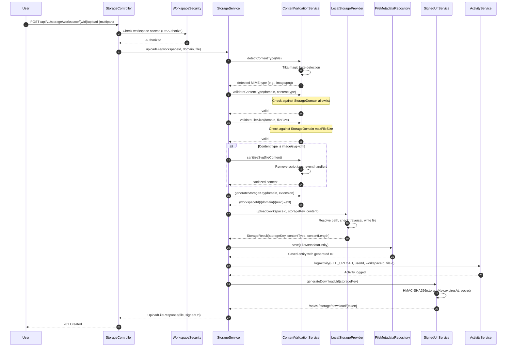

---
tags:
  - flow/user-facing
  - architecture/flow
Created: 2026-03-06
Updated: 2026-03-06
Domains:
  - "[[Storage]]"
---
# Flow: File Upload

---

## Overview

Uploads a file to a workspace-scoped storage domain, validates content type and file size via magic byte detection, sanitizes SVGs, persists file metadata, and returns a signed download URL. This is the primary write path for the [[File Storage]] sub-domain.

---

## Trigger

**What initiates this flow:**

|Trigger Type|Source|Condition|
|---|---|---|
|User Action|File upload UI / API client|User uploads a file to a workspace (e.g., avatar upload)|

**Entry Point:** `StorageController`

---

## Preconditions

- User has valid JWT token with workspace access
- User has appropriate workspace role permissions (enforced via `@PreAuthorize`)
- Storage provider is available and writable
- HMAC signing secret is configured (`storage.signed-url.secret`)

---

## Actors

|Actor|Role in Flow|
|---|---|
|User|Initiates file upload via UI or API|
|[[WorkspaceSecurity]]|Cross-domain validation of workspace access|
|`StorageController`|API entry point, delegates to StorageService|
|`StorageService`|Orchestrates validation, storage, metadata persistence, and signed URL generation|
|`ContentValidationService`|Detects content type via Tika, validates against domain rules, sanitizes SVGs, generates storage key|
|`LocalStorageProvider`|Writes file bytes to local filesystem|
|`FileMetadataRepository`|Persists file metadata to database|
|`SignedUrlService`|Generates HMAC-signed download URL|
|`ActivityService`|Logs upload operation for audit trail|

---

## Flow Steps

### Happy Path: Upload File

### Step-by-Step Breakdown

#### 1. Receive Request

- **Component:** `StorageController`
- **Action:** Receives multipart POST request with workspace ID, domain, and file
- **Input:** `MultipartFile`, `StorageDomain` (enum), workspace ID (path variable)
- **Output:** Passes to `StorageService`

#### 2. Workspace Authorization

- **Component:** [[WorkspaceSecurity]]
- **Action:** `@PreAuthorize` evaluates `@workspaceSecurity.hasWorkspace(#workspaceId)`
- **Input:** Workspace ID from request path
- **Output:** Authorization granted or `AccessDeniedException` thrown

#### 3. Content Type Detection

- **Component:** `ContentValidationService`
- **Action:** Uses Apache Tika to detect MIME type from file magic bytes
- **Input:** File bytes (first few KB read for detection)
- **Output:** Detected MIME type string (e.g., `image/png`)
- **Side Effects:** None

#### 4. Content Type Validation

- **Component:** `ContentValidationService`
- **Action:** Checks detected MIME type against `StorageDomain.allowedContentTypes`
- **Input:** Domain enum value, detected content type
- **Output:** Void (throws `ContentTypeNotAllowedException` if not allowed)

#### 5. File Size Validation

- **Component:** `ContentValidationService`
- **Action:** Checks file size against `StorageDomain.maxFileSize`
- **Input:** Domain enum value, file size in bytes
- **Output:** Void (throws `FileSizeLimitExceededException` if exceeded)

#### 6. SVG Sanitization (Conditional)

- **Component:** `ContentValidationService`
- **Action:** If content type is `image/svg+xml`, sanitizes SVG to remove XSS vectors
- **Input:** Raw SVG file content
- **Output:** Sanitized SVG content (script tags, event handlers removed)
- **Side Effects:** None

#### 7. Storage Key Generation

- **Component:** `ContentValidationService`
- **Action:** Generates UUID-based storage key with domain prefix and Tika-detected extension
- **Input:** Domain, file extension (from Tika, includes leading dot)
- **Output:** Storage key string (e.g., `{workspaceId}/avatar/{uuid}.png`)

#### 8. Physical File Storage

- **Component:** `LocalStorageProvider`
- **Action:** Writes file bytes to `{basePath}/{storageKey}` on local filesystem
- **Input:** Workspace ID, storage key, file content InputStream, content type
- **Output:** `StorageResult` (storageKey, contentType, contentLength)
- **Side Effects:** File created on disk. Path traversal check (resolve + normalize + startsWith) executed before write.

#### 9. Metadata Persistence

- **Component:** `FileMetadataRepository`
- **Action:** Saves `FileMetadataEntity` with all file metadata
- **Input:** Entity with workspace ID, domain, storage key, original filename, content type, file size, uploaded by
- **Output:** Saved entity with generated UUID
- **Side Effects:** Database INSERT

#### 10. Activity Logging

- **Component:** `ActivityService`
- **Action:** Logs FILE_UPLOAD activity with file details
- **Input:** Activity type, operation, user ID, workspace ID, entity ID, details map
- **Output:** Activity log record
- **Side Effects:** Database INSERT to activity log

#### 11. Signed URL Generation

- **Component:** `SignedUrlService`
- **Action:** Computes HMAC-SHA256 token and constructs download URL
- **Input:** Storage key, expiry duration
- **Output:** Download URL path (`/api/v1/storage/download/{token}`)

#### 12. Return Response

- **Component:** `StorageController`
- **Action:** Returns `UploadFileResponse` with file metadata and signed URL
- **Output:** HTTP 201 Created with JSON body

---

## Failure Modes

### Failure Point: Content Type Not Allowed

|Failure|Cause|Detection|User Experience|Recovery|
|---|---|---|---|---|
|Content type rejected|File magic bytes indicate a type not in domain allowlist|`ContentValidationService.validateContentType`|HTTP 415 Unsupported Media Type|User uploads a file with an allowed content type|

### Failure Point: File Size Exceeded

|Failure|Cause|Detection|User Experience|Recovery|
|---|---|---|---|---|
|File too large|File exceeds `StorageDomain.maxFileSize`|`ContentValidationService.validateFileSize`|HTTP 413 Payload Too Large|User uploads a smaller file|

### Failure Point: Storage Provider Failure

|Failure|Cause|Detection|User Experience|Recovery|
|---|---|---|---|---|
|Write failure|Disk full, permission denied, I/O error|`LocalStorageProvider.upload` throws `StorageProviderException`|HTTP 500 Internal Server Error|Ops resolves storage issue, user retries|

### Failure Point: Metadata Persistence Failure

|Failure|Cause|Detection|User Experience|Recovery|
|---|---|---|---|---|
|DB write failure|Database connection loss after file stored|Repository `save` throws exception|HTTP 500 Internal Server Error|Orphaned file on disk (harmless). User retries upload.|

### Partial Completion Scenarios

|Scenario|State After Failure|Cleanup Required|Retry Safe|
|---|---|---|---|
|Validation failure (type/size)|No side effects|None|Yes|
|Storage write failure|No side effects|None|Yes|
|Metadata write failure|Orphaned file on disk|Future background cleanup|Yes|
|Activity log failure|File stored and metadata persisted|Manual activity log entry|Yes (file already stored)|

---

## Security Considerations

- **Authorization checks at:** Service layer via `@PreAuthorize("@workspaceSecurity.hasWorkspace(#workspaceId)")` on `StorageService.uploadFile`
- **Content validation:** Magic byte detection prevents content type spoofing
- **SVG sanitization:** Prevents stored XSS via embedded scripts in SVG files
- **Path traversal prevention:** `LocalStorageProvider` validates resolved path starts with base path
- **Storage key generation:** UUID-based keys prevent filename injection and collisions
- **Audit logging:** All uploads logged via `ActivityService`

---

## Related

- [[Provider-Agnostic File Storage]] -- Feature design for the storage system
- [[Flow - Signed URL Download]] -- Download flow using signed URLs generated here
- [[ADR-005 Strategy Pattern with Conditional Bean Selection for Storage Providers]] -- Provider abstraction
- [[ADR-006 HMAC-Signed Download Tokens for File Access]] -- Signed URL mechanism
- [[ADR-007 Magic Byte Content Validation via Apache Tika]] -- Content type detection
- [[File Storage]] -- Sub-domain plan

---

## Changelog

|Date|Change|Reason|
|---|---|---|
|2026-03-06|Initial documentation|Phase 1: Storage Foundation implementation|
