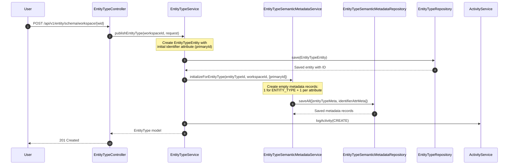
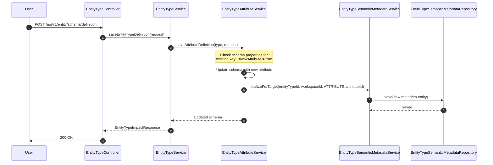
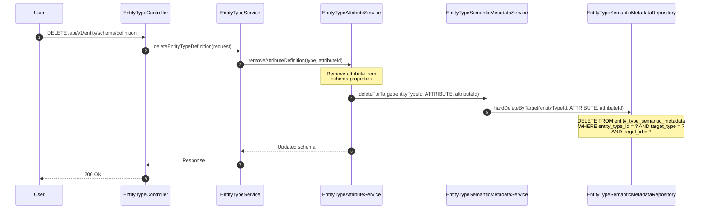
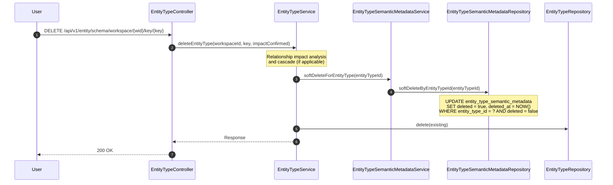

---
tags:
  - flow/active
  - architecture/flow
Domains:
  - "[[Entities]]"
  - "[[Knowledge]]"
Created: 2026-02-18
---
# Flow: Semantic Metadata Lifecycle Sync

---

## Overview

Semantic metadata records in `entity_type_semantic_metadata` must stay synchronized with entity type, attribute, and relationship lifecycle events. The `EntityTypeSemanticMetadataService` does not own its own creation triggers -- metadata records are created and destroyed as side effects of operations in [[EntityTypeService]], [[EntityTypeAttributeService]], and [[EntityTypeRelationshipService]]. This flow documents every lifecycle event that creates, hard-deletes, or soft-deletes metadata, the transaction boundaries that guarantee atomicity, and the failure modes when synchronization breaks down.

**Business value:** Ensures every entity type component has a corresponding semantic metadata record from the moment it exists, so users never encounter a "no metadata" state when they navigate to the Knowledge Layer UI. Also ensures orphaned metadata never accumulates when components are removed.

**Key invariant:** For any non-deleted entity type, there exists exactly one `entity_type_semantic_metadata` row per live component (the entity type itself, each attribute in its schema, each relationship definition). This 1:1 guarantee is maintained by lifecycle hooks executing within the same `@Transactional` boundary as the triggering mutation.

---

## Trigger

**What initiates this flow:**

| Trigger Type | Source | Condition |
|---|---|---|
| Entity Type Publish | [[EntityTypeService]].publishEntityType | New entity type created and saved |
| Attribute Addition | [[EntityTypeAttributeService]].saveAttributeDefinition | New attribute UUID not present in existing schema.properties |
| Attribute Removal | [[EntityTypeAttributeService]].removeAttributeDefinition | Attribute removed from entity type schema |
| Relationship Addition | [[EntityTypeRelationshipService]] | New relationship definition added |
| Relationship Removal | [[EntityTypeRelationshipService]] | Relationship definition removed |
| Entity Type Soft-Delete | [[EntityTypeService]].deleteEntityType | Entity type soft-deleted |

**Entry Points:** [[EntityTypeController]] (user-initiated), internal service calls (cascade operations)

---

## Preconditions

- User has workspace access (enforced via `@PreAuthorize` on the originating service method -- not on the metadata lifecycle hooks themselves)
- Entity type exists in workspace (verified by the calling service before the lifecycle hook fires)
- For attribute/relationship operations: entity type schema or relationships JSONB is being modified in the same transaction

---

## Flow Steps

### Happy Path: Entity Type Published (metadata initialization)

### Happy Path: Attribute Added (metadata created)

### Happy Path: Attribute Removed (metadata hard-deleted)

### Happy Path: Entity Type Soft-Deleted (metadata cascade soft-delete)

---

## Step-by-Step Breakdown

### 1. Entity Type Publish -- Initialize All Metadata

**Subdomain:** [[Type Definitions]]

- **Component:** [[EntityTypeService]] -> [[EntityTypeSemanticMetadataService]]
- **Action:** After entity type is saved, create empty metadata records for the entity type itself and its initial identifier attribute
- **Input:** `entityTypeId: UUID`, `workspaceId: UUID`, `attributeIds: List<UUID>` (contains the primaryId of the identifier attribute)
- **Output:** Batch-saved metadata entities (no return value used by caller)
- **Side Effects:**
  - Creates 1 metadata record with `targetType=ENTITY_TYPE`, `targetId=entityTypeId`
  - Creates 1 metadata record with `targetType=ATTRIBUTE`, `targetId=primaryId`
  - All fields (`definition`, `classification`, `tags`) are initialized empty/null -- users populate them later via KnowledgeController
  - Debug log: "Initialized semantic metadata for entity type {id} with {n} attributes"

### 2. Attribute Addition -- Initialize Single Attribute Metadata

**Subdomain:** [[Type Definitions]]

- **Component:** [[EntityTypeAttributeService]] -> [[EntityTypeSemanticMetadataService]]
- **Action:** When a new attribute is added to an entity type schema (detected by checking `schema.properties` before the update), create an empty metadata record
- **Input:** `entityTypeId: UUID`, `workspaceId: UUID`, `targetType: ATTRIBUTE`, `targetId: UUID` (the attribute UUID from the request)
- **Output:** Single saved metadata entity
- **Side Effects:**
  - New-attribute detection: `val isNewAttribute = type.schema.properties?.containsKey(id) != true` evaluated BEFORE the schema update is applied
  - Only triggers for genuinely new attributes; updates to existing attributes do not create duplicate metadata
  - If the attribute UUID already has a metadata record (edge case: re-add after removal without hard-delete), the save creates a new one (the old was hard-deleted)

### 3. Attribute Removal -- Hard-Delete Attribute Metadata

**Subdomain:** [[Type Definitions]]

- **Component:** [[EntityTypeAttributeService]] -> [[EntityTypeSemanticMetadataService]]
- **Action:** When an attribute is removed from schema, permanently delete its metadata record
- **Input:** `entityTypeId: UUID`, `targetType: ATTRIBUTE`, `targetId: UUID`
- **Output:** None (void operation)
- **Side Effects:**
  - Executes `@Modifying @Query DELETE` via `hardDeleteByTarget` -- this is a physical row deletion, not a soft-delete
  - Rationale: removed attributes have no parent to reference; orphaned metadata rows serve no purpose and cannot be restored without the attribute itself being re-added

### 4. Relationship Addition -- Initialize Single Relationship Metadata

**Subdomain:** [[Relationships]]

- **Component:** [[EntityTypeRelationshipService]] -> [[EntityTypeSemanticMetadataService]]
- **Action:** When a new relationship definition is added to an entity type, create an empty metadata record
- **Input:** `entityTypeId: UUID`, `workspaceId: UUID`, `targetType: RELATIONSHIP`, `targetId: UUID` (the relationship definition UUID)
- **Output:** Single saved metadata entity
- **Side Effects:** Same pattern as attribute addition but with `RELATIONSHIP` discriminator

### 5. Relationship Removal -- Hard-Delete Relationship Metadata

**Subdomain:** [[Relationships]]

- **Component:** [[EntityTypeRelationshipService]] -> [[EntityTypeSemanticMetadataService]]
- **Action:** When a relationship definition is removed, permanently delete its metadata record
- **Input:** `entityTypeId: UUID`, `targetType: RELATIONSHIP`, `targetId: UUID`
- **Output:** None (void operation)
- **Side Effects:** Same hard-delete pattern as attribute removal

### 6. Entity Type Soft-Delete -- Cascade Soft-Delete All Metadata

**Subdomain:** [[Type Definitions]]

- **Component:** [[EntityTypeService]] -> [[EntityTypeSemanticMetadataService]]
- **Action:** When an entity type is soft-deleted, soft-delete ALL of its metadata records (entity type, attributes, relationships)
- **Input:** `entityTypeId: UUID`
- **Output:** `Int` (count of rows updated)
- **Side Effects:**
  - Bulk `@Modifying @Query UPDATE` sets `deleted=true` and `deleted_at=CURRENT_TIMESTAMP` on all rows where `entity_type_id = ?` and `deleted = false`
  - After this, `@SQLRestriction("deleted = false")` on `AuditableSoftDeletableEntity` makes all metadata invisible to standard JPA queries
  - Metadata is NOT hard-deleted because the entity type itself is only soft-deleted -- if entity type restore is ever implemented, metadata can be restored alongside it

---

## Data Transformations

| Step | Input Shape | Output Shape | Transformation |
|---|---|---|---|
| 1. Initialize | entityTypeId, workspaceId, List<UUID> attributeIds | List<EntityTypeSemanticMetadataEntity> | Create N+1 empty entities (1 ENTITY_TYPE + N ATTRIBUTE) with null definition, null classification, empty tags |
| 2. Init target | entityTypeId, workspaceId, targetType, targetId | EntityTypeSemanticMetadataEntity | Create single empty entity for the given target |
| 3. Hard-delete | entityTypeId, targetType, targetId | void | JPQL DELETE removes row from database |
| 6. Soft-delete | entityTypeId | Int (affected rows) | JPQL UPDATE sets deleted flag and timestamp on all rows for entity type |

---

## Failure Modes

### Failure Point: Metadata Initialization During Entity Type Publish

| Failure | Cause | Detection | User Experience | Recovery |
|---|---|---|---|---|
| SaveAll fails | Database constraint violation or connection error | Exception propagates from repository | Entity type creation rolls back entirely (same `@Transactional`) | User retries entity type creation |
| Duplicate metadata | Race condition or retry creates duplicate (entity_type_id, target_type, target_id) | UNIQUE constraint on table | Transaction rolls back with constraint violation | Idempotent on retry -- first successful creation wins |

### Failure Point: Metadata Hard-Delete During Attribute Removal

| Failure | Cause | Detection | User Experience | Recovery |
|---|---|---|---|---|
| Delete fails | Database error | Exception propagates | Attribute removal rolls back (same transaction) | User retries attribute removal |
| No matching row | Metadata record never existed (initialization was skipped) | `hardDeleteByTarget` deletes 0 rows (no exception) | Silent success -- attribute still removed correctly | None needed; absence is acceptable |

### Failure Point: Metadata Soft-Delete During Entity Type Deletion

| Failure | Cause | Detection | User Experience | Recovery |
|---|---|---|---|---|
| Bulk update fails | Database error | Exception propagates | Entity type deletion rolls back | User retries entity type deletion |
| Partial update | Should not happen -- single UPDATE statement is atomic | N/A | N/A | N/A |

### Partial Completion Scenarios

| Scenario | State After Failure | Cleanup Required | Retry Safe |
|---|---|---|---|
| Metadata init fails during entity type publish | No entity type created (rolled back) | None | Yes |
| Metadata hard-delete fails during attribute removal | Attribute still in schema (rolled back) | None | Yes |
| Metadata soft-delete fails during entity type deletion | Entity type still exists (rolled back) | None | Yes |
| Metadata init fails for new attribute | Attribute not added to schema (rolled back) | None | Yes |

---

## Transaction Boundaries

All metadata lifecycle operations execute within the same `@Transactional` boundary as the triggering mutation. There are no separate transactions or async boundaries.

| Lifecycle Event | Transaction Owner | Metadata Operation | Atomicity |
|---|---|---|---|
| Entity type publish | `EntityTypeService.publishEntityType` | `initializeForEntityType` | Same transaction -- entity type and metadata committed together or not at all |
| Attribute add | `EntityTypeService.saveEntityTypeDefinition` | `initializeForTarget` | Same transaction -- schema update and metadata committed together |
| Attribute remove | `EntityTypeService.deleteEntityTypeDefinition` | `deleteForTarget` | Same transaction -- schema update and metadata deletion committed together |
| Relationship add | `EntityTypeRelationshipService` | `initializeForTarget` | Same transaction -- relationship JSONB update and metadata committed together |
| Relationship remove | `EntityTypeRelationshipService` | `deleteForTarget` | Same transaction -- relationship JSONB update and metadata deletion committed together |
| Entity type soft-delete | `EntityTypeService.deleteEntityType` | `softDeleteForEntityType` | Same transaction -- entity type soft-delete and metadata soft-delete committed together |

---

## Components Involved

| Component | Role | Can Block Flow |
|---|---|---|
| [[EntityTypeService]] | Triggers metadata initialization on publish and soft-delete on entity type deletion | Yes (orchestrator) |
| [[EntityTypeAttributeService]] | Triggers metadata creation for new attributes and hard-deletion on attribute removal | Yes (detects new vs. existing attributes) |
| [[EntityTypeRelationshipService]] | Triggers metadata creation for new relationships and hard-deletion on relationship removal | Yes (manages relationship JSONB) |
| EntityTypeSemanticMetadataService | Executes all metadata CRUD operations; no `@PreAuthorize` on lifecycle hooks (called within existing secured context) | Yes (database I/O) |
| EntityTypeSemanticMetadataRepository | Data access layer; provides `hardDeleteByTarget` and `softDeleteByEntityTypeId` custom queries | Yes (database I/O) |
| EntityTypeRepository | Used by metadata service for workspace ownership verification on public-facing methods (not lifecycle hooks) | No (not involved in lifecycle hooks) |

---

## Gotchas & Tribal Knowledge

> [!warning] Entity Type Restore Is NOT Implemented
> If an entity type is restored from soft-delete via direct database intervention, its semantic metadata remains invisible due to `@SQLRestriction("deleted = false")` on `AuditableSoftDeletableEntity`. A `restoreForEntityType` method exists as a placeholder in `EntityTypeSemanticMetadataService` but logs a warning and does nothing. Restoring metadata requires a native SQL query that bypasses JPA restrictions. This is deferred beyond Phase 1.

> [!warning] Attribute and Relationship target_id References Are Not FK-Constrained
> The `target_id` column in `entity_type_semantic_metadata` stores UUID keys that reference entries inside JSONB columns on `entity_types` -- specifically, keys in `schema.properties` for attributes and `id` fields within the `relationships` array for relationship definitions. These are NOT foreign keys to separate tables. Orphan detection depends entirely on the lifecycle hooks in [[EntityTypeAttributeService]] and [[EntityTypeRelationshipService]] being wired correctly. If a code path removes an attribute or relationship without going through these services, metadata orphans will accumulate silently.

> [!warning] Hard-Delete vs. Soft-Delete Asymmetry
> Attribute and relationship metadata is **hard-deleted** when the parent component is removed (physical row deletion). Entity type metadata is **soft-deleted** when the parent entity type is soft-deleted (sets `deleted=true`). This asymmetry exists because attribute/relationship removal is permanent (those JSONB entries are gone), while entity type soft-delete is potentially reversible. The hard-delete uses a `@Modifying @Query` JPQL DELETE statement on the repository.

> [!warning] initializeForEntityType Only Covers Initial Identifier Attribute
> When `publishEntityType` is called, the `attributeIds` list passed to `initializeForEntityType` contains only the initial identifier attribute UUID (`primaryId`). Attributes added later via `saveAttributeDefinition` get their own metadata through the separate `initializeForTarget` hook. If additional attributes are somehow added during entity type creation (not through the standard flow), they will not have metadata records.

> [!warning] No Activity Logging for Metadata Mutations
> Per locked design decision, `EntityTypeSemanticMetadataService` does not call `activityService.logActivity()` for any metadata create, update, or delete operation. Metadata changes are not tracked in the audit trail. Only the parent entity type lifecycle events (create, update, delete) are logged by their respective services.

> [!warning] Lifecycle Hooks Have No @PreAuthorize
> The lifecycle hook methods (`initializeForEntityType`, `initializeForTarget`, `deleteForTarget`, `softDeleteForEntityType`) on `EntityTypeSemanticMetadataService` do not carry `@PreAuthorize` annotations. They execute within the already-secured context of the calling service method. If these methods are ever called from an unsecured context, workspace isolation would be bypassed.

---

## Related

- [[Semantic Metadata Foundation]] -- Phase 1 feature scope and plan
- [[ADR-002 Separate Table for Semantic Metadata]] -- Decision to store metadata in a dedicated table
- [[ADR-003 Single Discriminator Table for Metadata Targets]] -- Decision to use a single table with `target_type` discriminator rather than separate tables per target
- [[Entity Semantics]] -- Subdomain within Entities that owns semantic metadata concepts
- [[Type Definitions]] -- Subdomain that owns entity type publish, attribute, and schema operations
- [[EntityTypeService]] -- Triggers metadata init on publish and soft-delete cascade
- [[EntityTypeAttributeService]] -- Triggers metadata init on attribute add and hard-delete on attribute remove
- [[EntityTypeRelationshipService]] -- Triggers metadata init on relationship add and hard-delete on relationship remove
- [[EntityTypeController]] -- Entry point for all entity type lifecycle mutations
- [[Knowledge Layer]] -- Parent feature area that semantic metadata serves

---

## Changelog

| Date | Change | Reason |
|---|---|---|
| 2026-02-18 | Initial flow documentation | Phase 1 -- Semantic Metadata Foundation planning |
