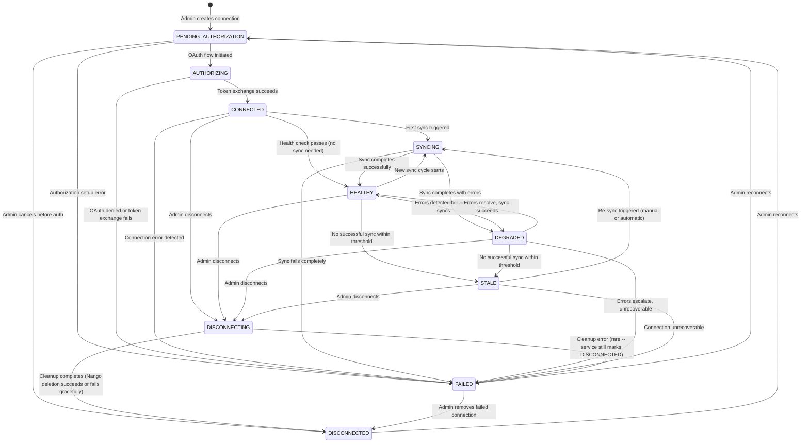
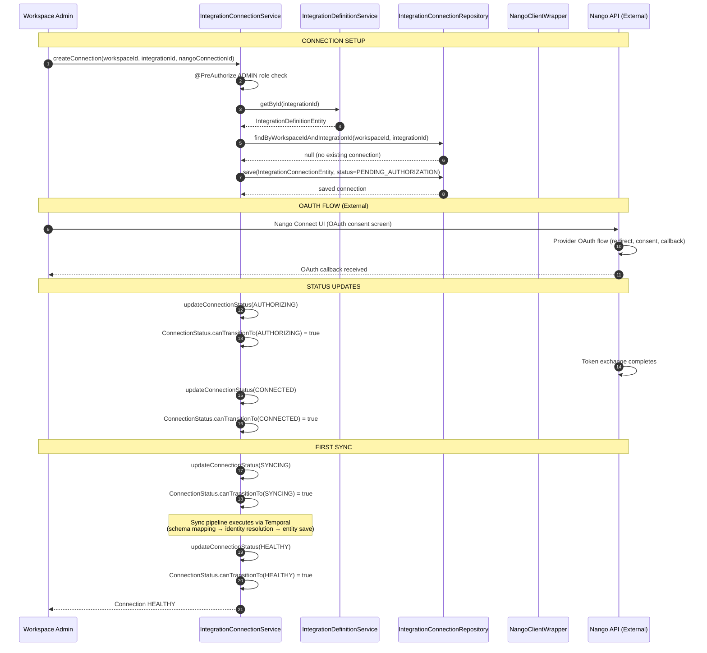
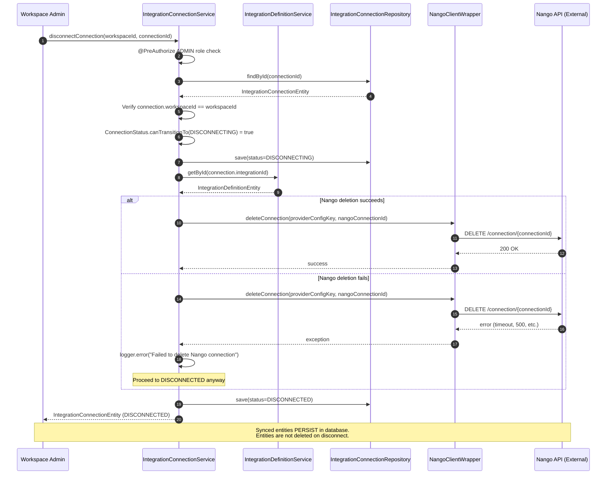

---
tags:
  - flow/user-facing
  - flow/planned
  - architecture/flow
Created: 2026-02-13
Domains:
  - "[[Integrations]]"
---
# Flow: Integration Connection Lifecycle

---

## Overview

The connection lifecycle manages how workspace admins connect third-party integrations via Nango OAuth, monitors connection health through sync operations, and handles disconnection with graceful cleanup. The lifecycle is governed by a 10-state machine encoded in the `ConnectionStatus` enum, with all transitions validated at the service layer by `IntegrationConnectionService`. This granular state model provides precise UX feedback -- users can see exactly what is happening with each connection at any moment.

**Business value:** Enables reliable, auditable integration connection management with clear visibility into connection health, graceful degradation on failures, and safe disconnect that preserves synced entity data.

---

## Trigger

**What initiates this flow:**

| Trigger Type | Source | Condition |
|---|---|---|
| Admin action | Workspace admin | Initiates connection setup for a third-party integration |
| OAuth callback | Nango | OAuth authorization completes (success or failure) |
| Sync event | Sync orchestration pipeline | Sync starts, completes, or fails -- updates connection health |
| Health monitor | Scheduled check or threshold detection | Connection becomes stale (no successful sync within configured threshold) or degrades (repeated errors) |
| Admin action | Workspace admin | Initiates disconnection of an existing connection |
| Reconnection | Workspace admin | Re-initiates authorization for a failed or disconnected connection |

**Entry Point:** [[IntegrationConnectionService]]

---

## Preconditions

- [ ] User is authenticated with valid workspace access and ADMIN role
- [ ] Integration definition exists in the global `integration_definitions` catalog
- [ ] Nango is configured (NANGO_SECRET_KEY environment variable set and non-blank)
- [ ] No existing connection for this integration in this workspace (for new connections; enforced by UNIQUE constraint on `workspace_id, integration_id`)

---

## Actors

| Actor | Role in Flow |
|---|---|
| Workspace Admin | Initiates connection setup and disconnection. Requires ADMIN workspace role. |
| IntegrationConnectionService | Manages connection lifecycle, enforces state machine transitions, coordinates with Nango |
| NangoClientWrapper | Communicates with Nango REST API for OAuth flows, connection queries, and deletion |
| IntegrationDefinitionService | Provides integration catalog metadata (provider key, capabilities, auth config) |
| ConnectionStatus enum | Encodes the 10-state machine with `canTransitionTo()` validation |

---

## Flow Steps

### Connection State Machine

The following state diagram shows all 10 states and their valid transitions as defined in `ConnectionStatus.canTransitionTo()`:

### State Transition Table

| Current State | Valid Transitions |
|---|---|
| PENDING_AUTHORIZATION | AUTHORIZING, FAILED, DISCONNECTED |
| AUTHORIZING | CONNECTED, FAILED |
| CONNECTED | SYNCING, HEALTHY, DISCONNECTING, FAILED |
| SYNCING | HEALTHY, DEGRADED, FAILED |
| HEALTHY | SYNCING, STALE, DEGRADED, DISCONNECTING |
| DEGRADED | HEALTHY, STALE, FAILED, DISCONNECTING |
| STALE | SYNCING, DISCONNECTING, FAILED |
| DISCONNECTING | DISCONNECTED, FAILED |
| DISCONNECTED | PENDING_AUTHORIZATION |
| FAILED | PENDING_AUTHORIZATION, DISCONNECTED |

Any transition not listed above is rejected by `ConnectionStatus.canTransitionTo()` and causes `IntegrationConnectionService.updateConnectionStatus()` to throw `InvalidStateTransitionException`.

---

### Happy Path: Connect

### Step-by-Step Breakdown

#### 1. Admin Creates Connection

- **Component:** [[IntegrationConnectionService]]
- **Action:** `createConnection(workspaceId, integrationId, nangoConnectionId)` validates admin role, verifies integration definition exists, checks no duplicate connection, creates entity with PENDING_AUTHORIZATION status.
- **Input:** workspaceId (UUID), integrationId (UUID from integration_definitions catalog), nangoConnectionId (string identifier from Nango)
- **Output:** `IntegrationConnectionEntity` with status PENDING_AUTHORIZATION
- **Side Effects:**
  - INSERT into `integration_connections` table
  - `@PreAuthorize` validates ADMIN role via `@workspaceSecurity.hasWorkspaceRole()`

#### 2. OAuth Flow (External)

- **Component:** Nango Connect UI / Nango API
- **Action:** Admin is directed to the provider's OAuth consent screen via Nango's connection flow. Nango handles the provider-specific OAuth redirect, consent capture, and callback.
- **Input:** Nango provider config key (from `IntegrationDefinitionEntity.nangoProviderKey`)
- **Output:** Nango callback with authorization result
- **Side Effects:** Nango stores the OAuth token and refresh token in its encrypted credential store

#### 3. Token Exchange and Connection Established

- **Component:** [[IntegrationConnectionService]]
- **Action:** Status transitions through AUTHORIZING to CONNECTED as the OAuth flow completes. Each transition is validated by `ConnectionStatus.canTransitionTo()`.
- **Input:** connectionId, new status
- **Output:** Updated `IntegrationConnectionEntity`
- **Side Effects:** UPDATE to `integration_connections.status` column

#### 4. First Sync

- **Component:** Sync orchestration pipeline (Temporal workflow)
- **Action:** Connection moves to SYNCING while the sync pipeline executes. On completion, transitions to HEALTHY (success) or DEGRADED/FAILED (errors).
- **Input:** Sync event from webhook or manual trigger
- **Output:** Updated connection status reflecting sync outcome
- **Side Effects:** Entity creation/updates via the sync pipeline (schema mapping, identity resolution, provenance tracking)

---

### Disconnect Path

#### Disconnect Design Decisions

- **ADMIN role required.** Only workspace administrators can disconnect integrations. This prevents accidental disconnection by regular members.
- **Graceful Nango failure handling.** If the Nango API call to delete the connection fails (timeout, 500, network error), the connection is still marked DISCONNECTED locally. The error is logged but does not block the disconnect operation. Rationale: the user's intent is clear (disconnect), and a Nango-side orphaned connection is harmless -- it will not send webhooks to an endpoint that no longer processes them.
- **Synced entities persist.** Disconnecting an integration does not delete entities that were synced from that integration. Those entities retain their provenance metadata (`source_type`, `source_integration_id`, `source_external_id`) and are marked as stale. This preserves data integrity and prevents accidental data loss.

---

### Reconnection Path

A DISCONNECTED or FAILED connection can be reconnected by transitioning back to PENDING_AUTHORIZATION:

1. Admin initiates reconnection for a DISCONNECTED or FAILED connection.
2. `ConnectionStatus.canTransitionTo(PENDING_AUTHORIZATION)` validates the transition (valid from both DISCONNECTED and FAILED states).
3. Connection status updates to PENDING_AUTHORIZATION.
4. OAuth flow re-initiates through Nango, following the same happy path as initial connection.
5. On successful reconnection, stale entities from the previous connection period get refreshed as new sync data arrives. Identity resolution re-runs on incoming data, matching to existing entities by provenance (`source_external_id`) or identity signals (email, phone).

---

## Failure Modes

### State Transition Failures

| Failure | Cause | Detection | User Experience | Recovery |
|---|---|---|---|---|
| Invalid state transition | Code attempts a transition not in `canTransitionTo()` | `InvalidStateTransitionException` thrown | 409 Conflict response | Fix calling code to respect state machine |
| Connection already exists | Duplicate `createConnection()` for same workspace + integration | `ConflictException` from UNIQUE constraint check | 409 Conflict ("Connection already exists for this integration in this workspace") | Use existing connection or disconnect first |

### OAuth Failures

| Failure | Cause | Detection | User Experience | Recovery |
|---|---|---|---|---|
| OAuth denied by user | User declines consent on provider's OAuth screen | Nango callback with error state | Connection stays PENDING_AUTHORIZATION or transitions to FAILED | Admin re-initiates connection |
| Token exchange fails | Provider returns error during token exchange | Status transitions to FAILED from AUTHORIZING | Connection marked FAILED | Admin retries (FAILED -> PENDING_AUTHORIZATION -> AUTHORIZING) |
| Provider OAuth endpoint down | External provider experiencing downtime | Nango reports connection failure | Connection transitions to FAILED | Wait for provider recovery, then reconnect |

### Sync Health Failures

| Failure | Cause | Detection | User Experience | Recovery |
|---|---|---|---|---|
| Sync fails | Schema mapping error, identity resolution failure, or entity save error | Temporal workflow reports failure | SYNCING -> FAILED | Fix underlying issue, re-sync |
| Sync degrades | Partial sync success with some record failures | Error count exceeds threshold during sync | SYNCING -> DEGRADED | Investigate failed records; DEGRADED -> HEALTHY once errors resolve |
| Connection goes stale | No successful sync within configured threshold | Scheduled health check or monitoring | HEALTHY/DEGRADED -> STALE | Trigger manual re-sync (STALE -> SYNCING) or investigate connection health |

### Nango API Failures

| Failure | Cause | Detection | User Experience | Recovery |
|---|---|---|---|---|
| Nango unavailable | Nango Cloud SaaS downtime | `NangoApiException` or connection timeout | Cannot create new connections; existing connections with valid tokens unaffected | Wait for Nango recovery |
| Rate limited | Too many API calls to Nango | 429 response -> `RateLimitException` | Delayed API response (retry with exponential backoff, 3 retries, 2s base) | Automatic retry; reduce API call frequency if persistent |
| Nango delete fails on disconnect | Network error or Nango API error during connection deletion | Exception caught in `disconnectConnection()` | Connection still marked DISCONNECTED locally; error logged | Nango-side connection may be orphaned; harmless since webhook endpoint stops processing |

---

## Security

- **ADMIN role required** for `createConnection()` and `disconnectConnection()`. Enforced via `@PreAuthorize("@workspaceSecurity.hasWorkspaceRole(#workspaceId, T(riven.core.enums.workspace.WorkspaceRoles).ADMIN)")`.
- **Read access** for `getConnectionsByWorkspace()` and `getConnection()` requires workspace membership. Enforced via `@PreAuthorize("@workspaceSecurity.hasWorkspace(#workspaceId)")`.
- **Status updates** (`updateConnectionStatus()`) require workspace membership. Typically called by internal services (sync pipeline, webhook handler) rather than directly by users.
- **All connections are workspace-scoped with RLS.** The `integration_connections` table has Row-Level Security policies matching the existing entity pattern: `workspace_id IN (SELECT workspace_id FROM workspace_members WHERE user_id = auth.uid())`. This ensures database-level tenant isolation even if application-level checks are bypassed.
- **Credentials never stored in the application database.** Only `nango_connection_id` (a string reference) is persisted. Actual OAuth tokens, refresh tokens, and API keys are stored and encrypted by Nango.
- **One connection per integration per workspace.** Enforced by UNIQUE constraint on `(workspace_id, integration_id)` in the `integration_connections` table. Prevents duplicate connections that could cause conflicting sync events.

---

## Components Involved

| Component | Role | Can Block Flow |
|---|---|---|
| [[IntegrationConnectionService]] | Manages connection lifecycle, enforces state transitions, coordinates disconnect with Nango | Yes (state transition validation, Nango API call on disconnect) |
| [[NangoClientWrapper]] | REST API client for Nango -- `getConnection()`, `listConnections()`, `deleteConnection()` | Yes (Nango API availability, rate limits) |
| [[IntegrationDefinitionService]] | Provides integration catalog metadata (provider key, capabilities) | Yes (NotFoundException if integration not in catalog) |
| ConnectionStatus enum | 10-state machine with `canTransitionTo()` validation | No (pure function, always returns boolean) |
| IntegrationConnectionRepository | JPA repository for `integration_connections` table | Yes (database availability) |
| IntegrationDefinitionRepository | JPA repository for `integration_definitions` table | Yes (database availability) |

---

## Related

- [[Integration Access Layer]]
- [[Entity Integration Sync]]
- [[ADR-001 Nango as Integration Infrastructure]]
- [[Integrations]]

---

## Gotchas & Tribal Knowledge

> [!warning] Nango Secret Key Runtime Validation
> `NangoClientWrapper` validates the secret key at call time via `ensureConfigured()`, not at application startup. This means the application will start successfully even without `NANGO_SECRET_KEY` configured. The first actual Nango API call (e.g., during `disconnectConnection()`) will fail with a clear error. This is intentional -- it allows existing deployments to run without Nango configured until integration features are enabled.

> [!warning] Disconnect Always Succeeds Locally
> `disconnectConnection()` catches and logs Nango API errors but still transitions to DISCONNECTED. This means a Nango-side connection may remain after a local disconnect. This is a deliberate design choice: the user's intent is to disconnect, and a Nango orphan is harmless (no webhook processing, no sync). If Nango cleanup is critical, a background reconciliation job could be added later.

> [!warning] State Machine Is Service-Layer Only
> The `ConnectionStatus.canTransitionTo()` validation is enforced in `IntegrationConnectionService.updateConnectionStatus()` but NOT at the database level. A direct database UPDATE bypassing the service layer could set an invalid status. The database `status` column uses a VARCHAR, not a CHECK constraint with transition rules. RLS provides tenant isolation, but state machine integrity depends on all updates going through the service.

> [!warning] Blocking WebClient Calls
> `NangoClientWrapper` uses `.block()` on Mono results because the application is servlet-based Spring MVC, not reactive. The WebClient is chosen for its retry/error handling capabilities. If the application migrates to reactive, these calls should switch to returning Mono directly.

---

## Changelog

| Date | Change | Reason |
|---|---|---|
| 2026-02-13 | Initial documentation | Phase 1 integration infrastructure |
