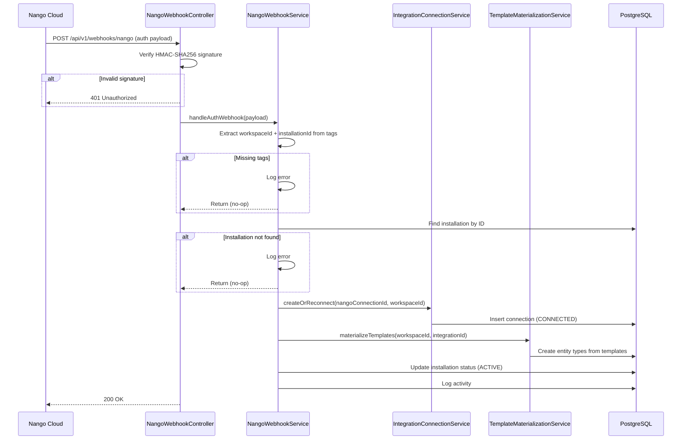
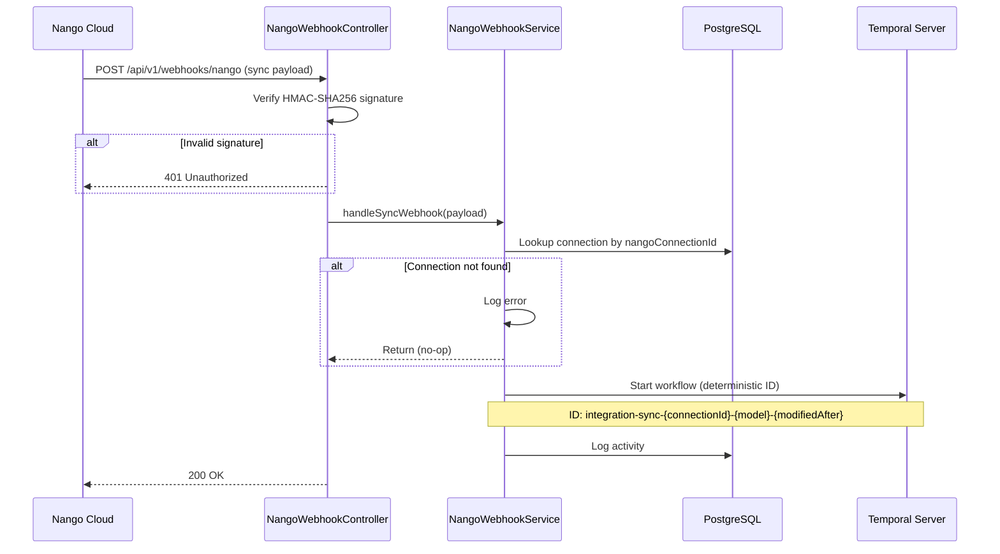
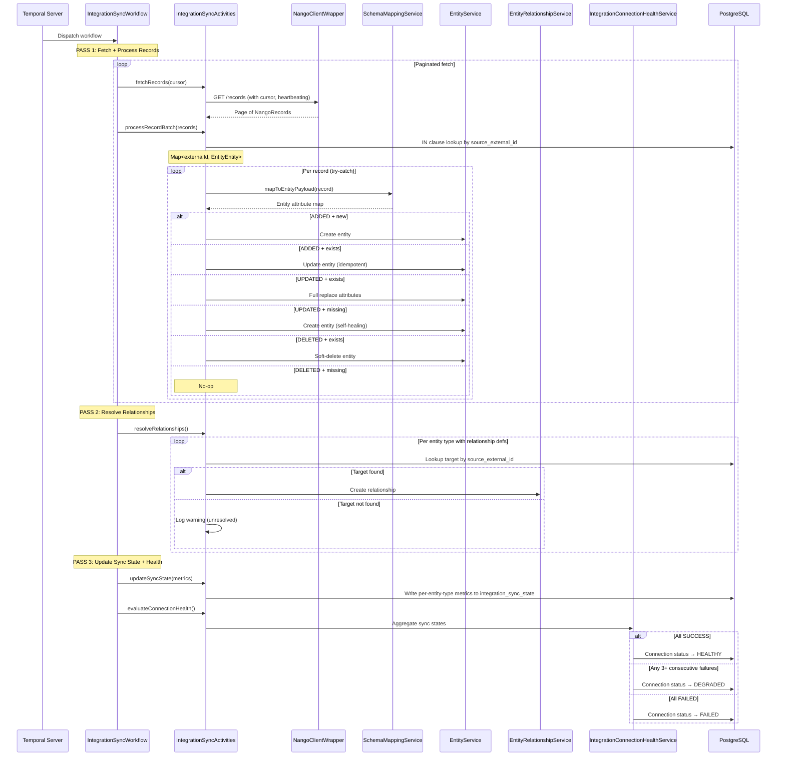

---
tags:
  - flow/background
  - architecture/flow
Created: 2026-03-16
Domains:
  - "[[riven/docs/system-design/domains/Integrations/Integrations]]"
  - "[[riven/docs/system-design/domains/Entities/Entities]]"
---
# Flow: Integration Data Sync Pipeline

---

## Overview

The Integration Data Sync Pipeline is the end-to-end flow that ingests external SaaS data into the Riven entity ecosystem. It crosses 5 boundaries: Nango Cloud sends webhooks to the NangoWebhookController, which verifies HMAC signatures and delegates to NangoWebhookService. For sync events, the service dispatches a Temporal workflow (IntegrationSyncWorkflow) that orchestrates a 3-pass pipeline: paginated record fetching with schema mapping and batch dedup (Pass 1), relationship resolution between synced entities (Pass 2), and sync state persistence with connection health aggregation (Pass 3). Auth webhooks bypass Temporal entirely, creating connections synchronously and triggering template materialization.

**Business value:** Enables automatic, reliable syncing of third-party tool data into workspace entities with per-record error isolation, idempotent processing, and health visibility -- users see their external data appear as entities without manual intervention, and connection health reflects the true state of each sync.

---

## Trigger

**What initiates this flow:**

| Trigger Type | Source | Condition |
|---|---|---|
| Sync webhook | Nango Cloud | Sync script completes (INITIAL or INCREMENTAL) |
| Auth webhook | Nango Cloud | OAuth authorization completes successfully |

**Entry Points:** NangoWebhookController (webhook ingestion), NangoWebhookService (dispatch)

---

## Preconditions

- [ ] Nango configured with webhook URL pointing to `/api/v1/webhooks/nango`
- [ ] HMAC secret key configured in `NangoConfigurationProperties`
- [ ] Temporal worker registered on `integration.sync` queue
- [ ] Integration connection exists (for sync webhooks)
- [ ] Installation exists in PENDING_CONNECTION state (for auth webhooks)

---

## Actors

| Actor | Role in Flow |
|---|---|
| Nango Cloud | Sends webhook notifications for auth and sync events |
| NangoWebhookController | Verifies HMAC signature, parses payload type, delegates to service |
| NangoWebhookService | Routes auth/sync events to appropriate handlers |
| IntegrationConnectionService | Creates/updates connection entities |
| TemplateMaterializationService | Creates workspace entity types from integration templates |
| Temporal Server | Schedules and manages sync workflow execution |
| IntegrationSyncWorkflow | Orchestrates the 3-pass sync pipeline |
| IntegrationSyncActivities | Executes individual sync steps (fetch, process, resolve, update health) |
| NangoClientWrapper | Fetches records from Nango REST API |
| SchemaMappingService | Transforms external JSON to entity attribute payloads |
| EntityService | Creates/updates/soft-deletes entities |
| EntityRelationshipService | Creates relationships between synced entities |
| IntegrationConnectionHealthService | Aggregates sync state into connection health status |

---

## Flow Steps

### Path 1: Auth Webhook (Connection Creation)

**Step-by-step:**
1. Nango sends auth webhook to `/api/v1/webhooks/nango` after successful OAuth
2. Controller verifies HMAC-SHA256 signature; returns 401 if invalid
3. Controller parses payload as auth type and delegates to NangoWebhookService
4. Service extracts `workspaceId` and `installationId` from Nango connection tags
5. If tags are missing, logs error and returns (200 still sent to Nango)
6. Service looks up installation by ID; if not found, logs error and returns
7. IntegrationConnectionService creates connection in CONNECTED state (or reconnects existing)
8. TemplateMaterializationService creates workspace entity types from integration templates
9. Installation status updated to ACTIVE
10. Activity logged; 200 returned to Nango

### Path 2: Sync Webhook (Workflow Dispatch)

**Step-by-step:**
1. Nango sends sync webhook after sync script completes (INITIAL or INCREMENTAL)
2. Controller verifies HMAC-SHA256 signature; returns 401 if invalid
3. Controller parses payload as sync type and delegates to NangoWebhookService
4. Service looks up connection by `nangoConnectionId`; if not found, logs error and returns
5. Service starts Temporal workflow with deterministic ID (`integration-sync-{connectionId}-{syncModel}-{modifiedAfter}`) to prevent duplicate processing from Nango's at-least-once delivery
6. Activity logged; 200 returned to Nango immediately (processing is async)

### Path 3: Sync Workflow Execution (Main Pipeline)

**Step-by-step:**

**Pass 1 -- Fetch and Process Records:**
1. Temporal dispatches the IntegrationSyncWorkflow
2. Workflow calls `fetchRecords` activity with cursor-based pagination, heartbeating on each page
3. For each page, workflow calls `processRecordBatch` activity
4. Batch dedup: IN clause query on `source_external_id` returns `Map<String, EntityEntity>` of existing entities
5. Per record (wrapped in try-catch for error isolation):
   - SchemaMappingService transforms external JSON to entity attribute payload
   - ADDED + new entity: create via EntityService
   - ADDED + entity exists: update (idempotent handling of Nango replays)
   - UPDATED + entity exists: full-replace attributes (integration entities are readonly)
   - UPDATED + entity missing: create (self-healing for missed initial sync)
   - DELETED + entity exists: soft-delete via EntityService
   - DELETED + entity missing: no-op (already deleted or never synced)

**Pass 2 -- Resolve Relationships:**
6. For each entity type that has relationship definitions in its integration template
7. Lookup target entity by `source_external_id` from the relationship field
8. If target found: create relationship via EntityRelationshipService
9. If target not found: log warning as unresolved (will resolve on next sync if target arrives)

**Pass 3 -- Update Sync State and Health:**
10. Write per-entity-type sync metrics (records processed, errors, timestamps) to `integration_sync_state`
11. IntegrationConnectionHealthService evaluates connection health from all sync states:
    - All entity types synced successfully: HEALTHY
    - Any entity type with 3+ consecutive failures: DEGRADED
    - All entity types failed: FAILED

---

## Data Transformations

| Step | Input Shape | Output Shape | Transformation |
|---|---|---|---|
| HMAC Verification | Raw request body + `X-Nango-Signature` header | Boolean | HMAC-SHA256 comparison against configured secret key |
| Webhook Parsing | JSON payload | NangoAuthWebhookPayload or NangoSyncWebhookPayload | Jackson deserialization + type discrimination on `type` field |
| Record Fetch | Nango API response (paginated) | List\<NangoRecord\> | HTTP GET with cursor pagination and activity heartbeating |
| Schema Mapping | NangoRecord JSON payload | Entity attribute map (Map\<String, Any?\>) | SchemaMappingService field transformation using declarative mapping definitions |
| Batch Dedup | List\<source_external_id\> | Map\<String, EntityEntity\> | IN clause query + `associateBy { it.sourceExternalId }` |
| Health Aggregation | List\<IntegrationSyncState\> | ConnectionStatus | Rule-based evaluation (all success, partial failure, total failure) |

---

## Failure Modes

### Webhook Failures

| Failure | Cause | Detection | User Experience | Recovery |
|---|---|---|---|---|
| Invalid HMAC | Wrong secret key or tampered payload | Signature mismatch | 401 Unauthorized | Fix secret key configuration |
| Missing tags on auth webhook | Nango connection metadata misconfiguration | Tags null check in service | 200 returned, error logged server-side | Fix Nango connection tags |
| Installation not found | Race condition or data issue | Repository lookup returns null | 200 returned, error logged server-side | Re-enable integration |
| Connection not found (sync) | Connection deleted between webhook send and receive | Repository lookup returns null | 200 returned, error logged server-side | Re-enable integration |

### Workflow Failures

| Failure | Cause | Detection | User Experience | Recovery |
|---|---|---|---|---|
| Nango API unavailable | Nango Cloud outage | fetchRecords activity fails | Temporal retries (3 attempts, 30s initial, 2x backoff) | Automatic retry; manual re-sync after outage |
| Nango rate limit (429) | Too many API calls | NangoClientWrapper retry logic | Automatic backoff | Built-in retry with exponential backoff |
| Schema mapping error | External schema changed | SchemaMappingService throws | Per-record error in batch result | Update schema mapping definitions |
| Single record processing error | Bad data in one record | Per-record try-catch | Other records still processed; error counted in sync state | Fix data, next sync retries |
| Relationship target not found | Target entity not yet synced | Lookup returns null | Logged as unresolved in result | Will resolve on next sync if target arrives |
| Workflow timeout | Extremely large dataset | Temporal timeout detection | Workflow marked failed | Increase timeout, paginate smaller batches |

### Partial Completion

| Scenario | State After Failure | Cleanup Required | Retry Safe |
|---|---|---|---|
| Failure after Pass 1, before Pass 2 | Entities upserted, no relationships | None -- relationships resolve on next sync | Yes |
| Failure mid-batch in Pass 1 | Partial entity upserts committed | None -- each entity save is independent | Yes (idempotent) |
| Failure in Pass 3 (health update) | Entities + relationships saved, stale health | None -- next sync updates health | Yes |

---

## Security Considerations

- HMAC-SHA256 signature verification on all webhook requests using `NangoConfigurationProperties.secretKey`
- No authentication required on webhook endpoint (HMAC replaces JWT -- Nango cannot authenticate as a user)
- Webhook handler returns 200 for all processed requests (even errors) to prevent Nango from retrying successfully received webhooks
- Temporal workflow runs with system-level access (no user JWT context) -- workspace authorization is implicit via the connection's `workspace_id`
- All entity mutations go through EntityService which enforces workspace scoping

---

## Components Involved

| Component | Role | Can Block Flow |
|---|---|---|
| NangoWebhookController | HMAC verification + delegation | Yes (signature failure returns 401) |
| NangoWebhookService | Routes auth/sync events to handlers | No (dispatches asynchronously for sync) |
| IntegrationConnectionService | Connection CRUD | Yes (database) |
| TemplateMaterializationService | Entity type creation from templates | Yes (database, schema validation) |
| Temporal Server | Workflow scheduling and management | Yes (Temporal availability) |
| IntegrationSyncWorkflow | Pipeline orchestration | No (orchestrator only) |
| IntegrationSyncActivities | Step execution | Yes (Nango API, database) |
| NangoClientWrapper | Nango API client | Yes (Nango availability, rate limits) |
| SchemaMappingService | Payload transformation | No (pure transformation) |
| EntityService | Entity persistence | Yes (database) |
| EntityRelationshipService | Relationship persistence | Yes (database) |
| IntegrationConnectionHealthService | Health evaluation | Yes (database) |

---

## Related

- [[2. Areas/2.1 Startup & Content/Riven/2. System Design/flows/Integration Connection Lifecycle]]
- [[riven/docs/system-design/feature-design/_Sub-Domain Plans/Entity Integration Sync]]
- [[2. Areas/2.1 Startup & Content/Riven/2. System Design/flows/Integration Data Sync Pipeline]]
- [[riven/docs/system-design/decisions/ADR-008 Temporal for Integration Sync Orchestration]]
- [[riven/docs/system-design/decisions/ADR-009 Unique Index Deduplication over Mapping Table]]
- [[riven/docs/system-design/decisions/ADR-010 Webhook-Driven Connection Creation]]
- [[riven/docs/system-design/decisions/ADR-001 Nango as Integration Infrastructure]]

---

## Gotchas & Tribal Knowledge

> [!warning] Nango HMAC uses secretKey, not webhookSecret
> Nango uses the main API secret key for webhook HMAC signatures, not a separate webhook secret. The `NangoConfigurationProperties.webhookSecret` property is unused and should be removed.

> [!warning] Webhook must always return 200
> Even on processing errors (missing tags, connection not found), return 200 to prevent Nango from retrying. Only return 401 for HMAC failures.

> [!warning] Deterministic workflow ID is critical
> Without it, Nango's at-least-once delivery would start duplicate workflows. The format `integration-sync-{connectionId}-{syncModel}-{modifiedAfter}` must be deterministic across retries.

> [!warning] Two-pass relationship resolution assumes same-integration targets
> Pass 2 only resolves relationships between entities from the same integration. Cross-integration relationships are not supported in v1.

> [!warning] Per-record error isolation
> The try-catch wraps individual record processing, not the entire batch. This is critical: one malformed record must not fail thousands of valid records.

---

## Changelog

| Date | Author | Change |
|------|--------|--------|
| 2026-03-16 | Claude | Initial version documenting the full sync pipeline flow |
