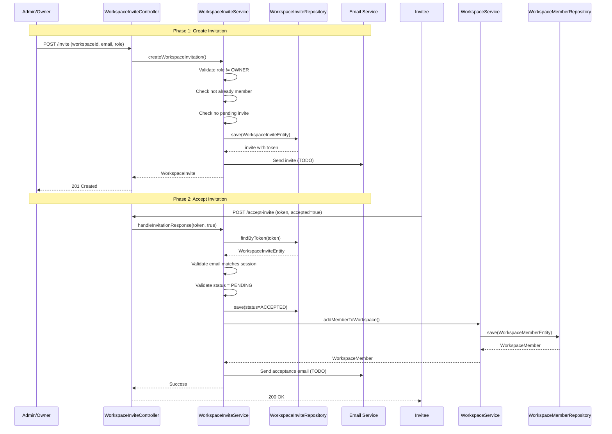

---
tags:
  - flow/user-facing
  - architecture/flow
Domains:
  - "[[Workspaces & Users]]"
Created: 2026-02-09
Updated: 2026-02-09
---
# Flow: Invitation Acceptance

## Overview

Workspace invitation flow enabling admins/owners to invite users by email, generating secure tokens, and allowing invitees to accept and join as workspace members.

---

## Trigger

Admin or Owner initiates workspace invitation via REST API.

**Entry Point:** [[WorkspaceController]] → `POST /api/v1/workspace/{workspaceId}/invite`

---

## Steps

### Create Invitation (Team Management)

1. **[[WorkspaceInviteService]]** — Validates request (role not OWNER, email not already member, no pending invite exists)
2. **[[WorkspaceInviteService]]** — Creates `WorkspaceInviteEntity` with PENDING status and secure token
3. **[[WorkspaceInviteService]]** — Logs `WORKSPACE_MEMBER_INVITE` activity via [[ActivityService]]
4. **[[WorkspaceInviteService]]** — Returns invite model (email sending marked TODO)

### Accept Invitation (Team Management → Workspace Management)

5. **[[WorkspaceInviteService]]** — Validates token exists and invitation is PENDING
6. **[[WorkspaceInviteService]]** — Validates authenticated user email matches invitation email
7. **[[WorkspaceInviteService]]** — Updates invite status to ACCEPTED
8. **[[WorkspaceService]]** — Creates `WorkspaceMemberEntity` with invited role
9. **[[WorkspaceService]]** — Persists workspace membership

---

## Failure Modes

| What Fails | User Sees | Recovery |
|---|---|---|
| Role = OWNER | 400 "Cannot create invite with Owner role" | Use transfer ownership methods |
| Email already member | 409 "User already member of workspace" | Remove member first or skip invite |
| Pending invite exists | 400 "Invitation already exists" | Revoke old invite or wait for acceptance |
| Token invalid/expired | 404 Not Found | Request new invitation |
| Invite not PENDING | 400 "Cannot respond to non-pending invite" | Check invite status, request new if needed |
| Email mismatch | 403 "Email does not match invite" | Authenticate as invited user |

---

## Components Involved

**Team Management Subdomain:**
- [[WorkspaceInviteService]] — Create, validate, accept/decline invitations
- [[WorkspaceInviteRepository]] — Persist invitation records with tokens
- [[WorkspaceInviteController]] — REST API endpoints for invitation operations

**Workspace Management Subdomain:**
- [[WorkspaceService]] — Add member to workspace upon acceptance
- [[WorkspaceMemberRepository]] — Persist workspace membership

**User Management Subdomain:**
- [[UserService]] — Retrieve user details (indirectly via [[AuthTokenService]])

**Cross-cutting:**
- [[ActivityService]] — Log invitation and membership events
- [[AuthTokenService]] — Extract authenticated user email/ID

---

## Gotchas

**Email service integration incomplete:**
- Email sending marked as TODO in both create and accept flows
- Invitations created but not delivered automatically
- Production deployment requires SMTP/email service configuration

**Token security:**
- Tokens generated automatically on invite creation
- No explicit expiration mechanism documented in code
- Consider implementing token expiration for production

**Workspace isolation:**
- PreAuthorize checks enforce workspace membership requirements
- Admin role required to create invitations (line 45 in WorkspaceInviteService)

**Decline flow:**
- Setting `accepted=false` marks invite as DECLINED
- Does not create workspace membership
- Original implementation includes decline handling (lines 150-157)

---

## Related

- [[Team Management]] — Parent subdomain containing invitation logic
- [[WorkspaceSecurity]] — Authorization enforcement for workspace operations
- [[Workspace Management]] — Membership management after acceptance
