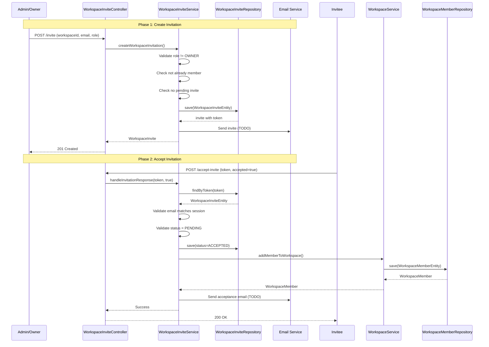

---
tags:
  - flow/user-facing
  - architecture/flow
Created: 2026-02-09
Updated: 2026-02-09
Critical: false
Domains:
  - "[[riven/docs/system-design/domains/Workspaces & Users/Workspaces & Users]]"
---
# Flow: Invitation Acceptance

## Overview

Workspace invitation flow enabling admins/owners to invite users by email, generating secure tokens, and allowing invitees to accept and join as workspace members.

---

## Trigger

Admin or Owner initiates workspace invitation via REST API.

**Entry Point:** [[riven/docs/system-design/domains/Workspaces & Users/Workspace Management/WorkspaceController]] → `POST /api/v1/workspace/{workspaceId}/invite`

---

## Steps

```mermaid
sequenceDiagram
    participant Admin as Admin/Owner
    participant WIC as WorkspaceInviteController
    participant WIS as WorkspaceInviteService
    participant WIR as WorkspaceInviteRepository
    participant Email as Email Service

    Note over Admin,Email: Phase 1: Create Invitation

    Admin->>WIC: POST /invite (workspaceId, email, role)
    WIC->>WIS: createWorkspaceInvitation()
    WIS->>WIS: Validate role != OWNER
    WIS->>WIS: Check not already member
    WIS->>WIS: Check no pending invite
    WIS->>WIR: save(WorkspaceInviteEntity)
    WIR-->>WIS: invite with token
    WIS->>Email: Send invite (TODO)
    WIS-->>WIC: WorkspaceInvite
    WIC-->>Admin: 201 Created

    Note over Admin,Email: Phase 2: Accept Invitation

    participant Invitee as Invitee
    participant WS as WorkspaceService
    participant WMR as WorkspaceMemberRepository

    Invitee->>WIC: POST /accept-invite (token, accepted=true)
    WIC->>WIS: handleInvitationResponse(token, true)
    WIS->>WIR: findByToken(token)
    WIR-->>WIS: WorkspaceInviteEntity
    WIS->>WIS: Validate email matches session
    WIS->>WIS: Validate status = PENDING
    WIS->>WIR: save(status=ACCEPTED)
    WIS->>WS: addMemberToWorkspace()
    WS->>WMR: save(WorkspaceMemberEntity)
    WMR-->>WS: WorkspaceMember
    WS-->>WIS: WorkspaceMember
    WIS->>Email: Send acceptance email (TODO)
    WIS-->>WIC: Success
    WIC-->>Invitee: 200 OK
```

### Create Invitation (Team Management)

1. **[[riven/docs/system-design/domains/Workspaces & Users/Team Management/WorkspaceInviteService]]** — Validates request (role not OWNER, email not already member, no pending invite exists)
2. **[[riven/docs/system-design/domains/Workspaces & Users/Team Management/WorkspaceInviteService]]** — Creates `WorkspaceInviteEntity` with PENDING status and secure token
3. **[[riven/docs/system-design/domains/Workspaces & Users/Team Management/WorkspaceInviteService]]** — Logs `WORKSPACE_MEMBER_INVITE` activity via [[riven/docs/system-design/domains/Workspaces & Users/User Management/ActivityService]]
4. **[[riven/docs/system-design/domains/Workspaces & Users/Team Management/WorkspaceInviteService]]** — Returns invite model (email sending marked TODO)

### Accept Invitation (Team Management → Workspace Management)

5. **[[riven/docs/system-design/domains/Workspaces & Users/Team Management/WorkspaceInviteService]]** — Validates token exists and invitation is PENDING
6. **[[riven/docs/system-design/domains/Workspaces & Users/Team Management/WorkspaceInviteService]]** — Validates authenticated user email matches invitation email
7. **[[riven/docs/system-design/domains/Workspaces & Users/Team Management/WorkspaceInviteService]]** — Updates invite status to ACCEPTED
8. **[[riven/docs/system-design/domains/Workspaces & Users/Workspace Management/WorkspaceService]]** — Creates `WorkspaceMemberEntity` with invited role
9. **[[riven/docs/system-design/domains/Workspaces & Users/Workspace Management/WorkspaceService]]** — Persists workspace membership

---

## Failure Modes

| What Fails | User Sees | Recovery |
|---|---|---|
| Role = OWNER | 400 "Cannot create invite with Owner role" | Use transfer ownership methods |
| Email already member | 409 "User already member of workspace" | Remove member first or skip invite |
| Pending invite exists | 400 "Invitation already exists" | Revoke old invite or wait for acceptance |
| Token invalid/expired | 404 Not Found | Request new invitation |
| Invite not PENDING | 400 "Cannot respond to non-pending invite" | Check invite status, request new if needed |
| Email mismatch | 403 "Email does not match invite" | Authenticate as invited user |

---

## Components Involved

**Team Management Subdomain:**
- [[riven/docs/system-design/domains/Workspaces & Users/Team Management/WorkspaceInviteService]] — Create, validate, accept/decline invitations
- [[riven/docs/system-design/domains/Workspaces & Users/Workspace Management/WorkspaceInviteRepository]] — Persist invitation records with tokens
- [[riven/docs/system-design/domains/Workspaces & Users/Workspace Management/WorkspaceInviteController]] — REST API endpoints for invitation operations

**Workspace Management Subdomain:**
- [[riven/docs/system-design/domains/Workspaces & Users/Workspace Management/WorkspaceService]] — Add member to workspace upon acceptance
- [[riven/docs/system-design/domains/Workspaces & Users/Workspace Management/WorkspaceMemberRepository]] — Persist workspace membership

**User Management Subdomain:**
- [[riven/docs/system-design/domains/Workspaces & Users/User Management/UserService]] — Retrieve user details (indirectly via [[riven/docs/system-design/domains/Workspaces & Users/Auth & Authorization/AuthTokenService]])

**Cross-cutting:**
- [[riven/docs/system-design/domains/Workspaces & Users/User Management/ActivityService]] — Log invitation and membership events
- [[riven/docs/system-design/domains/Workspaces & Users/Auth & Authorization/AuthTokenService]] — Extract authenticated user email/ID

---

## Gotchas

**Email service integration incomplete:**
- Email sending marked as TODO in both create and accept flows
- Invitations created but not delivered automatically
- Production deployment requires SMTP/email service configuration

**Token security:**
- Tokens generated automatically on invite creation
- No explicit expiration mechanism documented in code
- Consider implementing token expiration for production

**Workspace isolation:**
- PreAuthorize checks enforce workspace membership requirements
- Admin role required to create invitations (line 45 in WorkspaceInviteService)

**Decline flow:**
- Setting `accepted=false` marks invite as DECLINED
- Does not create workspace membership
- Original implementation includes decline handling (lines 150-157)

---

## Related

- [[riven/docs/system-design/domains/Workspaces & Users/Team Management/Team Management]] — Parent subdomain containing invitation logic
- [[riven/docs/system-design/domains/Workspaces & Users/Auth & Authorization/WorkspaceSecurity]] — Authorization enforcement for workspace operations
- [[riven/docs/system-design/domains/Workspaces & Users/Workspace Management/Workspace Management]] — Membership management after acceptance
