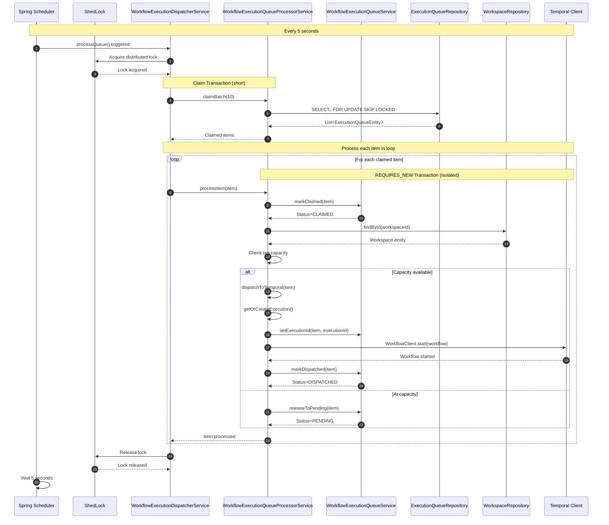

---
tags:
  - flow/scheduled
  - flow/background
  - architecture/flow
Created: 2026-02-09
Updated: 2026-02-09
Critical: true
Domains:
  - "[[Workflows]]"
---
# Flow: Queue Processing

---

## Overview

The Queue Processing flow is a scheduled background process that continuously polls the workflow execution queue and dispatches pending executions to Temporal. It bridges the gap between API enqueue requests and actual workflow execution, handling workspace capacity limits, distributed locking across instances, retry logic, and stale execution recovery.

---

## Trigger

**What initiates this flow:**

|Trigger Type|Source|Condition|
|---|---|---|
|Schedule|Spring @Scheduled|Every 5 seconds (fixed delay)|

**Entry Point:** [[WorkflowExecutionDispatcherService]].processQueue()

**Stale Recovery Entry Point:** [[WorkflowExecutionDispatcherService]].recoverStaleItems() (every 60 seconds)

---

## Preconditions

_What must be true before this flow can execute?_

- [x] Workflow engine enabled (`riven.workflow.engine.enabled=true`)
- [x] ShedLock table exists in database for distributed locking
- [x] Temporal cluster is running and accessible
- [x] At least one workflow execution is enqueued (status=PENDING)
- [x] Database connection pool has available connections

---

## Actors

|Actor|Role in Flow|
|---|---|
|Spring Scheduler|Triggers processQueue() every 5 seconds|
|ShedLock|Provides distributed lock across multiple app instances|
|[[WorkflowExecutionDispatcherService]]|Orchestrates batch processing loop|
|[[WorkflowExecutionQueueProcessorService]]|Claims batches and processes individual items|
|[[WorkflowExecutionQueueService]]|Manages queue state transitions|
|Temporal WorkflowClient|Starts workflow executions|
|PostgreSQL|Stores queue items with FOR UPDATE SKIP LOCKED|

---

## Flow Steps

### Happy Path



### Step-by-Step Breakdown

#### 1. Schedule Trigger

- **Component:** Spring Scheduler
- **Action:** Invokes processQueue() after fixed 5-second delay from previous execution
- **Input:** None (scheduled trigger)
- **Output:** Method invocation on [[WorkflowExecutionDispatcherService]]
- **Side Effects:** None

#### 2. Acquire Distributed Lock

- **Component:** ShedLock
- **Action:** Attempt to acquire lock named "processExecutionQueue"
- **Input:** Lock configuration (lockAtMostFor=4m, lockAtLeastFor=10s)
- **Output:** Lock granted or denied
- **Side Effects:** Inserts/updates row in `shedlock` table

**Lock behavior:**
- If lock unavailable (another instance holds it): Skip this execution, retry in 5 seconds
- If lock acquired: Proceed to batch claiming
- Lock automatically released when method completes (or after lockAtMostFor timeout)

#### 3. Claim Batch (Short Transaction)

- **Component:** [[WorkflowExecutionQueueProcessorService]].claimBatch()
- **Action:** Execute `SELECT...FOR UPDATE SKIP LOCKED` query to claim pending items
- **Input:** Batch size (constant: 10)
- **Output:** List of up to 10 ExecutionQueueEntity (status=PENDING)
- **Side Effects:** Locks claimed rows in database until transaction commits

**Query:**
```sql
SELECT * FROM workflow_execution_queue
WHERE status = 'PENDING'
ORDER BY created_at ASC
LIMIT 10
FOR UPDATE SKIP LOCKED
```

**Transaction boundary:** @Transactional method commits immediately, releasing row locks before processing begins.

#### 4. Early Return Check

- **Component:** [[WorkflowExecutionDispatcherService]]
- **Action:** Check if claimed batch is empty
- **Input:** Claimed items list
- **Output:** Return early if empty, continue if items found
- **Side Effects:** None

If queue empty: Release lock and wait for next scheduled execution.

#### 5. Process Each Item (Loop)

For each claimed item, [[WorkflowExecutionDispatcherService]] calls [[WorkflowExecutionQueueProcessorService]].processItem(). Each iteration runs in an **independent REQUIRES_NEW transaction**.

##### 5a. Mark Claimed

- **Component:** [[WorkflowExecutionQueueService]].markClaimed()
- **Action:** Update item status to CLAIMED, record claimedAt timestamp
- **Input:** ExecutionQueueEntity
- **Output:** Updated entity with status=CLAIMED
- **Side Effects:** Database write

##### 5b. Load Workspace and Check Capacity

- **Component:** [[WorkflowExecutionQueueProcessorService]]
- **Action:** Load workspace entity, derive tier, count active executions
- **Input:** item.workspaceId
- **Output:** Workspace entity, active execution count
- **Side Effects:** Database reads

**Capacity check:**
```kotlin
val tier = WorkspaceTier.fromPlan(workspace.plan)
val activeCount = workflowExecutionRepository.countActiveByWorkspace(workspaceId)

if (activeCount >= tier.maxConcurrentWorkflows) {
    // At capacity - release back to pending
}
```

**Tier limits:**
- FREE: 1 concurrent execution
- PRO: 5 concurrent executions
- ENTERPRISE: 20 concurrent executions

##### 5c. Branch: At Capacity

- **Component:** [[WorkflowExecutionQueueService]].releaseToPending()
- **Action:** Reset status to PENDING, increment attemptCount, clear claimedAt
- **Input:** ExecutionQueueEntity
- **Output:** Updated entity with status=PENDING
- **Side Effects:** Database write, item will be retried on next polling cycle

**Purpose:** Defer execution until workspace capacity becomes available (another execution completes).

##### 5d. Branch: Capacity Available - Dispatch

- **Component:** [[WorkflowExecutionQueueProcessorService]].dispatchToTemporal()
- **Action:** Create/reuse execution entity, start Temporal workflow
- **Input:** ExecutionQueueEntity
- **Output:** Temporal workflow started
- **Side Effects:** Database writes (execution entity), Temporal workflow created

**Dispatch steps:**

1. Load workflow definition and version
2. Extract node IDs from workflow graph
3. **Get or create WorkflowExecutionEntity:**
   - If item.executionId set (retry): Load existing, update status to RUNNING
   - Otherwise: Create new execution entity with status=RUNNING
4. **Persist execution ID to queue item BEFORE starting Temporal** (ensures retry can reuse)
5. Start Temporal workflow with WorkflowExecutionInput
6. Mark queue item as DISPATCHED

##### 5e. Mark Dispatched

- **Component:** [[WorkflowExecutionQueueService]].markDispatched()
- **Action:** Update item status to DISPATCHED, record dispatchedAt timestamp
- **Input:** ExecutionQueueEntity
- **Output:** Updated entity with status=DISPATCHED
- **Side Effects:** Database write

**Result:** Item removed from processing queue, workflow now running in Temporal.

#### 6. Release Lock

- **Component:** ShedLock
- **Action:** Automatically release "processExecutionQueue" lock when processQueue() method returns
- **Input:** None
- **Output:** Lock released
- **Side Effects:** Updates `shedlock` table, allows other instances to acquire lock

#### 7. Wait for Next Schedule

- **Component:** Spring Scheduler
- **Action:** Wait 5 seconds (fixedDelay) before next processQueue() invocation
- **Input:** None
- **Output:** Next scheduled trigger
- **Side Effects:** None

---

## Data Transformations

|Step|Input Shape|Output Shape|Transformation|
|---|---|---|---|
|claimBatch|None|List\<ExecutionQueueEntity\>|Database query with SKIP LOCKED|
|markClaimed|ExecutionQueueEntity (status=PENDING)|ExecutionQueueEntity (status=CLAIMED)|Status transition + timestamp|
|Capacity check|workspaceId|activeCount: Int, tier.maxConcurrent: Int|Query active executions, derive tier limit|
|getOrCreateExecution|ExecutionQueueEntity|WorkflowExecutionEntity|Create new or load existing execution|
|Temporal start|WorkflowExecutionInput|Temporal workflow ID|Start async workflow in Temporal|
|markDispatched|ExecutionQueueEntity (status=CLAIMED)|ExecutionQueueEntity (status=DISPATCHED)|Status transition + timestamp|

---

## Failure Modes

### Failure Point: Lock Acquisition

|Failure|Cause|Detection|User Experience|Recovery|
|---|---|---|---|---|
|Lock unavailable|Another instance holds lock|ShedLock returns false|No impact (transparent)|Skip execution, retry in 5 seconds|
|ShedLock table missing|Database schema issue|Exception during lock acquisition|Workflow executions not dispatched|Create shedlock table, restart app|
|Database connection failure|Network/DB down|Connection exception|Workflow executions delayed|Spring scheduler retries on next interval|

### Failure Point: Batch Claiming

|Failure|Cause|Detection|User Experience|Recovery|
|---|---|---|---|---|
|Database query failure|DB connection lost|SQLException|Items not claimed, remain PENDING|Retry on next scheduled execution|
|Lock contention|High concurrency|SKIP LOCKED returns empty|No impact (other instance processing)|Next polling cycle claims different items|

### Failure Point: Workspace Not Found

|Failure|Cause|Detection|User Experience|Recovery|
|---|---|---|---|---|
|Workspace deleted|Race condition|workspaceRepository.findById() returns null|Workflow never executes|Mark queue item as FAILED (permanent)|

### Failure Point: Workflow Definition Not Found

|Failure|Cause|Detection|User Experience|Recovery|
|---|---|---|---|---|
|Definition deleted|Race condition|workflowDefinitionRepository.findById() returns null|Workflow never executes|Mark queue item as FAILED (permanent)|

### Failure Point: Temporal Dispatch

|Failure|Cause|Detection|User Experience|Recovery|
|---|---|---|---|---|
|Temporal cluster down|Network/service outage|WorkflowClient.start() throws exception|Workflow execution delayed|Delete execution entity, release to PENDING for retry|
|Invalid workflow ID|Implementation bug|Exception during start|Workflow never executes|Release to PENDING, fail after MAX_ATTEMPTS (3)|
|Temporal configuration error|Missing task queue|Exception during start|Workflow never executes|Release to PENDING, fail after MAX_ATTEMPTS (3)|

### Failure Point: Max Attempts Exceeded

|Failure|Cause|Detection|User Experience|Recovery|
|---|---|---|---|---|
|Repeated dispatch failures|Temporal down for >15 seconds|attemptCount >= 3|Workflow execution permanently failed|Mark queue item as FAILED with error message|

### Partial Completion Scenarios

|Scenario|State After Failure|Cleanup Required|Retry Safe|
|---|---|---|---|
|Claim succeeds, processItem crashes|Items locked in CLAIMED state|Stale recovery releases to PENDING|Yes|
|Execution entity created, Temporal start fails|Orphaned WorkflowExecutionEntity|Deleted immediately in catch block|Yes|
|Temporal start succeeds, markDispatched fails|Workflow running, queue item stuck CLAIMED|Stale recovery releases to PENDING (duplicate detection needed)|Partial|
|Transaction commits, app crashes|Queue item updated, no rollback|None (transaction committed)|Yes|

---

## Alternative Paths

### Stale Item Recovery Path

**Condition:** Dispatcher crashed while items in CLAIMED state (not processed within 5 minutes)

**Diverges at:** Separate scheduled method (recoverStaleItems), runs every 60 seconds

**Steps:**

1. Acquire ShedLock (name: "recoverStaleQueueItems", lockAtMostFor: 2m)
2. Query items with status=CLAIMED and claimedAt < (NOW - 5 minutes)
3. For each stale item: [[WorkflowExecutionQueueService]].releaseToPending()
4. Log count of recovered items
5. Release lock

**Rejoins at:** Items returned to PENDING, will be claimed on next processQueue() cycle

### At Capacity Path

**Condition:** Workspace has reached tier limit for concurrent executions

**Diverges at:** Step 5b (capacity check)

**Steps:**

1. Check: activeCount >= tier.maxConcurrentWorkflows
2. Log: "Workspace at capacity"
3. Call [[WorkflowExecutionQueueService]].releaseToPending(item)
4. Increment attemptCount (not counted against MAX_ATTEMPTS)
5. Continue to next item in batch

**Rejoins at:** Next processQueue() cycle when capacity available

### Retry with Existing Execution

**Condition:** Queue item has executionId set (previous dispatch failed after creating entity)

**Diverges at:** Step 5d (getOrCreateExecution)

**Steps:**

1. Load existing WorkflowExecutionEntity by item.executionId
2. Update status to RUNNING, clear error, update startedAt
3. Reuse same execution ID for Temporal workflow
4. Continue dispatch flow

**Rejoins at:** Step 5d (start Temporal workflow)

---

## Compensation / Rollback

_If this flow needs to be undone, what's the strategy?_

**Queue processing is transactional per item, not globally reversible.**

|Step to Undo|Compensation Action|Automated / Manual|
|---|---|---|
|Claim batch|Automatic (row locks released when transaction commits)|Automated|
|Mark CLAIMED|Release to PENDING via stale recovery|Automated|
|Create execution entity|Delete entity (happens automatically on Temporal start failure)|Automated|
|Start Temporal workflow|Terminate workflow via Temporal API|Manual|
|Mark DISPATCHED|Cannot undo (workflow already running)|N/A|

**REQUIRES_NEW transaction isolation:**
- Each item commits independently
- No global rollback across batch
- Partial completion is expected and safe

---

## Async Boundaries

_Where does the flow become asynchronous?_

|Point|Mechanism|Eventual Consistency Window|Failure Handling|
|---|---|---|---|
|Temporal workflow start|WorkflowClient.start() returns immediately|Workflow executes asynchronously after dispatch|Temporal handles retries, failures reported via workflow status|
|Between polling cycles|5-second fixed delay|Items remain in PENDING until next cycle|Spring scheduler automatically retries|
|Stale recovery|60-second interval|Items stuck in CLAIMED for up to 5 minutes before recovery|Automatic release to PENDING|

---

## Timeouts & SLAs

|Segment|Timeout|SLA|Breach Action|
|---|---|---|---|
|End-to-end (enqueue to dispatch)|~5 seconds (average)|<10 seconds for 90th percentile|Queue depth increases, items wait longer|
|Single item processing|None (best-effort)|<1 second per item|Lock may timeout (4 minutes for full batch)|
|ShedLock hold time|4 minutes (lockAtMostFor)|<1 minute for batch of 10|Lock released, another instance may claim|
|Stale recovery window|5 minutes|Crashed items recovered within 5 minutes|Items remain unprocessed longer|
|Retry max duration|15 seconds (3 attempts × 5s interval)|N/A|Item marked FAILED permanently|

---

## Idempotency

- [x] Flow is fully idempotent (with caveats)

**Idempotency guarantees:**

1. **SKIP LOCKED prevents duplicate claiming:** Each item claimed by only one instance
2. **Temporal workflow ID is deterministic:** `execution-{executionId}` ensures same ID on retry
3. **Execution entity reuse on retry:** If executionId already set, reuses existing entity

**Idempotency caveats:**

1. **Rare race condition:** If lock expires mid-processing (>4 minutes), another instance may claim same item
2. **Temporal duplicate detection:** Temporal prevents duplicate workflow starts with same ID
3. **At-capacity releases:** Item can be released and reclaimed multiple times (safe, increments attemptCount)

**Idempotency Key:** ExecutionQueueEntity.id (primary key)

**Duplicate Detection:**
- Database: FOR UPDATE SKIP LOCKED ensures atomic claim
- Temporal: Workflow ID prevents duplicate starts
- Transaction isolation: REQUIRES_NEW prevents concurrent modifications

---

## Observability

### Key Metrics

|Metric|What It Measures|
|---|---|
|`queue_processing_batch_size`|Items claimed per polling cycle|
|`queue_processing_duration_seconds`|Time to process full batch|
|`queue_items_dispatched_total`|Successful dispatches to Temporal|
|`queue_items_at_capacity_total`|Items released due to capacity limits|
|`queue_items_failed_total`|Permanent failures (by reason)|
|`queue_stale_recovery_count`|Items recovered by stale job|
|`shedlock_acquisition_failures`|Lock contention or ShedLock issues|

### Trace Structure

```
flow:queue_processing
├── step:claim_batch
│   └── db:query (SKIP LOCKED)
├── step:process_item (per item)
│   ├── step:mark_claimed
│   │   └── db:update
│   ├── step:check_capacity
│   │   ├── db:query (workspace)
│   │   └── db:query (active executions)
│   ├── step:dispatch_temporal
│   │   ├── db:insert (execution entity)
│   │   ├── db:update (queue item executionId)
│   │   ├── temporal:start_workflow
│   │   └── db:update (mark dispatched)
│   └── step:mark_dispatched
│       └── db:update
└── step:release_lock
```

### Key Log Events

|Event|Level|When|Key Fields|
|---|---|---|---|
|Processing N queue items|DEBUG|Batch claimed, before loop|batch size|
|Workspace at capacity|INFO|Capacity check fails|workspaceId, activeCount, tier limit|
|Dispatching queue item|INFO|Before Temporal start|queue item ID, workflow definition ID|
|Dispatched execution|INFO|After successful Temporal start|execution ID, queue item ID|
|Failed to start Temporal workflow|ERROR|WorkflowClient.start() throws|queue item ID, exception|
|Error processing queue item|ERROR|processItem() catches exception|queue item ID, exception, attemptCount|
|Recovered N stale queue items|INFO|After stale recovery finds items|recovered count|

---

## Testing Scenarios

### Happy Path Tests

- [x] Claim batch of 10 items when queue has 15 pending
- [x] Process all items with capacity available
- [x] Mark all items as DISPATCHED
- [x] Temporal workflows started with correct input
- [x] Next polling cycle claims remaining 5 items

### Edge Cases

- [x] Empty queue (claim returns 0 items, early return)
- [x] Workspace at capacity (items released to PENDING)
- [x] Queue item with executionId set (reuses existing execution)
- [x] Workspace deleted during processing (marks item FAILED)
- [x] Workflow definition deleted during processing (marks item FAILED)
- [x] Lock unavailable (skip execution, retry in 5 seconds)

### Failure Injection Tests

- [x] Temporal cluster down (items released, retried up to MAX_ATTEMPTS)
- [x] Database connection lost during claim (exception, retry next cycle)
- [x] Dispatcher crash while items in CLAIMED state (stale recovery releases them)
- [x] Transaction rollback during processItem (REQUIRES_NEW isolation prevents batch rollback)
- [x] Lock timeout after 4 minutes (another instance can acquire lock)

---

## Rate Limits & Throttling

|Limit Type|Value|Scope|Exceeded Behavior|
|---|---|---|---|
|Polling interval|5 seconds|Global|Fixed delay, not configurable|
|Batch size|10 items|Per polling cycle|Remaining items wait for next cycle|
|Lock hold time|4 minutes max|Per instance|Lock released, another instance may acquire|
|Workspace tier capacity|1/5/20 concurrent|Per workspace|Items released to PENDING until capacity available|
|Retry attempts|3 max|Per queue item|Item marked FAILED after 3rd attempt|

---

## Security Considerations

- **Authorization checks at:** None (background process, no user context)
- **Sensitive data in flight:** Workflow input parameters (stored in queue entity, passed to Temporal)
- **Audit logging:** Queue item state transitions logged, execution entity records created

**Security notes:**
- Queue processing runs with system-level privileges (no workspace scoping)
- Workspace isolation enforced by execution entity (workspaceId foreign key)
- Temporal workflows inherit workspace context via WorkflowExecutionInput

---

## Performance Characteristics

|Metric|Typical|Peak|Notes|
|---|---|---|---|
|Latency (p50)|<1 second|<3 seconds|Time from PENDING to DISPATCHED (one cycle)|
|Latency (p99)|<10 seconds|<30 seconds|Multiple cycles if capacity limited|
|Throughput|120 items/min|600 items/min|10 items × 12 cycles/min (5s interval)|

### Bottlenecks

|Step|Bottleneck|Mitigation|
|---|---|---|
|Temporal workflow start|Network latency to Temporal cluster|Use local Temporal deployment, optimize network|
|Capacity check query|Active execution count per workspace|Add index on (workspace_id, status)|
|Lock contention|Multiple instances starting simultaneously|ShedLock handles gracefully (one acquires, others skip)|
|SKIP LOCKED performance|Large queue with many locked rows|PostgreSQL scans efficiently, minimal impact|

---

## Components Involved

|Component|Role|Can Block Flow|
|---|---|---|
|[[WorkflowExecutionDispatcherService]]|Orchestrates batch loop, acquires lock|No (delegates to processor)|
|[[WorkflowExecutionQueueProcessorService]]|Claims batch, processes items|Yes (REQUIRES_NEW transactions block per item)|
|[[WorkflowExecutionQueueService]]|State transitions (markClaimed, markDispatched, etc)|Yes (database writes)|
|[[ExecutionQueueRepository]]|SKIP LOCKED queries, persistence|Yes (database queries)|
|[[WorkspaceRepository]]|Load workspace for tier check|Yes (database queries)|
|[[WorkflowDefinitionRepository]]|Load workflow definition|Yes (database queries)|
|[[WorkflowExecutionRepository]]|Create execution entities, count active|Yes (database writes/queries)|
|Temporal WorkflowClient|Start workflows|Yes (network call to Temporal)|
|ShedLock|Distributed locking|Yes (lock table writes)|

---

## External Dependencies

|Service|Step|Failure Impact|Fallback|
|---|---|---|---|
|PostgreSQL|All database operations|Processing halts, Spring scheduler retries|None (critical dependency)|
|Temporal cluster|Workflow start (step 5d)|Items released to PENDING, retry up to MAX_ATTEMPTS|Mark FAILED after 3 attempts|
|ShedLock table|Lock acquisition (step 2)|Processing cannot proceed, all instances fail|Create shedlock table manually|

---

## Related

- [[WorkflowExecutionDispatcherService]] - Entry point for scheduled processing
- [[WorkflowExecutionQueueProcessorService]] - Core processing logic
- [[WorkflowExecutionQueueService]] - Queue state management
- [[Flow - Workflow Execution]] - What happens after dispatch
- [[Queue Management]] - Subdomain overview

---

## Gotchas & Tribal Knowledge

> [!warning] ShedLock Table Must Exist Before Startup
> The application will fail to start if the `shedlock` table does not exist. Create it manually:
> ```sql
> CREATE TABLE shedlock (
>     name VARCHAR(64) PRIMARY KEY,
>     lock_until TIMESTAMP NOT NULL,
>     locked_at TIMESTAMP NOT NULL,
>     locked_by VARCHAR(255) NOT NULL
> );
> ```
> Multiple applications can share the same ShedLock table (lock names must be unique).

> [!warning] REQUIRES_NEW Transaction Isolation
> Each queue item is processed in a REQUIRES_NEW transaction:
> - Row locks released immediately when processItem() completes
> - Failures in one item don't roll back other items
> - Changes commit even if dispatcher's outer scope fails
> - **Do NOT add @Transactional to processQueue()** - breaks isolation model

> [!warning] Execution ID Persisted BEFORE Temporal Start
> The execution ID is written to the queue item BEFORE starting the Temporal workflow:
> - If Temporal start succeeds but app crashes, retry finds the execution
> - If Temporal start fails, execution entity is deleted but ID remains
> - Next retry creates a new execution entity (old ID overwritten)
> - This prevents orphaned execution entities from accumulating

> [!warning] Capacity Check Race Condition
> There's a small window between capacity check and dispatch:
> - Capacity check happens in one transaction
> - Temporal workflow start happens after transaction commits
> - Another execution could start in between
> - Workspace might briefly exceed tier limit by 1-2 executions
> - Self-correcting: next items released until capacity drops

> [!warning] At-Capacity Items Don't Count Against MAX_ATTEMPTS
> Items released due to workspace capacity increment attemptCount but are NOT marked FAILED:
> - Only dispatch failures (Temporal errors) count toward MAX_ATTEMPTS
> - At-capacity releases can happen indefinitely until capacity available
> - This prevents legitimate queued items from expiring during high load

> [!warning] Fixed Batch Size and Polling Interval
> BATCH_SIZE (10) and POLL_INTERVAL_MS (5000) are hardcoded constants:
> - Not configurable via application properties
> - Large queues take multiple cycles to drain
> - Consider increasing BATCH_SIZE if queue grows unbounded
> - Trade-off: larger batches hold locks longer (4-minute lock timeout)

> [!warning] Lock Timeout vs Processing Time
> Lock is held for up to 4 minutes (lockAtMostFor):
> - Batch of 10 items processed sequentially
> - Each item may include Temporal network call
> - If processing exceeds 4 minutes, lock released automatically
> - Another instance can acquire lock, leading to duplicate processing
> - Temporal's workflow ID prevents duplicate workflow starts

> [!warning] Thread Boundaries - ShedLock vs REQUIRES_NEW
> Two distinct contexts in this flow:
>
> **ShedLock thread boundary:**
> - @SchedulerLock annotation wraps entire processQueue() method
> - Lock acquired before claimBatch(), released after loop completes
> - Ensures only ONE instance processes queue at a time globally
> - Thread: Spring scheduler thread (scheduled-executor pool)
>
> **REQUIRES_NEW transaction boundary:**
> - Each processItem() call runs in isolated transaction
> - Independent of ShedLock (lock held across multiple transactions)
> - Database connection acquired/released per item
> - Thread: Same Spring scheduler thread (synchronous loop)
>
> **Key insight:** ShedLock provides distributed coordination, REQUIRES_NEW provides transactional isolation. Both are necessary.

---

## Changelog

|Date|Change|Reason|
|---|---|---|
|2026-02-09|Initial documentation|Phase 4 - Architecture flows documentation|
