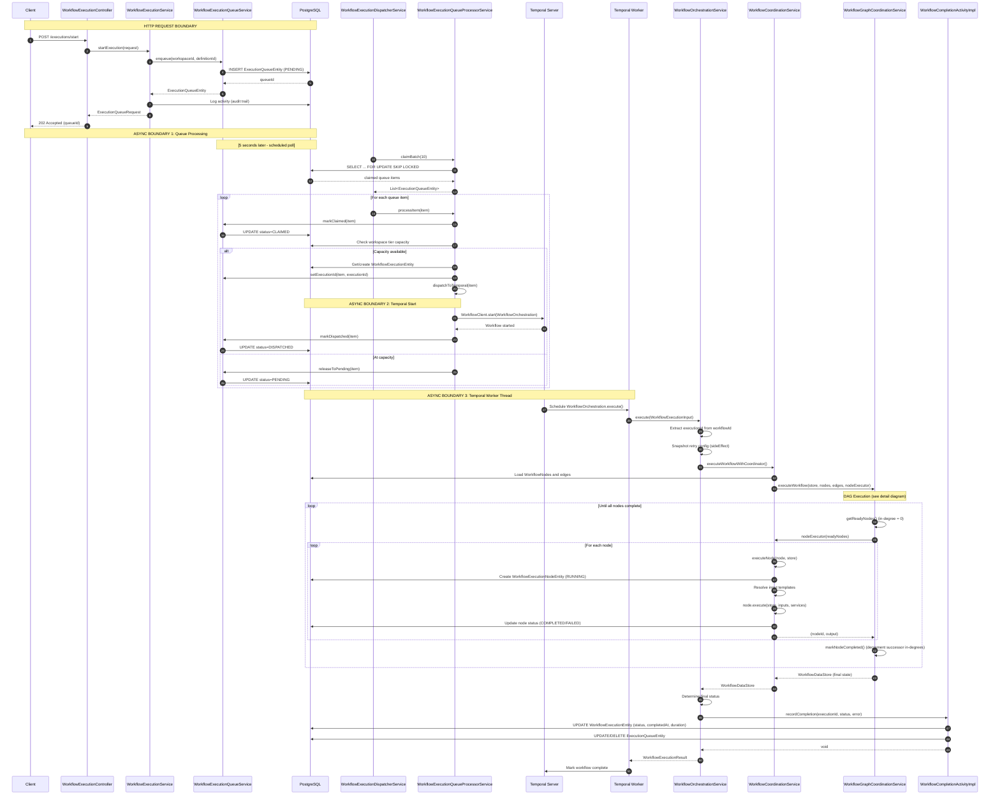
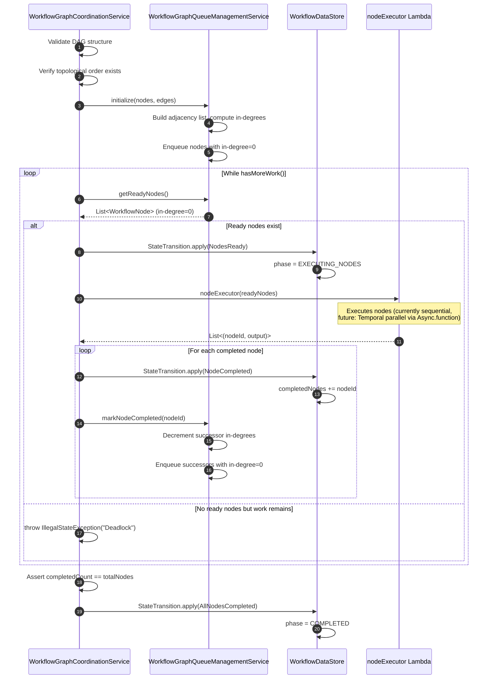

---
tags:
  - flow/user-facing
  - architecture/flow
Created: 2026-02-09
Updated: 2026-02-09
Critical: true
Domains:
  - "[[Workflows]]"
---
# Flow: Workflow Execution

---

## Overview

Workflow execution traces the complete path from API trigger through asynchronous queue processing to Temporal-based DAG execution. This flow coordinates HTTP request handling, database queue management, distributed scheduling, and stateful DAG traversal with parallel node execution—representing the most complex multi-boundary flow in the system.

**Business value:** Enables reliable, fault-tolerant, tier-aware workflow orchestration with automatic retry, capacity limiting, and dead-letter handling for stuck executions.

---

## Trigger

**What initiates this flow:**

|Trigger Type|Source|Condition|
|---|---|---|
|API Call|Client application|POST to `/api/v1/workflow/executions/start`|

**Entry Point:** [[WorkflowExecutionController]]

---

## Preconditions

- [ ] Workflow definition exists and belongs to workspace
- [ ] User is authenticated with valid workspace access
- [ ] Workspace tier configuration present (for capacity checks)
- [ ] Temporal worker running and connected to task queue
- [ ] ShedLock configured for distributed dispatcher locking

---

## Actors

|Actor|Role in Flow|
|---|---|
|User/Client|Initiates execution request via API|
|API Layer|Validates request and enqueues execution|
|Queue Processor|Claims pending executions (scheduled, ShedLock)|
|Dispatcher|Checks capacity and starts Temporal workflow|
|Temporal Worker|Executes workflow orchestration logic|
|Node Executor|Runs individual workflow nodes|
|Completion Activity|Records final execution status|

---

## Flow Steps

### High-Level Flow

### DAG Execution Detail

### Step-by-Step Breakdown

#### 1. API Request Received

- **Component:** [[WorkflowExecutionController]]
- **Action:** Receives POST to `/api/v1/workflow/executions/start`
- **Input:** `StartWorkflowExecutionRequest` (workflowDefinitionId, workspaceId)
- **Output:** HTTP 202 Accepted with `ExecutionQueueRequest` (queueId, status)
- **Side Effects:** None (synchronous validation only)

#### 2. Execution Enqueued

- **Component:** [[WorkflowExecutionService]]
- **Action:** Delegates to [[WorkflowExecutionQueueService]] to enqueue execution
- **Input:** workspaceId, workflowDefinitionId
- **Output:** `ExecutionQueueEntity` with generated queueId
- **Side Effects:**
  - INSERT into `execution_queue` table (status=PENDING)
  - INSERT into `activity` table (audit log)

#### 3. Queue Processing Scheduled (ASYNC BOUNDARY)

- **Component:** [[WorkflowExecutionDispatcherService]]
- **Action:** `@Scheduled(fixedDelay=5000)` triggers `processQueue()`
- **Input:** None (scheduled)
- **Output:** None (void)
- **Side Effects:** ShedLock acquires distributed lock `processExecutionQueue`

#### 4. Batch Claim

- **Component:** [[WorkflowExecutionQueueProcessorService]]
- **Action:** Claims up to 10 pending items via `SELECT FOR UPDATE SKIP LOCKED`
- **Input:** BATCH_SIZE=10
- **Output:** `List<ExecutionQueueEntity>`
- **Side Effects:** Row-level locks on claimed queue items (released after transaction)

#### 5. Process Individual Queue Item

- **Component:** [[WorkflowExecutionQueueProcessorService]]
- **Action:** Each item processed in isolated transaction (REQUIRES_NEW)
- **Input:** Single `ExecutionQueueEntity`
- **Output:** None
- **Side Effects:**
  - UPDATE queue item status to CLAIMED
  - Query workspace tier and active execution count
  - Branch: capacity check

#### 6a. Capacity Available - Dispatch to Temporal

- **Component:** [[WorkflowExecutionQueueProcessorService]]
- **Action:** Creates/reuses WorkflowExecutionEntity, starts Temporal workflow
- **Input:** Queue item, workflow definition, version
- **Output:** Temporal workflow ID
- **Side Effects:**
  - INSERT or UPDATE `workflow_execution` table (status=RUNNING)
  - UPDATE queue item with executionId
  - Temporal workflow started on task queue
  - UPDATE queue item status to DISPATCHED

#### 6b. At Capacity - Release to Pending

- **Component:** [[WorkflowExecutionQueueProcessorService]]
- **Action:** Releases queue item back to PENDING status
- **Input:** Queue item
- **Output:** None
- **Side Effects:** UPDATE queue item (status=PENDING, claimedAt=null, attemptCount++)

#### 7. Workflow Orchestration (ASYNC BOUNDARY)

- **Component:** [[WorkflowOrchestrationService]]
- **Action:** Temporal worker invokes `execute(WorkflowExecutionInput)` on worker thread
- **Input:** WorkflowExecutionInput (workflowDefinitionId, nodeIds, workspaceId)
- **Output:** WorkflowExecutionResult
- **Side Effects:** None (deterministic workflow code, all side effects via activities)

#### 8. Configuration Snapshot

- **Component:** [[WorkflowOrchestrationService]]
- **Action:** Uses `Workflow.sideEffect()` to snapshot retry configuration
- **Input:** RetryConfig from application.yml
- **Output:** Frozen RetryConfig (deterministic for replay)
- **Side Effects:** None

#### 9. Coordination Activity Invoked

- **Component:** [[WorkflowCoordinationService]]
- **Action:** Activity executes workflow DAG coordination
- **Input:** workflowDefinitionId, nodeIds, workspaceId
- **Output:** WorkflowDataStore (final state with all outputs)
- **Side Effects:**
  - SELECT workflow nodes and edges from database
  - Creates WorkflowExecutionNodeEntity for each node
  - Updates node execution status throughout DAG traversal

#### 10. DAG Validation

- **Component:** [[WorkflowGraphCoordinationService]]
- **Action:** Validates DAG structure and topological order
- **Input:** nodes, edges
- **Output:** None (throws on invalid)
- **Side Effects:** None

#### 11. Queue Initialization

- **Component:** WorkflowGraphQueueManagementService
- **Action:** Builds adjacency list, computes in-degrees, enqueues root nodes
- **Input:** nodes, edges
- **Output:** Internal queue state
- **Side Effects:** Mutable state in singleton service (thread safety concern documented)

#### 12. Pull-Based Node Execution Loop

- **Component:** [[WorkflowGraphCoordinationService]]
- **Action:** Repeatedly gets ready nodes (in-degree=0), executes, marks complete
- **Input:** nodeExecutor lambda
- **Output:** None (updates WorkflowDataStore in-place)
- **Side Effects:** State transitions in WorkflowDataStore

#### 13. Individual Node Execution

- **Component:** [[WorkflowCoordinationService]]
- **Action:** Executes single node via polymorphic dispatch
- **Input:** WorkflowNode, WorkflowDataStore
- **Output:** NodeExecutionResult (status, output)
- **Side Effects:**
  - INSERT WorkflowExecutionNodeEntity (status=RUNNING)
  - Resolves input templates against datastore
  - Calls node.execute() (polymorphic)
  - UPDATE WorkflowExecutionNodeEntity (status=COMPLETED/FAILED)
  - Writes StepOutput to datastore

#### 14. Completion Callback

- **Component:** [[WorkflowCompletionActivityImpl]]
- **Action:** Records final workflow status
- **Input:** executionId, status, error
- **Output:** None
- **Side Effects:**
  - UPDATE WorkflowExecutionEntity (status, completedAt, durationMs, error)
  - DELETE queue item (if COMPLETED) or UPDATE status=FAILED (if FAILED)

#### 15. Workflow Result Returned

- **Component:** [[WorkflowOrchestrationService]]
- **Action:** Returns WorkflowExecutionResult to Temporal
- **Input:** Final datastore state
- **Output:** WorkflowExecutionResult (executionId, status, nodeResults)
- **Side Effects:** Temporal marks workflow as complete

---

## Failure Modes

### Failure Point: Queue Enqueue

|Failure|Cause|Detection|User Experience|Recovery|
|---|---|---|---|---|
|Workflow not found|Invalid workflowDefinitionId|`NotFoundException`|HTTP 404|Fix request and retry|
|Wrong workspace|Workflow belongs to different workspace|`SecurityException`|HTTP 403|Fix workspaceId and retry|
|Database unavailable|PostgreSQL connection failure|DB exception|HTTP 500|Auto-retry (Spring Retry) or user retry|

### Failure Point: Queue Processing

|Failure|Cause|Detection|User Experience|Recovery|
|---|---|---|---|---|
|Stale claimed items|Dispatcher crashed after claiming|ShedLock timeout, CLAIMED > 5 minutes|Execution stuck|`recoverStaleItems()` scheduled task (every 60s) releases to PENDING|
|Workspace not found|Workspace deleted after enqueue|Null check in processor|Queue item marked FAILED|Manual investigation required|
|Max attempts exceeded|Dispatch failed 3+ times|`attemptCount >= MAX_ATTEMPTS`|Queue item marked FAILED|Manual investigation, re-enqueue|

### Failure Point: Temporal Dispatch

|Failure|Cause|Detection|User Experience|Recovery|
|---|---|---|---|---|
|Temporal unavailable|Server connection failure|Exception in `WorkflowClient.start()`|Queue item released to PENDING|Auto-retry on next poll (up to MAX_ATTEMPTS=3)|
|Workflow definition version missing|Version deleted/corrupted|Null check in dispatcher|Queue item marked FAILED|Fix data and re-enqueue|
|Execution entity creation fails|Database constraint violation|Exception in repository save|Queue item released to PENDING|Auto-retry on next poll|

### Failure Point: DAG Validation

|Failure|Cause|Detection|User Experience|Recovery|
|---|---|---|---|---|
|Cycle detected|Workflow graph has circular dependency|`WorkflowValidationException`|Workflow marked FAILED|Fix workflow definition structure|
|Disconnected components|Node unreachable from roots|Validation error|Workflow marked FAILED|Fix workflow definition edges|
|Empty workflow|No nodes in definition|Early exit with COMPLETED|Workflow completes immediately|None (valid state)|

### Failure Point: Node Execution

|Failure|Cause|Detection|User Experience|Recovery|
|---|---|---|---|---|
|HTTP 4xx error|Client error in HTTP_REQUEST node|`WorkflowErrorClassifier` → NON-RETRYABLE|Node marked FAILED, workflow FAILED|Fix node configuration|
|HTTP 5xx error|Server error in HTTP_REQUEST node|`WorkflowErrorClassifier` → RETRYABLE|Temporal retries per RetryOptions|Auto-retry with exponential backoff|
|Validation error|Invalid input data|`ValidationException`|Node marked FAILED, workflow FAILED|Fix workflow definition or input|
|Security error|Auth failure|`SecurityException`|Node marked FAILED, workflow FAILED|Fix credentials or permissions|
|Timeout|Node execution exceeds activity timeout|ActivityFailure|Node marked FAILED, workflow FAILED|Increase timeout or optimize node|

### Failure Point: Completion Recording

|Failure|Cause|Detection|User Experience|Recovery|
|---|---|---|---|---|
|Execution entity deleted|Race condition or manual deletion|Null check in completion activity|Warning logged, workflow completes|Status not persisted (workflow result still valid)|
|Queue item missing|Queue item deleted during execution|Null check in completion activity|Warning logged, workflow completes|Queue status not updated (execution status persisted)|
|Database failure|PostgreSQL unavailable|Exception in repository|Completion activity retries (3 attempts)|Auto-retry with exponential backoff|

### Partial Completion Scenarios

|Scenario|State After Failure|Cleanup Required|Retry Safe|
|---|---|---|---|
|Enqueue fails|No queue item created|None|Yes (idempotent API call)|
|Dispatch fails after execution entity created|Execution entity exists, queue PENDING|Execution entity reused on retry|Yes|
|Node execution fails mid-DAG|Partial node executions persisted|None (Temporal handles retry)|Yes (deterministic replay)|
|Completion fails|Execution complete but status not persisted|Manual status update|No (workflow already complete)|

---

## Async Boundaries

|Point|Mechanism|Eventual Consistency Window|Failure Handling|
|---|---|---|---|
|HTTP → Queue|Database INSERT|~5 seconds (poll interval)|User gets queueId immediately, can poll status|
|Queue → Temporal|Scheduled poll + WorkflowClient.start()|~5 seconds + Temporal latency|ShedLock prevents duplicate dispatch, SKIP LOCKED prevents double-claim|
|Temporal Worker → Activities|Temporal task distribution|~seconds (worker poll interval)|Temporal retry policy handles transient failures|
|Activity → Database|Transactional writes|Immediate (ACID)|Spring @Transactional rollback on failure|

---

## Idempotency

- [x] Flow is partially idempotent
- [ ] Flow is fully idempotent
- [ ] Not idempotent

**Idempotency Key:** Queue item ID (generated on enqueue)

**Duplicate Detection:**
- Enqueue: No deduplication (multiple requests create multiple queue items)
- Dispatch: executionId persisted to queue item before Temporal start
  - On retry after Temporal start failure: reuses existing WorkflowExecutionEntity
- Node execution: Each node gets single WorkflowExecutionNodeEntity (created before try block)
- Completion: No deduplication needed (executionId is unique)

**Caveats:**
- API calls are NOT idempotent - each POST creates a new queue item
- Temporal workflow execution is deterministic (replay-safe) via Workflow.sideEffect()
- Queue processing uses SKIP LOCKED to prevent double-processing

---

## Components Involved

|Component|Role|Can Block Flow|
|---|---|---|
|[[WorkflowExecutionController]]|API entry point, request validation|Yes (HTTP timeout)|
|[[WorkflowExecutionService]]|Orchestrates enqueue + activity logging|Yes (database failure)|
|[[WorkflowExecutionQueueService]]|Queue CRUD operations|Yes (database failure)|
|[[WorkflowExecutionDispatcherService]]|Scheduled queue processor with ShedLock|No (scheduled, processes batches)|
|[[WorkflowExecutionQueueProcessorService]]|Claims and dispatches individual items|No (per-item transactions)|
|[[WorkflowOrchestrationService]]|Temporal workflow implementation (deterministic)|Yes (activity timeout)|
|[[WorkflowCoordinationService]]|Temporal activity for DAG coordination|Yes (database failure, node execution failure)|
|[[WorkflowGraphCoordinationService]]|DAG traversal and state machine|Yes (validation failure, deadlock)|
|WorkflowGraphQueueManagementService|In-degree tracking and ready node queueing|Yes (thread safety issue with singleton state)|
|[[WorkflowNodeInputResolverService]]|Template resolution against datastore|No (pure function)|
|[[WorkflowCompletionActivityImpl]]|Records final execution status|No (best-effort, logs warnings on failure)|

---

## Related

- [[WorkflowOrchestrationService]] - Temporal workflow implementation
- [[WorkflowGraphCoordinationService]] - DAG execution coordination
- [[WorkflowExecutionQueueService]] - Queue management
- [[Workflows]] - Domain overview

---

## Gotchas & Tribal Knowledge

> [!warning] Thread Safety Concern in WorkflowGraphQueueManagementService
> This service is a singleton with mutable state (adjacency list, in-degrees, ready queue). Concurrent workflow executions will interfere with each other. This is a known issue documented in STATE.md blockers:
> - **Blocker:** Thread safety issue - singleton with mutable state will interfere with concurrent workflows
> - **Impact:** Multiple parallel workflows will corrupt each other's DAG state
> - **Mitigation:** Currently relies on single-threaded Temporal worker (not enforced)
> - **TODO:** Refactor to immutable state or request-scoped instance

> [!warning] Sequential Batch Execution
> Despite "parallel" terminology, nodes in the same batch (in-degree=0) execute sequentially via the nodeExecutor lambda. True parallelism requires Temporal child workflows or Async.function + Promise.allOf. This is a documented limitation (TODO at WorkflowGraphCoordinationService:105).

> [!warning] Execution Entity Deletion on Dispatch Failure
> If Temporal workflow start fails, the WorkflowExecutionEntity is deleted to avoid orphaned records. However, the queue item retains the executionId. On retry, a new execution entity is created (logged as warning: "Execution X not found for queue item Y, creating new").

> [!warning] Deterministic Replay Requirements
> WorkflowOrchestrationService MUST follow Temporal determinism rules:
> - NO standard logging (use Workflow.getLogger())
> - NO direct database calls (use activities)
> - NO System.currentTimeMillis() (use Workflow.currentTimeMillis())
> - USE Workflow.sideEffect() for any external state (retry config, workflow ID parsing)
> - Violating these rules causes non-deterministic replay errors

> [!warning] Completion Best-Effort
> WorkflowCompletionActivityImpl logs warnings if execution entity or queue item is missing but does NOT fail the workflow. The workflow result is considered authoritative even if database updates fail.

> [!warning] Workspace Capacity Checks Are Racy
> Capacity check (active executions vs tier limit) happens in queue processor, not atomically with dispatch. High concurrency can cause temporary over-capacity (multiple items dispatched before counts update). This is acceptable per tier limits as soft limits.

---

## Changelog

|Date|Change|Reason|
|---|---|---|
|2026-02-09|Initial documentation|Phase 4 architecture flows|
