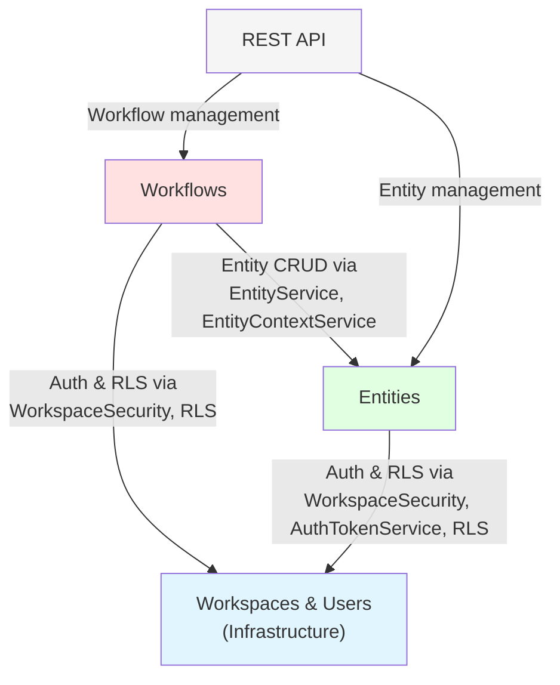

---
tags:
  - architecture/integration
  - type/integration-map
Created: 2026-02-09
Updated: 2026-02-09
---
# Domain Integration Map

## Overview

This document maps all cross-domain interactions in Riven Core. Three domains are currently documented: [[Workflows]], [[Entities]], and [[Workspaces & Users]]. The Workspaces & Users domain serves as the foundational infrastructure layer, providing workspace scoping and authorization capabilities that both Workflows and Entities depend upon.

## System Dependency Diagram

## Cross-Domain Interactions

| # | Source | Target | Interaction | Mechanism | Related Flow |
|---|--------|--------|------------|-----------|--------------|
| 1 | [[Workflows]] | [[Entities]] | Node actions execute entity CRUD | [[EntityService]], [[EntityContextService]] (direct service call) | [[Workflow Execution]] |
| 2 | [[Workflows]] | [[Workspaces & Users]] | Workspace scoping for all queries | PostgreSQL RLS via workspace_members | [[Auth & Authorization]] |
| 3 | [[Workflows]] | [[Workspaces & Users]] | Authorization for API endpoints | [[WorkspaceSecurity]] (@PreAuthorize) | [[Auth & Authorization]] |
| 4 | [[Workflows]] | [[Workspaces & Users]] | Capacity tier check before dispatch | [[WorkspaceService]] (direct service call) | [[Queue Processing]] |
| 5 | [[Entities]] | [[Workspaces & Users]] | Workspace scoping for all queries | PostgreSQL RLS via workspace_members | [[Auth & Authorization]] |
| 6 | [[Entities]] | [[Workspaces & Users]] | Authorization for API endpoints | [[WorkspaceSecurity]] (@PreAuthorize) | [[Auth & Authorization]] |
| 7 | [[Entities]] | [[Workspaces & Users]] | User context for activity logging | [[AuthTokenService]] (direct service call) | [[Entity CRUD]] |

## Key Integration Patterns

### Pattern 1: RLS-Based Workspace Isolation

All domains rely on PostgreSQL Row-Level Security via the `workspace_members` table. [[WorkspaceSecurity]] activates RLS context. See [[Auth & Authorization]] for the full flow.

### Pattern 2: @PreAuthorize Authorization

Both [[Workflows]] and [[Entities]] use `@PreAuthorize` expressions that delegate to [[WorkspaceSecurity]] bean methods. The authority format `ROLE_{workspaceId}_{ROLE}` is the critical coupling point.

### Pattern 3: Direct Service Calls (Workflows → Entities)

Workflow node actions call [[EntityService]] and [[EntityContextService]] directly. This is the primary cross-domain data dependency.

## Gotchas

> [!warning] Authority Format Coupling
> The `ROLE_{workspaceId}_{ROLE}` format is embedded in [[TokenDecoder]], [[WorkspaceSecurity]], and all `@PreAuthorize` annotations. Changing this format requires coordinated updates across all three domains.

> [!warning] RLS Silent Filtering
> RLS does not throw errors — it silently filters results. A misconfigured workspace context returns empty data, not a 403. See [[Auth & Authorization]] for details.
