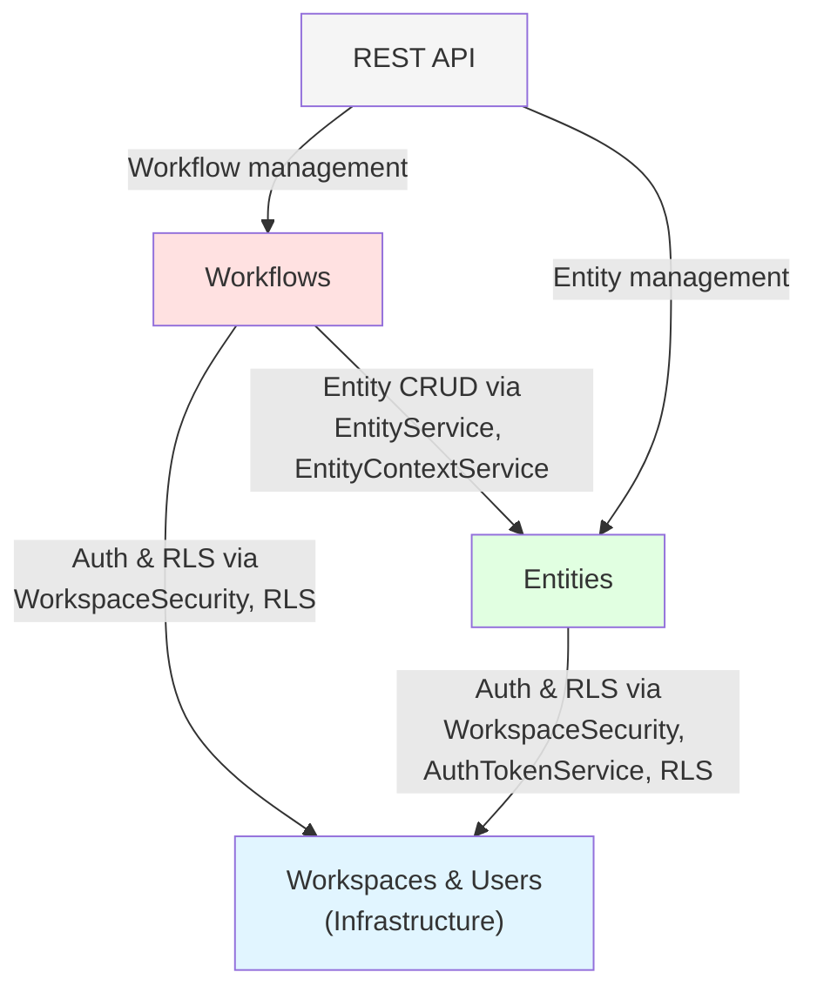

---
tags:
  - architecture/integration
  - type/integration-map
Created: 2026-02-09
Updated: 2026-02-09
---
# Domain Integration Map

## Overview

This document maps all cross-domain interactions in Riven Core. Three domains are currently documented: [[riven/docs/system-design/domains/Workflows/Workflows]], [[riven/docs/system-design/domains/Entities/Entities]], and [[riven/docs/system-design/domains/Workspaces & Users/Workspaces & Users]]. The Workspaces & Users domain serves as the foundational infrastructure layer, providing workspace scoping and authorization capabilities that both Workflows and Entities depend upon.

## System Dependency Diagram

```mermaid
flowchart TD
    WU["Workspaces & Users<br/>(Infrastructure)"]
    WF["Workflows"]
    ENT["Entities"]
    API["REST API"]

    WF -->|"Entity CRUD via<br/>EntityService, EntityContextService"| ENT
    WF -->|"Auth & RLS via<br/>WorkspaceSecurity, RLS"| WU
    ENT -->|"Auth & RLS via<br/>WorkspaceSecurity, AuthTokenService, RLS"| WU
    API -->|"Workflow management"| WF
    API -->|"Entity management"| ENT

    style WU fill:#e1f5ff
    style WF fill:#ffe1e1
    style ENT fill:#e1ffe1
    style API fill:#f5f5f5
```

## Cross-Domain Interactions

| # | Source | Target | Interaction | Mechanism | Related Flow |
|---|--------|--------|------------|-----------|--------------|
| 1 | [[riven/docs/system-design/domains/Workflows/Workflows]] | [[riven/docs/system-design/domains/Entities/Entities]] | Node actions execute entity CRUD | [[riven/docs/system-design/domains/Entities/Entity Management/EntityService]], [[riven/docs/system-design/domains/Workflows/State Management/EntityContextService]] (direct service call) | [[riven/docs/system-design/flows/Workflow Execution]] |
| 2 | [[riven/docs/system-design/domains/Workflows/Workflows]] | [[riven/docs/system-design/domains/Workspaces & Users/Workspaces & Users]] | Workspace scoping for all queries | PostgreSQL RLS via workspace_members | [[riven/docs/system-design/flows/Auth & Authorization]] |
| 3 | [[riven/docs/system-design/domains/Workflows/Workflows]] | [[riven/docs/system-design/domains/Workspaces & Users/Workspaces & Users]] | Authorization for API endpoints | [[riven/docs/system-design/domains/Workspaces & Users/Auth & Authorization/WorkspaceSecurity]] (@PreAuthorize) | [[riven/docs/system-design/flows/Auth & Authorization]] |
| 4 | [[riven/docs/system-design/domains/Workflows/Workflows]] | [[riven/docs/system-design/domains/Workspaces & Users/Workspaces & Users]] | Capacity tier check before dispatch | [[riven/docs/system-design/domains/Workspaces & Users/Workspace Management/WorkspaceService]] (direct service call) | [[riven/docs/system-design/flows/Queue Processing]] |
| 5 | [[riven/docs/system-design/domains/Entities/Entities]] | [[riven/docs/system-design/domains/Workspaces & Users/Workspaces & Users]] | Workspace scoping for all queries | PostgreSQL RLS via workspace_members | [[riven/docs/system-design/flows/Auth & Authorization]] |
| 6 | [[riven/docs/system-design/domains/Entities/Entities]] | [[riven/docs/system-design/domains/Workspaces & Users/Workspaces & Users]] | Authorization for API endpoints | [[riven/docs/system-design/domains/Workspaces & Users/Auth & Authorization/WorkspaceSecurity]] (@PreAuthorize) | [[riven/docs/system-design/flows/Auth & Authorization]] |
| 7 | [[riven/docs/system-design/domains/Entities/Entities]] | [[riven/docs/system-design/domains/Workspaces & Users/Workspaces & Users]] | User context for activity logging | [[riven/docs/system-design/domains/Workspaces & Users/Auth & Authorization/AuthTokenService]] (direct service call) | [[riven/docs/system-design/flows/Entity CRUD]] |

## Key Integration Patterns

### Pattern 1: RLS-Based Workspace Isolation

All domains rely on PostgreSQL Row-Level Security via the `workspace_members` table. [[riven/docs/system-design/domains/Workspaces & Users/Auth & Authorization/WorkspaceSecurity]] activates RLS context. See [[riven/docs/system-design/flows/Auth & Authorization]] for the full flow.

### Pattern 2: @PreAuthorize Authorization

Both [[riven/docs/system-design/domains/Workflows/Workflows]] and [[riven/docs/system-design/domains/Entities/Entities]] use `@PreAuthorize` expressions that delegate to [[riven/docs/system-design/domains/Workspaces & Users/Auth & Authorization/WorkspaceSecurity]] bean methods. The authority format `ROLE_{workspaceId}_{ROLE}` is the critical coupling point.

### Pattern 3: Direct Service Calls (Workflows → Entities)

Workflow node actions call [[riven/docs/system-design/domains/Entities/Entity Management/EntityService]] and [[riven/docs/system-design/domains/Workflows/State Management/EntityContextService]] directly. This is the primary cross-domain data dependency.

## Gotchas

> [!warning] Authority Format Coupling
> The `ROLE_{workspaceId}_{ROLE}` format is embedded in [[riven/docs/system-design/domains/Workspaces & Users/Auth & Authorization/TokenDecoder]], [[riven/docs/system-design/domains/Workspaces & Users/Auth & Authorization/WorkspaceSecurity]], and all `@PreAuthorize` annotations. Changing this format requires coordinated updates across all three domains.

> [!warning] RLS Silent Filtering
> RLS does not throw errors — it silently filters results. A misconfigured workspace context returns empty data, not a 403. See [[riven/docs/system-design/flows/Auth & Authorization]] for details.
