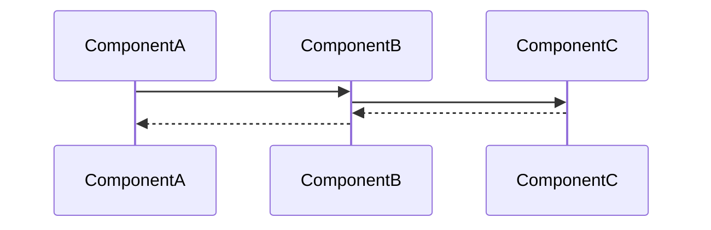

---
tags:
  - "#status/draft"
  - status/implemented
  - status/designed
  - priority/low
  - priority/medium
  - priority/high
  - architecture/design
  - architecture/feature
Created:
Updated:
Domains:
  - "[[Domain]]"
---
# Feature: {{title}}

---

## 1. Overview

### Problem Statement

_What problem does this feature solve? Why does it need to exist?_

### Proposed Solution

_High-level description of the approach (2-3 sentences max)_

### Success Criteria

_How do we know this feature is working correctly?_

- [ ] Criterion 1
- [ ] Criterion 2

---

## 2. Data Model

### New Entities

_What new tables/entities are being introduced?_

| Entity | Purpose | Key Fields |
| ------ | ------- | ---------- |
|        |         |            |

### Entity Modifications

_What existing entities need changes?_

|Entity|Change|Rationale|
|---|---|---|
||||

### Data Ownership

_Which component is the source of truth for each piece of data?_

### Relationships

```
[Entity A] ---(relationship)---> [Entity B]
```

### Data Lifecycle

- **Creation:** How/when is this data created?
- **Updates:** What triggers changes?
- **Deletion:** When/how is it removed? Soft delete? Cascade?

### Consistency Requirements

- [ ] Requires strong consistency (ACID transactions)
- [ ] Eventual consistency acceptable
- _If eventual:_ What's the acceptable delay? What happens during inconsistency?

---

## 3. Component Design

### New Components

_List each new service/component this feature introduces_

#### ComponentName

- **Responsibility:**
- **Dependencies:** [[Dependency1]], [[Dependency2]]
- **Exposes to:** [[Consumer1]], [[Consumer2]]

### Affected Existing Components

|Component|Change Required|Impact|
|---|---|---|
|[[]]|||

### Component Interaction Diagram



---

## 4. API Design

### New Endpoints

#### `POST /api/v1/resource`

- **Purpose:**
- **Request:**

```json
{
  
}
```

- **Response:**

```json
{
  
}
```

- **Error Cases:**
    - `400` -
    - `404` -
    - `409` -

### Contract Changes

_Any changes to existing APIs? Versioning implications?_

### Idempotency

- [ ] Operations are idempotent
- _If not:_ How do we handle retries?

---

## 5. Failure Modes & Recovery

### Dependency Failures

|Dependency|Failure Scenario|System Behavior|Recovery|
|---|---|---|---|
|Database||||
|External API||||
|Message Queue||||

### Partial Failure Scenarios

_What happens if we fail mid-operation?_

|Scenario|State Left Behind|Recovery Strategy|
|---|---|---|
||||

### Rollback Strategy

_If this feature needs to be disabled/rolled back, what's required?_

- [ ] Feature flag controlled
- [ ] Database migration reversible
- [ ] Backward compatible with previous version

### Blast Radius

_If this component fails completely, what else breaks?_

---

## 6. Security

### Authentication & Authorization

- **Who can access this feature?**
- **Authorization model:** RBAC / Resource-based / Other
- **Required permissions:**

### Data Sensitivity

|Data Element|Sensitivity|Protection Required|
|---|---|---|
||PII / Confidential / Public|Encryption / Audit / None|

### Trust Boundaries

_Where does validated data become untrusted?_

### Attack Vectors Considered

- [ ] Input validation
- [ ] Authorization bypass
- [ ] Data leakage
- [ ] Rate limiting

---

## 7. Performance & Scale

### Expected Load

- **Requests/sec:**
- **Data volume:**
- **Growth rate:**

### Performance Requirements

- **Latency target:** p50: ___ ms, p99: ___ ms
- **Throughput target:**

### Scaling Strategy

- [ ] Horizontal scaling possible
- [ ] Vertical scaling required
- **Bottleneck:**

### Caching Strategy

_What can be cached? TTL? Invalidation strategy?_

### Database Considerations

- **New indexes required:**
- **Query patterns:**
- **Potential N+1 issues:**

---

## 8. Observability

### Key Metrics

_What metrics indicate this feature is healthy?_

|Metric|Normal Range|Alert Threshold|
|---|---|---|
||||

### Logging

_What events should be logged? At what level?_

|Event|Level|Key Fields|
|---|---|---|
||INFO/WARN/ERROR||

### Tracing

_What spans should be created for distributed tracing?_

### Alerting

_What conditions should trigger alerts?_

|Condition|Severity|Response|
|---|---|---|
||||

---

## 9. Testing Strategy

### Unit Tests

- [ ] Component logic coverage
- [ ] Edge cases identified:

### Integration Tests

- [ ] API contract tests
- [ ] Database interaction tests
- [ ] External service mocks

### End-to-End Tests

- [ ] Happy path
- [ ] Failure scenarios

### Load Testing

- [ ] Required (describe scenario)
- [ ] Not required (justify)

---

## 10. Migration & Rollout

### Database Migrations

_List migrations in order_

### Data Backfill

_Is existing data affected? How will it be migrated?_

### Feature Flags

- **Flag name:**
- **Rollout strategy:** % rollout / User segment / All at once

### Rollout Phases

|Phase|Scope|Success Criteria|Rollback Trigger|
|---|---|---|---|
|1||||
|2||||

---

## 11. Open Questions

> [!warning] Unresolved
> 
> - [ ] Question 1
> - [ ] Question 2

---

## 12. Decisions Log

|Date|Decision|Rationale|Alternatives Considered|
|---|---|---|---|
|||||

---

## 13. Implementation Tasks

- [ ] Task 1
- [ ] Task 2
- [ ] Task 3

---

## Related Documents

- [[ADR-xxx-decision-name]]
- [[Flow - Related Flow]]
- [[Domain - Relevant Domain]]

---

## Changelog

| Date | Author | Change        |
| ---- | ------ | ------------- |
|      |        | Initial draft |