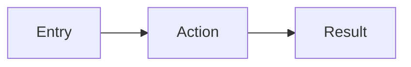

---
tags:
  - priority/low
  - priority/medium
  - priority/high
  - status/draft
  - status/designed
  - status/implemented
  - architecture/design
  - architecture/feature
  - architecture/frontend
Created:
Updated:
Domains:
  - "[[Domain]]"
Backend-Feature: "[[]]"
Pages:
  - "[[]]"
---
# Quick Frontend Design: {{title}}

## What & Why

_One paragraph: what are we building and why?_

---

## User Flow

---

## Components

| Component | Responsibility | Shared Deps |
| --------- | -------------- | ----------- |
|           |                |             |

---

## State & Data

**Queries/Mutations:**

| Hook | Endpoint | Key | Purpose |
| ---- | -------- | --- | ------- |
|      |          |     |         |

**State Ownership:**

| State | Location | Purpose |
| ----- | -------- | ------- |
|       | Server / URL / Local |  |

---

## Key Interactions & States

_Only document non-obvious interactions, error states, and edge cases_

---

## Tasks

- [ ]
- [ ]
- [ ]
