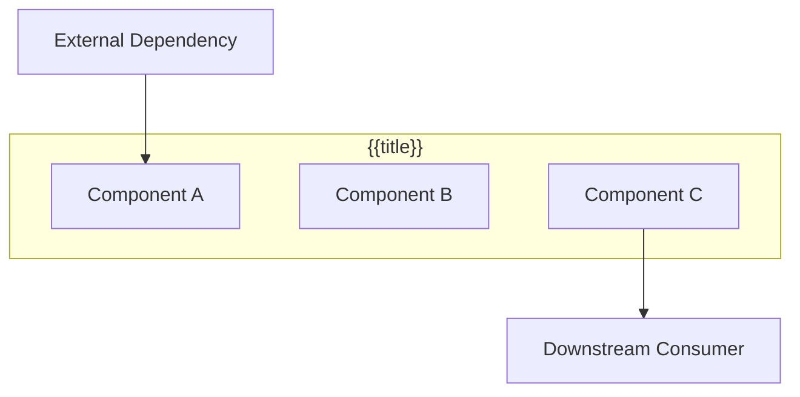
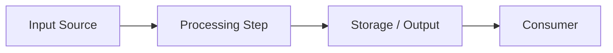
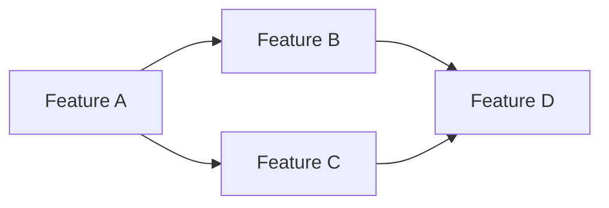

---
tags:
  - architecture/subdomain-plan
Created: {{date:DD-MM-YYYY}}
Updated:
Domains:
  - "[[Domain]]"
---
# Sub-Domain Plan: {{title}}

---

> _Overarching design plan for the **{{title}}** sub-domain. Groups related feature designs, defines architecture and data flows, and sets the implementation sequence._

---

## 1. Vision & Purpose

### What This Sub-Domain Covers

_What area of the system does this sub-domain represent? What capability does it deliver?_

### Why It Exists as a Distinct Area

_What makes this a cohesive sub-domain rather than individual unrelated features?_

### Boundaries

- **Owns:**
- **Does NOT own:**

---

## 2. Architecture Overview

### System Context

_Where does this sub-domain sit within the broader system? What does it depend on, and what depends on it?_



### Core Components

| Component | Responsibility | Status |
| --------- | -------------- | ------ |
|           |                | Planned / Built / Partial |

### Key Design Decisions

_Architectural choices that shape how features in this sub-domain are built_

|Decision|Rationale|Alternatives Rejected|
|---|---|---|
||||

---

## 3. Data Flow

### Primary Flow

_The main data path through this sub-domain — how data enters, transforms, and exits_



### Secondary Flows

_Additional flows (error handling, async processing, feedback loops)_

---

## 4. Feature Map

> Features belonging to this sub-domain and their current pipeline status.

```dataviewjs
const base = "2. Areas/2.1 Startup & Business/Riven/2. System Design/feature-design";
const pages = dv.pages(`"${base}"`)
  .where(p => p.file.name !== "feature-design")
  .where(p => {
    const sd = p["Sub-Domain"];
    if (!sd) return false;
    const items = Array.isArray(sd) ? sd : [sd];
    return items.some(s => String(s).includes(dv.current().file.name));
  });

const getPriority = (p) => {
  const t = (p.tags || []).map(String);
  if (t.some(tag => tag.includes("priority/high"))) return ["High", 1];
  if (t.some(tag => tag.includes("priority/medium"))) return ["Med", 2];
  if (t.some(tag => tag.includes("priority/low"))) return ["Low", 3];
  return ["\u2014", 4];
};

const getDesign = (p) => {
  const t = (p.tags || []).map(String);
  if (t.some(tag => tag.includes("status/implemented"))) return "Implemented";
  if (t.some(tag => tag.includes("status/designed"))) return "Designed";
  if (t.some(tag => tag.includes("status/draft"))) return "Draft";
  return "\u2014";
};

if (pages.length > 0) {
  const rows = pages
    .sort((a, b) => getPriority(a)[1] - getPriority(b)[1])
    .map(p => [
      p.file.link,
      p.file.folder.replace(/.*\//, ""),
      getPriority(p)[0],
      getDesign(p),
      p["blocked-by"] ? "Yes" : ""
    ]);
  dv.table(["Feature", "Stage", "P", "Design", "Blocked"], rows);
} else {
  dv.paragraph("*No features linked yet. Add `Sub-Domain: \"[[" + dv.current().file.name + "]]\"` to feature frontmatter to link them here.*");
}
```

---

## 5. Feature Dependencies

_How features within this sub-domain depend on each other and on external features_



### Implementation Sequence

_Recommended build order based on dependencies and value delivery_

| Phase | Features | Rationale |
| ----- | -------- | --------- |
| 1     |          | Foundation — unblocks everything else |
| 2     |          | Core capability |
| 3     |          | Enhancement / polish |

---

## 6. Domain Interactions

### Depends On

| Domain / Sub-Domain | What We Need | Integration Point |
| -------------------- | ------------ | ----------------- |
|                      |              | API / Event / Direct |

### Consumed By

| Domain / Sub-Domain | What They Need | Integration Point |
| -------------------- | -------------- | ----------------- |
|                      |                | API / Event / Direct |

### Cross-Cutting Concerns

_Shared patterns, utilities, or conventions that span features in this sub-domain_

---

## 7. Design Constraints

_Non-negotiable constraints that shape all features within this sub-domain_

- **Performance:**
- **Security:**
- **Compatibility:**
- **Infrastructure:**

---

## 8. Open Questions

> [!warning] Unresolved
>
> - [ ] Question 1
> - [ ] Question 2

---

## 9. Decisions Log

| Date | Decision | Rationale | Alternatives Considered |
| ---- | -------- | --------- | ----------------------- |
|      |          |           |                         |

---

## Related Documents

- [[Domain - Parent Domain]]
- [[ADR-xxx-decision-name]]
- [[Flow - Related Flow]]

---

## Changelog

| Date | Author | Change        |
| ---- | ------ | ------------- |
|      |        | Initial draft |
