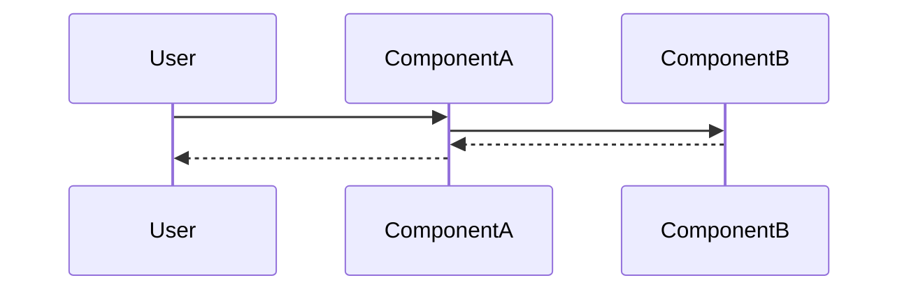

---
tags:
  - flow/active
  - flow/scheduled
  - flow/background
  - flow/deprecated
  - flow/integration
  - flow/user-facing
  - flow/planned
  - architecture/flow
Domains:
  - "[[Domain]]"
Created:
Updated:
---
# Flow: {{title}}

## Overview

_What does this flow accomplish?_

---

## Trigger

_What kicks this off?_

**Entry Point:** [[ComponentName]]

---

## Steps

1. **[[ComponentA]]** —
2. **[[ComponentB]]** —
3. **[[ComponentC]]** —

---

## Failure Modes

|What Fails|User Sees|Recovery|
|---|---|---|
||||

---

## Components Involved

- [[ComponentA]]
- [[ComponentB]]
- [[ComponentC]]

---

## Gotchas

---

## Related

- [[Feature - Related]]
- [[Flow - Related]]