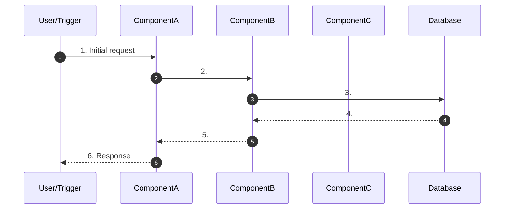

---
tags:
  - flow/user-facing
  - flow/active
  - flow/planned
  - flow/scheduled
  - flow/background
  - flow/deprecated
  - flow/integration
  - architecture/flow
Created:
Updated:
Critical:
Domains:
  - "[[Domain]]"
---
# Flow: {{title}}

---

## Overview

_What does this flow accomplish? What's the business value? (2-3 sentences)_

---

## Trigger

**What initiates this flow:**

|Trigger Type|Source|Condition|
|---|---|---|
|User Action / API Call / Event / Schedule / System|||

**Entry Point:** [[ComponentName]]

---

## Preconditions

_What must be true before this flow can execute?_

- [ ]
- [ ]

---

## Actors

|Actor|Role in Flow|
|---|---|
|User / System / External Service||

---

## Flow Steps

### Happy Path



### Step-by-Step Breakdown

#### 1. {{Step Name}}

- **Component:** [[ComponentA]]
- **Action:**
- **Input:**
- **Output:**
- **Side Effects:**

#### 2. {{Step Name}}

- **Component:** [[ComponentB]]
- **Action:**
- **Input:**
- **Output:**
- **Side Effects:**

#### 3. {{Step Name}}

- **Component:** [[ComponentC]]
- **Action:**
- **Input:**
- **Output:**
- **Side Effects:**

_Continue as needed..._

---

## Data Transformations

|Step|Input Shape|Output Shape|Transformation|
|---|---|---|---|
|||||

---

## Failure Modes

### Failure Point: {{Description}}

|Failure|Cause|Detection|User Experience|Recovery|
|---|---|---|---|---|
||||||

### Failure Point: {{Description}}

|Failure|Cause|Detection|User Experience|Recovery|
|---|---|---|---|---|
||||||

### Partial Completion Scenarios

|Scenario|State After Failure|Cleanup Required|Retry Safe|
|---|---|---|---|
||||Yes / No|

---

## Alternative Paths

### {{Alternative Path Name}}

**Condition:** When does this path execute instead?

**Diverges at:** Step X

**Steps:** 1. 2.

**Rejoins at:** Step Y / Terminates separately

---

## Compensation / Rollback

_If this flow needs to be undone, what's the strategy?_

|Step to Undo|Compensation Action|Automated / Manual|
|---|---|---|
||||

---

## Async Boundaries

_Where does the flow become asynchronous?_

|Point|Mechanism|Eventual Consistency Window|Failure Handling|
|---|---|---|---|
||Queue / Event / Webhook|||

---

## Timeouts & SLAs

|Segment|Timeout|SLA|Breach Action|
|---|---|---|---|
|End-to-end||||
|Step X to Y||||

---

## Idempotency

- [ ] Flow is fully idempotent
- [ ] Partially idempotent (explain)
- [ ] Not idempotent (explain safeguards)

**Idempotency Key:**

**Duplicate Detection:**

---

## Observability

### Key Metrics

|Metric|What It Measures|
|---|---|
|`flow_{{name}}_started_total`|Flow initiations|
|`flow_{{name}}_completed_total`|Successful completions|
|`flow_{{name}}_failed_total`|Failures (by reason)|
|`flow_{{name}}_duration_seconds`|End-to-end latency|

### Trace Structure

```
flow:{{name}}
├── step:{{step1}}
│   └── db:query
├── step:{{step2}}
│   └── external:api_call
└── step:{{step3}}
```

### Key Log Events

|Event|Level|When|Key Fields|
|---|---|---|---|
|`flow.started`|INFO|Flow begins|correlation_id, trigger|
|`flow.completed`|INFO|Flow succeeds|correlation_id, duration|
|`flow.failed`|ERROR|Flow fails|correlation_id, step, error|

---

## Testing Scenarios

### Happy Path Tests

- [ ]

### Edge Cases

- [ ]

### Failure Injection Tests

- [ ]

---

## Rate Limits & Throttling

|Limit Type|Value|Scope|Exceeded Behavior|
|---|---|---|---|
|||Per user / Global||

---

## Security Considerations

- **Authorization checks at:**
- **Sensitive data in flight:**
- **Audit logging:**

---

## Performance Characteristics

|Metric|Typical|Peak|Notes|
|---|---|---|---|
|Latency (p50)||||
|Latency (p99)||||
|Throughput||||

### Bottlenecks

|Step|Bottleneck|Mitigation|
|---|---|---|
||||

---

## Components Involved

|Component|Role|Can Block Flow|
|---|---|---|
|[[]]||Yes / No|

---

## External Dependencies

|Service|Step|Failure Impact|Fallback|
|---|---|---|---|
|||||

---

## Related

- [[Feature - Related Feature]]
- [[Flow - Related Flow]]
- [[ADR-xxx - Design Decision]]

---

## Gotchas & Tribal Knowledge

> ## [!warning] Watch Out

---

## Changelog

|Date|Change|Reason|
|---|---|---|
||||