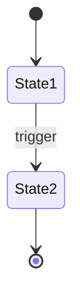

---
tags:
  - component/active
  - component/planned
  - component/deprecated
  - layer/service
  - layer/utility
  - layer/configuration
  - architecture/component
Created:
Updated:
Domains:
  - "[[Domain]]"
---
# {{title}}

---

## Purpose

_What problem does this component solve? Why does it exist? (1-2 sentences)_

---

## Responsibilities

_What this component owns and is accountable for:_

**Explicitly NOT responsible for:**

---

## Dependencies

### Internal Dependencies

|Component|Purpose|Coupling|
|---|---|---|
|[[]]||High / Medium / Low|

### External Dependencies

|Service/Library|Purpose|Failure Impact|
|---|---|---|
||||

### Injected Dependencies

_Constructor/DI dependencies for Spring context_

```kotlin
// Key injected dependencies
```

---

## Consumed By

|Component|How It Uses This|Notes|
|---|---|---|
|[[]]|||

---

## Public Interface

### Key Methods

#### `methodName(params): ReturnType`

- **Purpose:**
- **When to use:**
- **Side effects:**
- **Throws:**

#### `anotherMethod(params): ReturnType`

- **Purpose:**
- **When to use:**
- **Side effects:**
- **Throws:**

### Events Published

_If this component emits events/messages_

|Event|Trigger|Payload|
|---|---|---|
||||

### Events Consumed

_If this component listens to events/messages_

|Event|Source|Action Taken|
|---|---|---|
||||

---

## Key Logic

### Core Algorithm / Business Rules

_Explain the main logic this component implements. Use pseudocode, state diagrams, or plain English—whatever communicates best._

### State Management

_If this component manages state, document transitions_



### Validation Rules

|Field/Input|Rule|Error|
|---|---|---|
||||

### Business Rules / Constraints

---

## Data Access

### Entities Owned

_This component is the source of truth for:_

|Entity|Operations|Notes|
|---|---|---|
|[[]]|CRUD / Read-only||

### Queries

_Key queries this component performs_

|Query|Purpose|Performance Notes|
|---|---|---|
||||

---

## Flows Involved

|Flow|Role in Flow|
|---|---|
|[[Flow - ]]|Initiator / Participant / Terminator|

---

## Configuration

|Property|Purpose|Default|Environment-specific|
|---|---|---|---|
||||Yes / No|

---

## Error Handling

### Errors Thrown

|Error/Exception|When|Expected Handling|
|---|---|---|
||||

### Errors Handled

|Error/Exception|Source|Recovery Strategy|
|---|---|---|
||||

---

## Observability

### Key Metrics

|Metric|Type|What It Indicates|
|---|---|---|
||Counter / Gauge / Histogram||

### Log Events

|Event|Level|When|Key Fields|
|---|---|---|---|
||INFO / WARN / ERROR|||

### Trace Spans

|Span|Parent|Key Attributes|
|---|---|---|
||||

---

## Gotchas & Edge Cases

> ## [!warning] Watch Out

### Known Limitations

### Common Mistakes

### Thread Safety / Concurrency

_Is this component thread-safe? Any synchronization concerns?_

---

## Technical Debt

|Issue|Impact|Effort|Ticket|
|---|---|---|---|
||High/Med/Low|High/Med/Low||

---

## Testing

### Unit Test Coverage

- **Location:**
- **Key scenarios covered:**

### Integration Test Notes

### How to Test Manually

_Steps to verify this component works in isolation_

---

## Related

- [[ADR-xxx - Relevant Decision]]
- [[Feature - Related Feature]]
- [[Domain - Parent Domain]]

---

## Changelog

|Date|Change|Reason|
|---|---|---|
||||